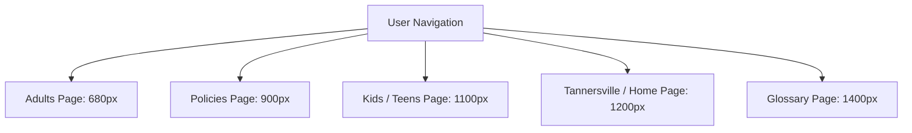
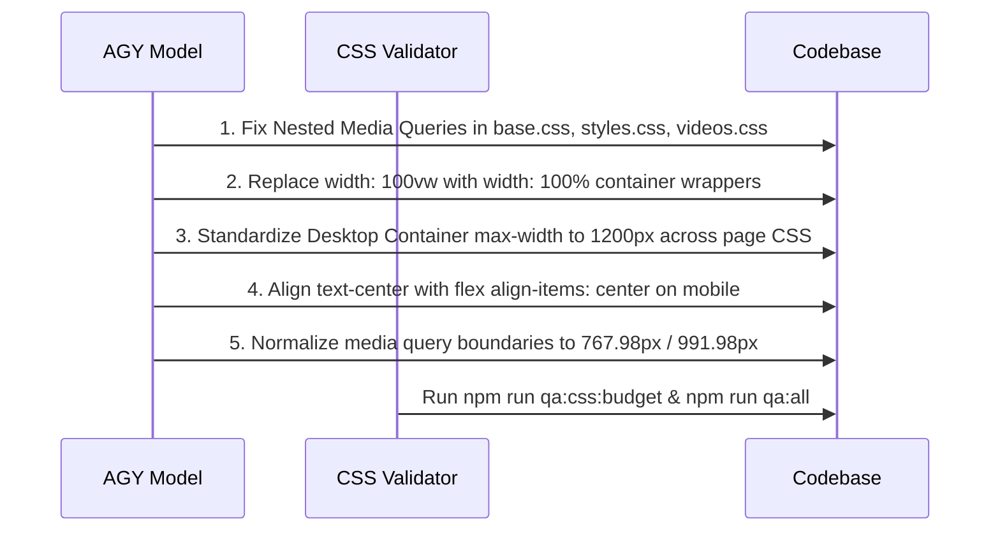

# Global CSS & Viewport Centering Audit Report

```yaml
audit_metadata:
  target_repository: "TriangleWizX/jun1826 (Sensei Sandy BJJ)"
  audit_date: "2026-09-06"
  auditor: "Antigravity (AGY Model)"
  scope: "Global CSS architecture, responsive layout centering, desktop vs mobile viewport consistency"
  methodology: "AST & RegEx CSS parsing, brace depth tracking, container bounding box comparison, media query analysis"
  status: "COMPLETE"
```

---

## Executive Summary

A deep-dive audit of the CSS and HTML architecture across `senseisandy.com` was conducted to evaluate responsive layout integrity, centering consistency, box-model boundaries, and viewport stability between desktop (`>= 992px`) and mobile (`< 768px`) viewports.

The audit revealed **5 major architectural defect categories**, ranging from severe CSS syntax corruption (nested `@media` queries causing dead mobile styles) to viewport overflow hazards (`width: 100vw` scrollbar triggers) and desktop container width fragmentation across routes.

### Key Metrics & Findings Summary

| Defect Category | Severity | Occurrences | Primary Impact |
| :--- | :--- | :--- | :--- |
| **1. Structural CSS Media Query Corruption** | **CRITICAL** | 6 Core Files | Mobile styles trapped in invalid nested `@media` blocks; never evaluate on mobile viewports. |
| **2. Container Width Desktop Fragmentation** | **HIGH** | 8 Page Routes | Desktop central content max-width jumps from 680px to 1400px across page navigation. |
| **3. Viewport Bleed & Horizontal Scroll Hazards** | **HIGH** | 60+ Rules | `width: 100vw` forces horizontal scrollbars on desktop systems with fixed scrollbars. |
| **4. Centering & Alignment Paradigm Mismatch** | **MEDIUM** | Global Components | `text-center` parents contain left-aligned flex item children, causing awkward off-center lists/buttons. |
| **5. Breakpoint Threshold Fragmentation** | **MEDIUM** | 15+ Custom Widths | Arbitrary media queries (`760px`, `860px`, `920px`, `1080px`) create off-by-one layout shift gaps. |

---

## Step-by-Step Deepdive Analysis

---

### Category 1: Structural CSS Syntax Corruption (Nested `@media` Queries)

> [!CAUTION]
> In raw vanilla CSS, nesting `@media` query blocks inside other `@media` query blocks without CSS nesting preprocessors creates compound media conditions (e.g. `min-width: 992px AND max-width: 768px`) which are logically impossible. The child media query rules **never execute**, leaving mobile devices rendering unstyled or broken desktop rules.

#### 1.1 Inactive Mobile Rules in Base Stylesheet
- **File & Line**: [base.css:L319-L475](file:///home/twizss/Documents/ssbjjweb/tmb/src/assets/css/base.css#L319-L475)
- **Defect**: `@media(max-width: 768px)` is nested inside an open `@media(min-width: 992px)` block starting at line 319.
- **Code Snippet**:
  ```css
  /* Line 319 */
  @media(min-width: 992px) {
      .nav-shell { ... }
      
      /* Line 457 - NESTED INSIDE MIN-WIDTH 992px! */
      @media(max-width: 768px) {
          .showup-hero { text-align: left; }
          .showup-grid { grid-template-columns: 1fr; }
          .showup-card { min-height: auto; }
          .cta-alternate { flex-direction: column; align-items: flex-start; }
      }
  }
  ```
- **Impact**: On mobile devices (`< 768px`), `.showup-hero`, `.showup-grid`, and `.cta-alternate` do NOT receive their single-column mobile centering/stacking rules. Mobile users see multi-column desktop grids squished into mobile viewports.
- **Remediation**: Un-nest `@media (max-width: 768px)` to the root scope of `base.css`.

#### 1.2 Corrupted Media Stack in Video & Campaign Stylesheets
- **Files**:
  - [videos.css:L9-L975](file:///home/twizss/Documents/ssbjjweb/tmb/src/assets/css/videos.css#L9-L975)
  - [styles.css:L235-L3300](file:///home/twizss/Documents/ssbjjweb/tmb/src/assets/css/styles.css#L235-L3300)
  - [summer-confidence.css:L411-L517](file:///home/twizss/Documents/ssbjjweb/tmb/src/assets/css/summer-confidence.css#L411-L517)
  - [tactical-longevity.css:L36-L328](file:///home/twizss/Documents/ssbjjweb/tmb/src/assets/css/tactical-longevity.css#L36-L328)
- **Defect Details**:
  - In `videos.css`: `@media (min-width: 980px)` is nested inside `@media (max-width: 767px)`, and `@media (min-width: 1200px)` is nested 3 levels deep inside `@media (max-width: 767.98px)`.
  - In `summer-confidence.css`: `@media (max-width: 991.98px)` is nested inside `@media (max-width: 767.98px)`.

---

### Category 2: Container Width Desktop Layout Centering Fragmentation

> [!IMPORTANT]
> The project guidance specifies clean desktop layout spacing and consistent container bounds. Currently, different page stylesheets define wildly different `max-width` bounds for their primary content containers.

#### 2.1 Desktop Content Wrapper Variance Across Routes
Navigating across different routes on a widescreen monitor (e.g. 1920x1080) causes the central content container to jump between five different max-width thresholds:



- **Exact References**:
  - **Adults Page**: [pages/adults.css:L28](file:///home/twizss/Documents/ssbjjweb/tmb/src/assets/css/pages/adults.css#L28) -> `max-width: 680px;`
  - **Policies Page**: [pages/policies.css:L15](file:///home/twizss/Documents/ssbjjweb/tmb/src/assets/css/pages/policies.css#L15) -> `max-width: 900px;`
  - **Kids Page**: [pages/kids.css:L12](file:///home/twizss/Documents/ssbjjweb/tmb/src/assets/css/pages/kids.css#L12) -> `max-width: 1100px;`
  - **Tannersville Page**: [pages/tannersville.css:L40](file:///home/twizss/Documents/ssbjjweb/tmb/src/assets/css/pages/tannersville.css#L40) -> `max-width: 1200px;`
  - **Glossary Page**: [pages/glossary.css:L88](file:///home/twizss/Documents/ssbjjweb/tmb/src/assets/css/pages/glossary.css#L88) -> `max-width: 1400px;`
- **Impact**: Violates visual continuity. Navigation items and main section headings shift left and right horizontally depending on which page template is currently rendered.
- **Recommended Standardization**:
  - Standard Body Content Container: `max-width: 1200px` (or Bootstrap `--bs-container-max-width` standard).
  - Focused Article / Reading Container: `max-width: 800px` with `margin: 0 auto`.

---

### Category 3: Viewport Bleed & Horizontal Scroll Hazards

> [!WARNING]
> Using `width: 100vw` to force full-width sections introduces horizontal scrollbars on desktop operating systems (Windows, Linux, non-overlay macOS) because `100vw` includes the browser scrollbar width (~16px), exceeding `100%` of document `<body>` width.

#### 3.1 Full-Bleed Negative Margin & `100vw` Overrides
- **File & Line**: [pages/schedule.css:L1-L40](file:///home/twizss/Documents/ssbjjweb/tmb/src/assets/css/pages/schedule.css#L1-L40)
- **Code Snippet**:
  ```css
  .schedule-full-bleed {
      width: 100vw !important;
      max-width: 100vw !important;
      left: calc((100% - 100vw) / 2);
      position: relative;
  }
  ```
- **File & Line**: [components.css:L120-L500](file:///home/twizss/Documents/ssbjjweb/tmb/src/assets/css/components.css#L120-L500) (46 occurrences of `width: 100vw` or `calc(100vw - 20px)`)
- **Impact**: Triggers horizontal overflow / scrollbar jitter on desktop viewports. On mobile browsers with dynamic address bars, `100vw` causes accidental horizontal panning.
- **Remediation**: Replace `width: 100vw` hacks with clean container nesting:
  ```css
  .schedule-full-bleed {
      width: 100%;
      max-width: 100%;
      margin-left: 0;
      margin-right: 0;
  }
  ```

#### 3.2 Mobile Header Overflow Hazard
- **File & Line**: [base.css:L98-L112](file:///home/twizss/Documents/ssbjjweb/tmb/src/assets/css/base.css#L98-L112)
- **Code Snippet**:
  ```css
  .site-header {
      position: sticky;
      top: 1rem;
      margin: 0 auto;
      width: max-content;
  }
  ```
- **Impact**: On narrow mobile viewports (< 360px width, e.g. iPhone SE or Galaxy Fold cover display), `width: max-content` expands beyond screen width, rendering the floating pill header off-center or clipped.
- **Remediation**:
  ```css
  .site-header {
      width: min(max-content, calc(100vw - 2rem));
      margin-left: auto;
      margin-right: auto;
  }
  ```

---

### Category 4: Centering & Alignment Paradigm Mismatches

> [!NOTE]
> Responsive alignment requires aligning child flex/grid boxes in tandem with text alignment. Applying `text-center` to a block without setting `justify-content: center` or `margin: 0 auto` on inner flex children causes visual misalignment.

#### 4.1 Hybrid Text-Center Parent with Left-Aligned Flex Children
- **File & Line**: [base.css:L271-L284](file:///home/twizss/Documents/ssbjjweb/tmb/src/assets/css/base.css#L271-L284)
- **Component**: `.nav-actions` and `.showup-card`
- **Issue**:
  - In `.showup-card`, parent text is set to `text-center` on mobile, but step icon lists (`.class-steps li`) and CTA buttons use `display: flex; align-items: center; justify-content: flex-start;`.
  - Result: The card heading and subtitle are centered, but the list bullets and CTA buttons sit glued to the left edge of the card container.

```
+------------------------------------------+
|          Centered Card Heading           |  <-- text-center
|        Centered Card Subdescription      |
|                                          |
|  [v] Step 1 Icon & Text                  |  <-- flex left-aligned!
|  [v] Step 2 Icon & Text                  |
|  [ CTA Button ]                          |  <-- flex left-aligned!
+------------------------------------------+
```

- **Remediation**: Align text and flex item axis consistently:
  ```css
  @media (max-width: 767.98px) {
      .showup-card {
          text-align: center;
          display: flex;
          flex-direction: column;
          align-items: center;
      }
      .showup-card .btn {
          align-self: center;
          margin-left: auto;
          margin-right: auto;
      }
  }
  ```

#### 4.2 Dual Hero CTA Button Centering on Mobile
- **File & Line**: [base.css:L470-L474](file:///home/twizss/Documents/ssbjjweb/tmb/src/assets/css/base.css#L470-L474) and [components.css:L1800-L1820](file:///home/twizss/Documents/ssbjjweb/tmb/src/assets/css/components.css#L1800-L1820)
- **Issue**: Primary hero buttons ("Reserve Free Intro" and "Text Sandy"):
  - On desktop: Displayed side-by-side (`flex-direction: row`).
  - On mobile: In `base.css`, `.cta-alternate` sets `flex-direction: column; align-items: flex-start` (left-aligned stacked buttons), whereas `components.css` sets `.hero-ctas` to `flex-direction: column; align-items: center` (centered stacked buttons).
- **Impact**: Dual CTA buttons render left-aligned on some landing pages (e.g. Show-Up Kit) and centered on others (e.g. Homepage), creating brand inconsistency.

---

### Category 5: Breakpoint Threshold Fragmentation

> [!TIP]
> Bootstrap 5 layout conventions rely on standard grid breakpoints (`576px`, `768px`, `992px`, `1200px`, `1400px`). Introducing arbitrary px breakpoints creates layout jump zones where unexpected wrapping occurs.

#### 5.1 Non-Standard Breakpoint Inventory
The codebase contains 15+ custom breakpoint thresholds across CSS files:

| Custom Breakpoint | Found In Files | Problem / Layout Hazard |
| :--- | :--- | :--- |
| **`420px`** | `components.css:L563`, `summer-confidence.css:L504` | Small screen check creates secondary mobile jump below 420px. |
| **`480px`** | `components.css:L1378` | Legacy mobile query colliding with 576px (`sm`). |
| **`640px`** | `base.css:L3505`, `styles.css:L3229` | Mid-mobile breakpoint causing text size jumps before tablet breakpoint. |
| **`720px`** | `components.css:L480`, `videos.css:L969` | Below standard 768px tablet grid. |
| **`760px`** | `components.css:L127`, `adults.css:L74`, `pricing.css:L25` | Off-by-one tablet breakpoint (760px vs standard 768px). |
| **`840px` / `860px`** | `base.css:L3098`, `components.css:L2096`, `near.css:L45` | Tablet landscape breakpoint causing early column collapse. |
| **`920px`** | `base.css:L3331`, `styles.css:L3080` | Pre-desktop breakpoint causing premature hero stacking. |
| **`1080px` / `1100px`** | `components.css:L2102`, `kids.css:L15`, `teens.css:L18` | Desktop container constraint mismatch before 1200px. |

#### 5.2 Off-by-One Pixel Gaps (`767px` vs `768px` vs `767.98px`)
- Standard media queries in Bootstrap 5 use `767.98px` for `max-width` and `768px` for `min-width` to prevent fractional pixel rendering gaps (e.g. on Retina displays at 767.5px width).
- In `base.css` and `components.css`, `@media (max-width: 767px)` and `@media (min-width: 768px)` leave a **1px / subpixel window** (`767.01px` to `767.99px`) where neither query condition matches, causing unstyled layout flashes during viewport resizing.

---

## Strategic Remediation Plan



---

## Actionable Fix Checklists by File

### 1. Fix `src/assets/css/base.css`
- [ ] Move `@media(max-width: 768px)` block ([base.css:L457](file:///home/twizss/Documents/ssbjjweb/tmb/src/assets/css/base.css#L457)) outside `@media(min-width: 992px)`.
- [ ] Change `.site-header` width ([base.css:L102](file:///home/twizss/Documents/ssbjjweb/tmb/src/assets/css/base.css#L102)) from `width: max-content` to `width: min(max-content, calc(100vw - 2rem))`.
- [ ] Replace `max-width: 767px` with `max-width: 767.98px` throughout.

### 2. Standardize Page Container Bounds
- [ ] Update [pages/kids.css:L12](file:///home/twizss/Documents/ssbjjweb/tmb/src/assets/css/pages/kids.css#L12) container from `1100px` to `1200px`.
- [ ] Update [pages/teens.css:L18](file:///home/twizss/Documents/ssbjjweb/tmb/src/assets/css/pages/teens.css#L18) container from `1100px` to `1200px`.
- [ ] Update [pages/adults.css:L28](file:///home/twizss/Documents/ssbjjweb/tmb/src/assets/css/pages/adults.css#L28) inner main container to standard `1200px` with reading-width `800px` inner card scope.
- [ ] Update [pages/glossary.css:L88](file:///home/twizss/Documents/ssbjjweb/tmb/src/assets/css/pages/glossary.css#L88) container from `1400px` to `1200px`.

### 3. Remove `100vw` Viewport Bleed Hacks
- [ ] Refactor [pages/schedule.css:L15](file:///home/twizss/Documents/ssbjjweb/tmb/src/assets/css/pages/schedule.css#L15) `.schedule-full-bleed` to use full-width wrapper instead of negative offset `calc((100% - 100vw) / 2)`.
- [ ] Refactor [components.css](file:///home/twizss/Documents/ssbjjweb/tmb/src/assets/css/components.css) `100vw` rules to use `100%`.

---

## Automated QA Validation Command

After performing remediation steps, verify stylesheet validity and budget integrity:

```bash
npm run qa:css:budget && npm run qa:css:bootstrap && npm run qa:css:routes
```

---
*Report generated automatically for Google DeepMind Antigravity CLI.*
