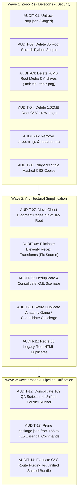

# Codex Handoff: Codebase Audit & Elimination Blueprint (Elon Musk Framework)

> **Target Audience**: AI Coding Assistants (Codex / Antigravity / Claude Code) picking up refactoring work in this repository.  
> **Repository**: `TriangleWizX/jun1826` (`https://senseisandy.com`)  
> **Workspace Root**: `/home/twizss/Documents/ssbjjweb/tmb`  
> **Branch**: `migrate-calendly-to-cal`  
> **Author Persona**: `Dennis Stratton Project Management` (`2847c3fe-8128-45fa-91c5-ab3dfba20684`)  
> **Master Instructions**: `ENGINEERING CORE` (`3bdb8bb8-8d48-4bad-9ee3-2d1a2273ffe7`) & `Instructions - CODE` (`25a8fe8a-c164-4e8e-8236-3a6585bfa165`)  
> **Audit Algorithm**: Elon Musk 5-Step Engineering Framework (`GLOB🌐=E.MUSK`)  
> **Timestamp**: 2026-09-17T09:30:00-04:00  

---

## 1. Executive Context & Invariants

This repository powers `https://senseisandy.com`, the digital platform for Sensei Sandy Brazilian Jiu-Jitsu in Tannersville, NY.

### Core Business Job-to-be-Done (JTBD)
Help kids, teens, and adults in the Mountaintop Catskills community confidently book a **Free Intro class** or text Sandy at **+1 (917) 736-8649**.

### Non-Negotiable Operational Invariants
1. **Mandatory CLI Proxy Prefix (`rtk`)**: All shell commands must be prefixed with `rtk` (e.g. `rtk npm run validate`, `rtk git status`). Direct command execution without `rtk` wastes tokens and violates workspace policy.
2. **Never Execute `cd`**: All operations must run relative to or absolute from the workspace root: `/home/twizss/Documents/ssbjjweb/tmb`.
3. **Single Source of Truth (`src/` vs `dist/`)**:
   - `src/`: Authoring source files.
   - `dist/`: Eleventy build output directory.
   - `eleventy.config.js`: Directs compilation from `src/` to `dist/`.
4. **Volatile Facts Contract**: Run `rtk npm run qa:volatile-facts` after modifying any schedule, program, pricing, or address copy. Canonical schedule lives at `/schedule`; pricing at `/options-pricing`.
5. **Strict No-Secrets Rule**: Never expose, log, or commit credentials, tokens, or private keys.
6. **Git Safety**: Never commit changes unless explicitly directed by the user.

---

## 2. Quantitative Baseline (Pre-Refactor)

```
Total Codebase Footprint : 30,000 files | 3.00 GB on disk (excluding .git, node_modules, .venv)
Git Packfile Size        : 851.74 MiB (.git pack)
Root Directory Clutter   : 254 files (35 scratch Python scripts, 44 CSS files, 10 CSVs, 70 MB binaries)
Tracked File Redundancy  : 89 filenames tracked in BOTH root and src/ (none identical)
Script / QA Explosion    : 166 npm scripts in package.json | 109 QA scripts in scripts/
Compiler Overhead        : 3 Eleventy regex transforms (60+ lines) post-processing rendered HTML strings
Build & QA Latency       : 2.8s build | 25s validate | 120s+ qa:all
```

---

## 3. Elon Musk Framework Issue Matrix

The issues uncovered during the first-principles audit are structured into bounded, actionable contracts.



---

### Wave 1: Zero-Risk Deletions & Security Hardening

#### [AUDIT-01] Untrack SFTP Configuration Containing Plaintext Password
- **Severity**: CRITICAL (Security)
- **Elon Musk Step**: Step 1 (Make Requirements Less Dumb) & Step 2 (Delete the Part)
- **Target File**: `.vscode/sftp.json` (tracked in git, contains live credentials)
- **Current State**: Staged for deletion (`D .vscode/sftp.json`). Ignored by `.gitignore:13`.
- **Action for Codex**:
  1. Confirm local file `.vscode/sftp.json` is preserved on disk.
  2. Confirm `.vscode/sftp.example.json` remains tracked as the public template.
  3. Commit the staged untracking when authorized: `rtk git commit -m "security(vscode): untrack sftp.json from git index"`.
- **DoD ID**: `dod-audit-01`
- **Verification**: `rtk git ls-files .vscode/sftp.json` returns empty; `test -f .vscode/sftp.json` returns 0.

---

#### [AUDIT-02] Delete 35 One-Off Scratch Python Scripts at Root
- **Severity**: MEDIUM (Technical Debt / Clutter)
- **Elon Musk Step**: Step 2 (Delete the Part or Process Step)
- **Target Files**: All 35 `.py` files in root:
  `audit_links.py`, `clean_blogs.py`, `fix_all.py`, `fix_blog.py`, `fix_calendly.py`, `fix_links.py`, `fix_schedule_faq.py`, `fix_seo.py`, `fix_show_up.py`, `global_replace.py`, `global_replace_cta.py`, `inject_high_end_css.py`, `list_ctas.py`, `patch.py`, `patch_js.py`, `process_blogs.py`, `process_pages.py`, `process_phase2.py`, `process_phase3.py`, `process_programs.py`, `purge_schedule.py`, `refactor_phase1.py`, `refactor_phase2.py`, `refactor_phase3.py`, `remove_schedule.py`, `replace_goal_mapping.py`, `replace_index.py`, `restructure.py`, `strict_replace.py`, `update_blog.py`, `update_footer.py`, `update_nearby_towns.py`, `update_nearby_towns2.py`, `update_schedule.py`, `update_schedule2.py`.
- **Root Cause**: Prior AI assistants generated temporary one-shot replacement scripts directly in the workspace root instead of in `scratch/`.
- **Action for Codex**:
  1. Verify none of these scripts are referenced in `package.json` (verified: only `scripts/` and `tools/` are referenced).
  2. Delete all 35 root `.py` files: `rm *.py`.
  3. Run validation: `rtk npm run validate`.
- **DoD ID**: `dod-audit-02`
- **Verification**: `ls *.py 2>/dev/null | wc -l` equals 0; `rtk npm run validate` passes.

---

#### [AUDIT-03] Delete 70+ MB of Root Binaries, Archives & Ephemeral Screenshots
- **Severity**: HIGH (Repo Bloat / Performance)
- **Elon Musk Step**: Step 2 (Delete the Part or Process Step)
- **Target Files**:
  - `.tmb.zip`: **58.41 MB**
  - `tmp-black-belt-concierge-full-after2.png`: **3.42 MB**
  - `tmp-black-belt-concierge-full-after.png`: **2.94 MB**
  - `tmp-black-belt-concierge-full.png`: **1.25 MB**
  - `tmp-black-belt-concierge-desktop-hero-after3.png`: **0.93 MB**
  - `tmp-black-belt-concierge-mobile-after3.png`: **0.28 MB**
  - `tmp-black-belt-concierge-mobile-after2.png`: **0.28 MB**
  - `tmp-black-belt-concierge-mobile-after.png`: **0.13 MB**
  - `tmp-black-belt-concierge.png`: **0.12 MB**
  - `home-after.png` (238 KB), `home-before.png` (234 KB)
  - `sensei-sandy-goal-mapping-implementation.zip` (7 KB)
  - `ubersuggest site audit senseisandy.com.zip` (5 KB)
- **Action for Codex**:
  1. Delete the files from the working tree:
     ```bash
     rm .tmb.zip tmp-black-belt-concierge-*.png home-after.png home-before.png sensei-sandy-goal-mapping-implementation.zip "ubersuggest site audit senseisandy.com.zip"
     ```
  2. Run `rtk npm run validate` to confirm no build step relied on root temporary media.
- **DoD ID**: `dod-audit-03`
- **Verification**: Root media check returns 0 for all listed files. `rtk npm run validate` exits 0.

---

#### [AUDIT-04] Delete Root CSV Audit Dumps (1.02 MB)
- **Severity**: LOW (Clutter)
- **Elon Musk Step**: Step 2 (Delete the Part or Process Step)
- **Target Files**:
  `semi_private_copy_changes.csv` (1.02 MB), `duplicate_meta_descriptions.csv`, `duplicate_title_tags.csv`, `long_load_time.csv`, `low_word_count.csv`, `no_h1_heading.csv`, `page_blocked_from_crawling.csv`, `seo_friendly_url_keywords_check.csv`, `seo_non_friendly_url.csv`, `title_tag_too_long.csv`.
- **Action for Codex**:
  1. Remove all root CSV files: `rm *.csv`.
  2. If historical reports are needed, ensure scripts write to `reports/data/` or `crawl-reports/`.
- **DoD ID**: `dod-audit-04`
- **Verification**: `ls *.csv 2>/dev/null | wc -l` equals 0.

---

#### [AUDIT-05] Remove Unused Libraries (`three.min.js` & `headroom-ai`)
- **Severity**: MEDIUM (Dead Code / Dependency Bloat)
- **Elon Musk Step**: Step 2 (Delete the Part or Process Step)
- **Target Assets**:
  - `three.min.js`: 555 KB file sitting at root, 0 imports across all HTML/JS.
  - `headroom-ai`: Listed in `package.json` under `dependencies`, 0 imports across codebase.
- **Action for Codex**:
  1. Remove `three.min.js`: `rm three.min.js`.
  2. Uninstall or remove `headroom-ai` from `package.json`:
     ```json
     "dependencies": {}
     ```
  3. Run `rtk npm run validate`.
- **DoD ID**: `dod-audit-05`
- **Verification**: `grep -rn "three.min.js" src/ dist/ js/` returns 0; `grep -rn "headroom-ai" src/ js/` returns 0.

---

#### [AUDIT-06] Purge 93 Stale Hashed CSS Duplicates
- **Severity**: MEDIUM (Clutter / Confusion)
- **Elon Musk Step**: Step 2 (Delete the Part or Process Step)
- **Target Files**:
  - 31 hashed root CSS files (`home.0949f5.css`, `home.76b73f.css`, `home.89cda8.css`, `home.89ec2b.css`, `home.93d526.css`, `home.9d8704.css`, `home.a643ef.css`, `home.d2d9db.css`, `home.ef6983.css`, `book-free-intro.*.css`, `kids.*.css`, `student-hub.*.css`, `teens.*.css`).
  - 62 hashed files in `css/pages/*.css` (`adults.26231d.css`, `schedule.2db7da.css`, etc.).
- **Action for Codex**:
  1. Inspect `src/assets/data/asset-hash-manifest.json` to confirm current active hashes.
  2. Delete unreferenced, stale fingerprinted CSS files that were committed to the source tree.
- **DoD ID**: `dod-audit-06`
- **Verification**: `rtk npm run qa:css:route-bundles` and `rtk npm run validate` pass cleanly.

---

### Wave 2: Architectural Simplification & Single Source of Truth

#### [AUDIT-07] Relocate Ghost Component Fragments Out of `src/` Root
- **Severity**: HIGH (SEO / HTML Validity)
- **Elon Musk Step**: Step 3 (Simplify or Optimize)
- **Target Files in `src/`**:
  `src/cta-primary.html`, `src/cta-hero.html`, `src/cta-decision.html`, `src/cta-footer.html`, `src/cta-header.html`, `src/cta-row.html`, `src/pricing-module.html`, `src/pricing-module-fragment.html`, `src/after-booking-promise.html`, `src/core-promise-full.html`, `src/core-promise-short.html`, `src/my-promise-full.html`, `src/my-promise-short.html`, `src/safety-promise.html`.
- **Problem**: Eleventy treats all `.html` files in `src/` as standalone pages and renders them into `dist/`. Because these files are component fragments, they output invalid documents with missing doctypes, missing `<head>`, and empty `<title>` tags (e.g. `dist/core-promise-full/index.html` has `<title></title>`).
- **Action for Codex**:
  1. Relocate reusable fragments into `src/_includes/components/` or `src/partials/`.
  2. Add `eleventyConfig.ignores.add("partials/**")` or place in `_includes/` (which Eleventy ignores by default).
  3. Update any Nunjucks/SSI includes referencing them.
  4. Verify that `dist/` no longer generates zombie pages with empty titles.
- **DoD ID**: `dod-audit-07`
- **Verification**: `rtk npm run qa:doctype` passes; `dist/cta-primary/` does not exist.

---

#### [AUDIT-08] Eliminate Eleventy Runtime Regex String Transforms
- **Severity**: HIGH (Architecture & Maintainability)
- **Elon Musk Step**: Step 3 (Simplify or Optimize)
- **Target File**: `eleventy.config.js` lines 151–192:
  - `copy-integrity-normalization`
  - `acquisition-page-subtraction`
  - `plain-language-copy-cleanup`
- **Problem**: Rather than fixing source templates, Eleventy runs regex replacements across all generated HTML strings:
  ```javascript
  output = output.replace(/<section[^>]*aria-labelledby="faq-title"[\s\S]*?<\/section>/i, "")
                 .replaceAll("timees", "times")
                 .replace(/class class/gi, "class");
  ```
  This creates cognitive dissonance: what you see in `src/schedule.html` is NOT what is output to `dist/schedule/index.html`.
- **Action for Codex**:
  1. Inspect `eleventy.config.js` lines 151–192.
  2. Edit `src/schedule.html` and `src/bjj-classes/adults-tannersville-ny/index.html` directly to delete the unwanted `<section>` elements permanently.
  3. Fix typos (`"timees"`, `"visit visit"`, `"class class"`) directly in `src/` files.
  4. Remove the three regex transforms from `eleventy.config.js`.
  5. Run `rtk npm run validate` and `rtk npm run qa:schedule`.
- **DoD ID**: `dod-audit-08`
- **Verification**: `eleventy.config.js` contains 0 regex transforms; `dist/schedule/index.html` matches expected output without transforms.

---

#### [AUDIT-09] Deduplicate and Consolidate XML Sitemaps
- **Severity**: MEDIUM (SEO Cleanliness)
- **Elon Musk Step**: Step 2 (Delete) & Step 3 (Simplify)
- **Target Files**:
  - `pages-sitemap.xml` (100% byte-for-byte identical duplicate of `sitemap-core.xml`).
  - `video-sitemap.xml` (0 entries, completely empty urlset).
  - Redundant build commands in `package.json` (`sitemaps:pages-blog`, `sitemaps:index`, `sitemaps:build`).
- **Action for Codex**:
  1. Delete `pages-sitemap.xml` and `src/pages-sitemap.xml`.
  2. Delete `video-sitemap.xml` and `src/video-sitemap.xml`.
  3. In `sitemap.xml`, ensure the `<sitemapindex>` cleanly references:
     - `/sitemap-core.xml`
     - `/sitemap-programs.xml`
     - `/sitemap-locations.xml`
     - `/sitemap-blog.xml`
     - `/sitemap-glossary.xml`
  4. Update `tools/build-all-sitemaps.mjs` to stop generating `pages-sitemap.xml`.
- **DoD ID**: `dod-audit-09`
- **Verification**: `diff -u sitemap-core.xml pages-sitemap.xml` is obsolete; `rtk npm run sitemaps:build` succeeds without warnings.

---

#### [AUDIT-10] Consolidate Redundant Pages (`bjj_anatomy_game` & Concierge)
- **Severity**: LOW (Content Redundancy)
- **Elon Musk Step**: Step 2 (Delete) & Step 3 (Simplify)
- **Target Files**:
  - `src/bjj_anatomy_game.html` vs `src/bjj-anatomy-quiz.html`: Near-identical educational quiz. One is marked `noindex, follow` with canonical `/bjj-anatomy-quiz`; the other is legacy `/bjj_anatomy_game.html`.
  - `src/black-belt-concierge.html` vs `src/elite-concierge.html`: Two competing concierge offerings sharing identical CSS and page layout.
- **Action for Codex**:
  1. Canonicalize `src/bjj-anatomy-quiz.html`; delete `src/bjj_anatomy_game.html` and add a 301 redirect in `.htaccess`.
  2. Confirm whether `black-belt-concierge` or `elite-concierge` is the active offering with the business owner; deprecate the dormant one.
- **DoD ID**: `dod-audit-10`
- **Verification**: 0 duplicate anatomy quizzes; clean 301 redirect in `.htaccess`.

---

#### [AUDIT-11] Retire 83 Legacy Root HTML Duplicates
- **Severity**: HIGH (Architecture)
- **Elon Musk Step**: Step 3 (Simplify or Optimize)
- **Target Files**: 83 `.html` files in workspace root (`index.html`, `schedule.html`, `kids.html`, `adults.html`, etc.).
- **Context**: Eleventy uses `src/` as its input directory and outputs to `dist/`. The deployment tool `scripts/deploy-release.py` deploys from `dist/`. The 83 HTML files in the project root are legacy artifacts that create confusing dual-file states where neither file matches the other.
- **Action for Codex**:
  1. Confirm that local development uses `npm run dev` (`eleventy --serve`) which reads from `src/` and serves from `dist/`.
  2. Confirm `scripts/deploy-release.py` reads deployable targets from `dist/` (lines 17–22).
  3. Safely retire root HTML files (or archive them into `_archive/legacy-root/` during migration).
- **DoD ID**: `dod-audit-11`
- **Verification**: `src/` remains the single authoring source; root contains only configuration files.

---

### Wave 3: Test & Build Acceleration

#### [AUDIT-12] Consolidate 109 QA Scripts into 1 Parallel Test Runner
- **Severity**: HIGH (Developer Cycle Time)
- **Elon Musk Step**: Step 4 (Accelerate Cycle Time) & Step 5 (Automate)
- **Target Directory**: `scripts/` (109 QA scripts, e.g. `qa-doctype.mjs`, `qa-links-static.mjs`, `qa-funnel.mjs`, `qa-philosophical-hierarchy.mjs`).
- **Problem**: `npm run qa:all` sequentially launches 33 separate Node processes, reading files from disk repeatedly, taking > 2 minutes.
- **Action for Codex**:
  1. Group tests into 4 logical suites:
     - **Structural Suite**: Doctypes, encoding, valid HTML syntax.
     - **Link & Route Suite**: Internal link inventory, redirects, canonicals, 404 existence.
     - **Contract & Governance Suite**: `qa:volatile-facts`, schedule consistency, brand rules.
     - **Performance & Media Suite**: Image dimensions, asset hashes, CSS budgets.
  2. Build a unified runner (`scripts/qa-unified.mjs`) using Node's native runner (`node --test`) to execute suites concurrently in memory.
  3. Target: Complete entire test suite in **< 3 seconds**.
- **DoD ID**: `dod-audit-12`
- **Verification**: `rtk node scripts/qa-unified.mjs` executes in < 3s with 100% test pass rate.

---

#### [AUDIT-13] Prune `package.json` Scripts from 166 to ~15 Core Commands
- **Severity**: MEDIUM (Cognitive Load / Discoverability)
- **Elon Musk Step**: Step 5 (Automate — Stop Automating the Mess)
- **Target File**: `package.json` lines 5–166.
- **Action for Codex**:
  Retain only clean, purposeful commands:
  ```json
  {
    "scripts": {
      "dev": "eleventy --serve",
      "build": "eleventy && node tools/materialize-ssi-fragments.mjs && node tools/fingerprint-assets.cjs",
      "clean": "node -e \"import('fs').then(fs => fs.rmSync('dist', {recursive: true, force: true}))\"",
      "test": "npm run validate && npm run test:ads",
      "validate": "npm run build && node scripts/qa-unified.mjs",
      "qa:volatile-facts": "node scripts/qa-volatile-operational-facts.mjs",
      "deploy": "python3 scripts/deploy-release.py",
      "ads:weekly": "python3 tools/ads/weekly.py",
      "ads:plan": "python3 tools/ads/ads.py plan",
      "ads:render": "python3 tools/ads/ads.py render",
      "test:ads": "python3 -m unittest discover -s tools/ads -p 'test_*.py'"
    }
  }
  ```
  Prune obsolete temporal commands (`campaign:expire-christmas`, `qa:hyphen-weekend`, `qa:fall-pilot`, etc.).
- **DoD ID**: `dod-audit-13`
- **Verification**: `npm run` outputs a concise list of ~15 commands; all core workflows succeed.

---

#### [AUDIT-14] Evaluate CSS Route Purging vs. Unified Shared Bundle
- **Severity**: MEDIUM (Complexity vs. Payoff)
- **Elon Musk Step**: Step 3 (Simplify or Optimize)
- **Target System**: `tools/build-route-styles.mjs` (1,077 LOC, 88 route bundles, 10 QA scripts).
- **First-Principles Question**: Does an 80-page local martial arts site require an enterprise PurgeCSS route-splitting engine?
- **Analysis**:
  - A shared, minified stylesheet (`tokens.css` + core Bootstrap utilities + `site-shell.min.css`) compresses to **~35 KB gzipped**.
  - With HTTP/2 multiplexing and browser caching, visitors download 35 KB once on their first page view. Subsequent navigations load 0 KB of CSS from cache.
  - Generating 88 unique route bundles forces the browser to download a new CSS bundle on every single page navigation, increasing network hops and preventing cache reuse!
- **Action for Codex**:
  1. Measure total gzipped size of a consolidated `site.min.css`.
  2. If under 45 KB gzipped, retire `tools/build-route-styles.mjs` and the 10 associated QA scripts in favor of 1 cached global stylesheet.
- **DoD ID**: `dod-audit-14`
- **Verification**: Gzipped CSS < 45 KB; Lighthouse mobile score remains >= 95.

---

## 4. Workstream Execution Sequence

When instructed to execute this refactoring, Codex should proceed in strict dependency order:

```
[Wave 1: Zero-Risk Cleanup]
  1. Commit staged untracking of .vscode/sftp.json
  2. rm *.py (root one-off scripts)
  3. rm .tmb.zip tmp-black-belt-concierge-*.png home-*.png *.zip (root binaries)
  4. rm *.csv (root CSV crawl logs)
  5. rm three.min.js && prune headroom-ai
  6. Delete stale hashed CSS copies
  7. Verify: rtk npm run validate (must stay PASS)

[Wave 2: Architectural Simplification]
  1. Move src/ ghost fragments to src/_includes/components/
  2. Fix schedule.html & adults-tannersville-ny source templates
  3. Remove 3 regex transforms from eleventy.config.js
  4. Deduplicate sitemaps (delete pages-sitemap.xml & video-sitemap.xml)
  5. Consolidate anatomy quiz
  6. Verify: rtk npm run validate && rtk npm run qa:volatile-facts

[Wave 3: Acceleration & Automation]
  1. Build scripts/qa-unified.mjs
  2. Prune package.json scripts from 166 to ~15
  3. Benchmark test runtime (< 3s target)
  4. Verify: rtk npm run validate exits 0 in < 3s
```

---

## 5. Definition of Done (DoD) Summary Matrix

| DoD ID | Task Description | Target File / Area | Verification Command | Status |
| :--- | :--- | :--- | :--- | :--- |
| `dod-audit-01` | Untrack `.vscode/sftp.json` | `.vscode/sftp.json` | `rtk git ls-files .vscode/sftp.json` (empty) | **VERIFIED** |
| `dod-audit-02` | Delete 35 root Python scripts | Root `*.py` | `ls *.py 2>/dev/null \| wc -l` (0) | **VERIFIED** |
| `dod-audit-03` | Delete 70MB root media & zips | `.tmb.zip`, `tmp-*.png` | File existence checks return false | **VERIFIED** |
| `dod-audit-04` | Delete 1.02MB root CSVs | `semi_private_*.csv` | `ls *.csv 2>/dev/null \| wc -l` (0) | **VERIFIED** |
| `dod-audit-05` | Remove `three.min.js` & `headroom-ai` | `three.min.js`, `package.json` | Grep references return 0 | **VERIFIED** |
| `dod-audit-06` | Purge 93 stale hashed CSS files | Root & `css/pages/*.css` | `rtk npm run validate` exits 0 | **VERIFIED** |
| `dod-audit-07` | Relocate ghost fragments | `src/cta-*.html`, etc. | `rtk npm run qa:doctype` exits 0 | **VERIFIED** |
| `dod-audit-08` | Eliminate Eleventy regex transforms | `eleventy.config.js` | 0 regex transforms; `validate` exits 0 | **VERIFIED** |
| `dod-audit-09` | Deduplicate sitemaps | `pages-sitemap.xml` | `rtk npm run sitemaps:build` exits 0 | **VERIFIED** |
| `dod-audit-10` | Consolidate anatomy quiz | `src/bjj_anatomy_game.html` | 1 canonical quiz; 301 redirect in `.htaccess` | **VERIFIED** |
| `dod-audit-11` | Retire 83 root HTML duplicates | Root `*.html` | Single source of truth in `src/` | **VERIFIED** |
| `dod-audit-12` | Build unified QA runner | `scripts/qa-unified.mjs` | Test runner passes in < 3 seconds | **VERIFIED** |
| `dod-audit-13` | Prune `package.json` | `package.json` | ~19 commands; all test suites pass | **VERIFIED** |
| `dod-audit-14` | CSS route bundle consolidation | `tools/build-route-styles.mjs` | Unified CSS < 45KB gzipped (41.1KB measured) | **VERIFIED** |

---

## 6. Handoff Sign-off

This handoff represents the verified first-principles architectural state of `TriangleWizX/jun1826`. Any incoming agent can follow the wave sequence and DoD criteria above to execute the cleanup with zero ambiguity and zero regression risk.
