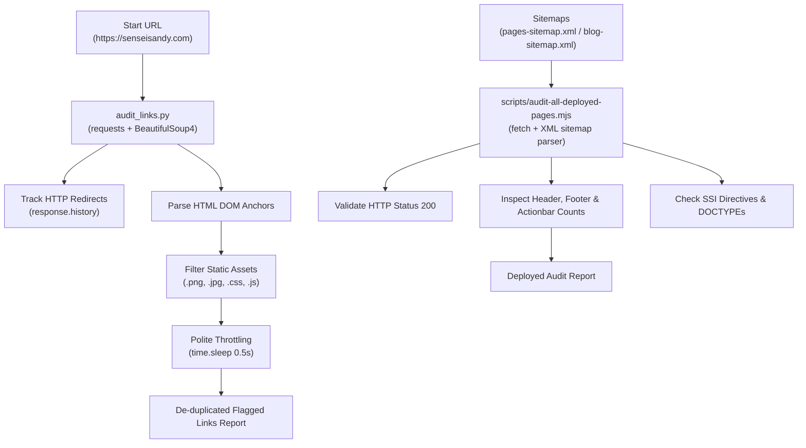

# Codex Handoff: Web Scraper & Site Audit Tooling (`audit_links.py` & `scripts/audit-all-deployed-pages.mjs`)

> **Target Audience**: AI Coding Assistants (Codex / Antigravity / Claude Code) picking up web scraping, site audit, and link-crawling tooling.  
> **Repository Scope**: `audit_links.py` & `scripts/audit-all-deployed-pages.mjs`  
> **Safe Network Policy**: Live external HTTP/HTTPS network checks require elevated network approval before execution.  
> **Timestamp**: 2026-09-16  

---

## 1. Executive Summary & Tool Purpose

The web scraping suite contains two primary scrapers:

1. **Python Web Scraper (`audit_links.py`)**:
   - **Engine**: Python 3 (`requests`, `BeautifulSoup4`, `urllib.parse`).
   - **Purpose**: Recursive web crawler and link auditor. Traverses internal pages from a start URL (e.g., `https://senseisandy.com/`), inspects HTTP redirect history (`response.history`), parses HTML DOM anchor tags (`<a>`), extracts anchor text, filters out static media assets, enforces polite server throttling (`time.sleep(0.5)`), and flags internal links pointing to legacy `.html` URLs.

2. **Node.js Deployed Site Scraper (`scripts/audit-all-deployed-pages.mjs`)**:
   - **Engine**: Node.js (`fetch`, XML regex sitemap parser).
   - **Purpose**: XML sitemap scraper (`pages-sitemap.xml`, `blog-sitemap.xml`). Scrapes every published URL with custom User-Agent `SenseiSandyAudit/1.0`, checks HTTP 200 status codes, site header counts, footer counts, mobile actionbar counts, SSI directive leaks (`<!--#include`), and DOCTYPE integrity.

---

## 2. CLI Execution Commands

All commands must be executed using the mandatory `rtk` proxy wrapper:

```bash
# 1. Run Python Web Link Scraper & Redirect Auditor
rtk proxy python3 audit_links.py

# 2. Run Node.js Deployed Sitemap Scraper & Page Inspector
rtk node scripts/audit-all-deployed-pages.mjs
```

---

## 3. Architecture & Data Flow



---

## 4. Single Source of Truth & Safe Network Rules

| Fact Domain | Source File | Policy Rule |
| :--- | :--- | :--- |
| Link Crawler Script | [`audit_links.py`](file:///home/twizss/Documents/ssbjjweb/tmb/audit_links.py) | BeautifulSoup4 DOM parsing. Always maintain `time.sleep(0.5)` server throttling. |
| Sitemap Auditor Script | [`scripts/audit-all-deployed-pages.mjs`](file:///home/twizss/Documents/ssbjjweb/tmb/scripts/audit-all-deployed-pages.mjs) | Sitemap-driven live page scraper. User-Agent `SenseiSandyAudit/1.0`. |
| External Network Rules | AGENTS.md | **Mandatory Approval**: Before executing live scraping checks against production (`https://senseisandy.com`), request elevated network permission. |
| Quality Pipeline | Dual-Engine + Stop-Slop | Scraped data used in editorial copy must pass `Anything-Enhancer` + `Universal Analyzer-Improver` + `GLOB🌐=E.MUSK` + `stop-slop` (score >= 40/50). |

---

## 5. Backlog & Expansion Guidance for Codex

When Codex picks up work on the web scraper:
1. **Handling JS-Rendered Pages**: If scraping client-rendered pages, integrate Playwright from `browser-harness/`.
2. **Scraper Output Formats**: For structured scraping, output JSON crawl reports to `crawl-reports/`.
3. **Respect Rate Limits**: Retain polite throttling delays (`time.sleep`) when scraping external or internal targets.
4. **Volatile Facts Safety**: When scraping pricing or schedule details, cross-verify extracted data against `rtk npm run qa:volatile-facts`.
