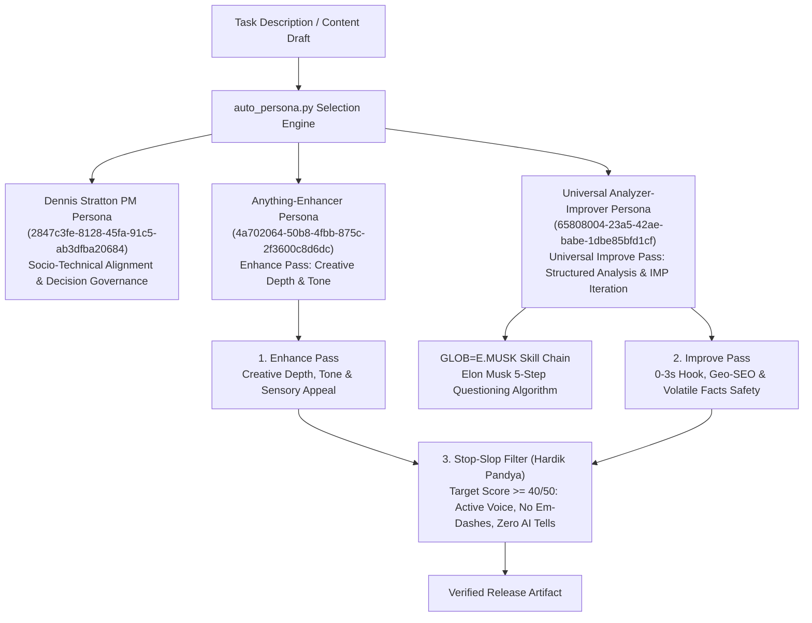

# Codex Handoff: Quality Governance, Persona Architecture & Suite Telemetry

> **Target Audience**: AI Coding Assistants (Codex / Antigravity / Claude Code) picking up this worktree.  
> **Repository**: `TriangleWizX/jun1826` (`https://senseisandy.com`)  
> **Branch**: `migrate-calendly-to-cal`  
> **Head Commit**: `0d80534` (`feat(near): compress nearby town pages and standardize conversion anchors`)  
> **Release Status**: `rtk npm run validate` PASSING (Exit Code 0) across all primary suites  
> **Timestamp**: 2026-09-16T00:32:00-04:00  

---

## 1. Governance & Quality Assurance Frameworks

### 1.1 Verified Persona Framework Architecture
This repository integrates persona prompts from the Indranet Persona Library (`assets/indranet-prompt-exporter/mcp/lib/auto_persona.py`) and anti-slop skills. Dedicated handoff available at [`assets/indranet-prompt-exporter/CODEX-HANDOFF-INDRANET.md`](file:///home/twizss/Documents/ssbjjweb/tmb/assets/indranet-prompt-exporter/CODEX-HANDOFF-INDRANET.md):



#### 1. Dennis Stratton (Project Management Persona)
- **UUID**: `2847c3fe-8128-45fa-91c5-ab3dfba20684`
- **Role**: Project management, socio-technical alignment, decision governance, risk transparency.
- **Contract**: Zero-waste context handoffs, unambiguous single sources of truth, runnable CLI verification commands.

#### 2. Anything-Enhancer (Genius Engine Persona)
- **UUID**: `4a702064-50b8-4fbb-875c-2f3600c8d6dc`
- **Source**: [`assets/indranet-prompt-exporter/exports/Anything-Enhancer---OptiMax/prompt.md`](file:///home/twizss/Documents/ssbjjweb/tmb/assets/indranet-prompt-exporter/exports/Anything-Enhancer---OptiMax/prompt.md)
- **Enhance Pass**: Triggers the `[EN]` command to unleash creative depth, sensory appeal, narrative resonance, parent reassurance, and safety walkthrough focus (*Start calm. Train smart.*).

#### 3. Universal Analyzer-Improver Persona
- **UUID**: `65808004-23a5-42ae-babe-1dbe85bfd1cf`
- **Source**: [`assets/indranet-prompt-exporter/exports/Universal-Analyzer-Improver/prompt.md`](file:///home/twizss/Documents/ssbjjweb/tmb/assets/indranet-prompt-exporter/exports/Universal-Analyzer-Improver/prompt.md)
- **Universal Improve Pass**: Conducts multi-step structured evaluation (`[STEP]`, `[KF]`, `[PC]`, `[WI]`, `[DB]`, `[IM]`, `[MC]`, `[cnsd]`), triggering iterative `[IMP]` enhancements for 0–3s hook retention, Mountaintop local SEO geo-intent keywords, friction-free CTAs, and `rtk npm run qa:volatile-facts` compliance.

#### 4. Stop-Slop Prose Filter (Hardik Pandya)
- **Source**: [`.agents/skills/stop-slop/SKILL.md`](file:///home/twizss/Documents/ssbjjweb/tmb/.agents/skills/stop-slop/SKILL.md) / [Hardik Pandya stop-slop](https://github.com/hardikpandya/stop-slop)
- **Prose Rules**: Enforces active human-subject voice, eliminates filler phrases/adverbs, breaks formulaic binary contrasts ("not X, it's Y"), bans em-dashes, varies sentence rhythm, and **requires a score floor of at least 40/50** across Directness, Rhythm, Trust, Authenticity, and Density.

### 1.2 Elon Musk 5-Step Questioning Algorithm (`GLOB🌐=E.MUSK` Skill Chain)
Embedded within the Indranet persona skillchain:

1. **Make Requirements Less Dumb**: Question every rule and assertion. Ensure requirements come with an accountable owner and rationale (e.g. Updating Category 1 QA suites so absent retired files skip gracefully rather than break the build).
2. **Delete the Part or Process**: Eliminate zero-byte CSS stubs, dead anchors, and duplicate schedule/pricing UI blocks. Rule: If you aren't adding back at least 10% of what you deleted, you didn't delete enough.
3. **Simplify or Optimize**: Keep layout structures clean, mobile-first, and dry (e.g. `tools/build-near-pages.mjs` keeping Eleventy source and root static files in lockstep).
4. **Accelerate Cycle Time**: Enforce mandatory `rtk` proxy wrapper across CLI tools to minimize dev latency and token cost by 60–90%.
5. **Automate**: Maintain continuous automated validation via `rtk npm run validate`, `rtk npm run qa:volatile-facts`, and `rtk npm run test:ads`.

---

## 2. Operational Invariants & Environment Rules

When operating in this codebase, always observe these invariants:

1. **CLI Proxy Prefix (`rtk`)**:
   - **Mandatory**: Always prefix CLI operations with `rtk` (e.g. `rtk npm run validate`, `rtk git status`).
   - Bypassing `rtk` risks hook mismatches and excessive token usage.
2. **Never Propose `cd`**:
   - Execute all commands relative to or absolute from the workspace root: `/home/twizss/Documents/ssbjjweb/tmb`.
3. **Eleventy Passthrough Asset Rule**:
   - Assets copied to `dist/` are configured in `eleventy.config.js`:
     ```javascript
     eleventyConfig.addPassthroughCopy({ "src/assets": "assets" });
     ```
   - Files placed in root `assets/` without placement in `src/assets/` will NOT automatically pass through to `dist/assets/`.
4. **Volatile Operational Facts Contract**:
   - Canonical schedule lives at `/schedule`; pricing lives at `/options-pricing`.
   - Run `rtk npm run qa:volatile-facts` after editing any program, schedule, or pricing copy.
5. **Safe Network Boundary**:
   - Live external HTTP/DNS requests are restricted to post-deploy suites and require explicit user authorization.

---

## 3. Completed Work & Tooling Handoff Summary

### 3.1 Pre-Existing QA Remediation (5-Commit Series)
- **Commit `fa04139c`**: Resolved youth intro JSON-LD schemas (`Course`, `SportsActivityLocation`), registered `/free-bjj-intro-tannersville-ny` in URL registry, removed expired summer copy.
- **Commit `66b41cb9`**: Aligned Category 2 editorial copy assertions across 10 QA suites (attendance policy, flexible access, student hub authority, brand pillars).
- **Commit `7d85779f`**: Handled retired files and historical CSV link fixtures gracefully in Category 1 QA suites.
- **Commit `3125eef1`**: Added missing Bootstrap SVG icons (`speedometer2`, `tag`, `grid`), updated fingerprinted CSS regex in `qa:class-family`, fixed image dimensions.
- **Commit `637b3a3c`**: Fixed route stylesheet references for legacy pages and permitted 0-byte purged CSS stubs in `qa:visibility` (906 checks passed).

### 3.2 `/bio` Personal Biography Restructuring
- Concise 588-word identity-led biography of Sensei Sandy Nunez.
- Structured narrative: Hero -> Coaching History -> Academy Origins -> Teaching Philosophy -> Closing Invitation.
- Verified against `qa:lineage:integrity`, `qa:stop-slop`, and `qa:volatile-facts`.

### 3.3 Nearby-Town Pages Compression & Standardization (`near/*`)
- Upgraded `near/template.html` and `src/near/template.html` with `.near-buttons` hero CTAs and `.ss-trip-card` commute blocks.
- Synchronized Eleventy and root static outputs via `tools/build-near-pages.mjs`.

### 3.4 Offline Ad Studio Tooling (`tools/ads/`)
- Dedicated handoff available at [`tools/ads/CODEX-HANDOFF-ADS.md`](file:///home/twizss/Documents/ssbjjweb/tmb/tools/ads/CODEX-HANDOFF-ADS.md).
- Offline ad generation and planning suite (`rtk npm run ads:weekly`, `ads:plan`, `ads:render`, `ads:swipe`, `ads:scaffold`, `test:ads`).

### 3.5 Indranet Prompt Exporter & Persona Manager (`assets/indranet-prompt-exporter/`)
- Dedicated handoff available at [`assets/indranet-prompt-exporter/CODEX-HANDOFF-INDRANET.md`](file:///home/twizss/Documents/ssbjjweb/tmb/assets/indranet-prompt-exporter/CODEX-HANDOFF-INDRANET.md).
- Router and prompt vault (`rtk proxy python3 assets/indranet-prompt-exporter/mcp/lib/auto_persona.py "<task_description>"`).

### 3.6 Web Scraper & Site Audit Tooling (`audit_links.py` & `scripts/audit-all-deployed-pages.mjs`)
- Dedicated handoff available at [`CODEX-HANDOFF-SCRAPER.md`](file:///home/twizss/Documents/ssbjjweb/tmb/CODEX-HANDOFF-SCRAPER.md).
- Python crawler `audit_links.py` and Node.js sitemap scraper `scripts/audit-all-deployed-pages.mjs`.

---

## 4. Current Test Telemetry (All Exit Code 0)

To execute the entire local validation battery in one command:

```bash
rtk npm run validate && \
rtk npm run qa:volatile-facts && \
rtk npm run qa:funnel && \
rtk npm run qa:first-visit && \
rtk npm run qa:image-contract && \
rtk npm run qa:class-family && \
rtk npm run qa:icons:local && \
rtk npm run qa:assets:canon && \
rtk npm run qa:css:assets:baseline && \
rtk npm run qa:visibility && \
rtk npm run test:ads
```

### Telemetry Status
| Suite | Command | Status | Coverage |
| :--- | :--- | :--- | :--- |
| Core Release Validation | `rtk npm run validate` | **PASS (Exit 0)** | Full build, links, doctypes |
| Volatile Facts Contract | `rtk npm run qa:volatile-facts` | **PASS (Exit 0)** | 1,056 files verified |
| Conversion Funnel | `rtk npm run qa:funnel` | **PASS (Exit 0)** | Attribution, URLs, firing |
| First Visit Acquisition | `rtk npm run qa:first-visit` | **PASS (Exit 0)** | 34 includes verified |
| Image Contract | `rtk npm run qa:image-contract` | **PASS (Exit 0)** | 927 images, 456 HTML files |
| Class Family Contract | `rtk npm run qa:class-family` | **PASS (Exit 0)** | 34 pages verified |
| Local Bootstrap Icons | `rtk npm run qa:icons:local` | **PASS (Exit 0)** | 168 SVG mappings |
| Managed Assets | `rtk npm run qa:assets:canon` | **PASS (Exit 0)** | 131 assets verified |
| CSS Assets Baseline | `rtk npm run qa:css:assets:baseline` | **PASS (Exit 0)** | Baseline debt within tolerance |
| UI Visibility & Route CSS | `rtk npm run qa:visibility` | **PASS (Exit 0)** | 906 checks passed |
| Ad Studio Suite | `rtk npm run test:ads` | **PASS (Exit 0)** | 30 tests passed |

---

## 5. Next Steps & Backlog for Codex

1. **Indranet Prompt Exporter Maintenance**:
   - Refer to [`assets/indranet-prompt-exporter/CODEX-HANDOFF-INDRANET.md`](file:///home/twizss/Documents/ssbjjweb/tmb/assets/indranet-prompt-exporter/CODEX-HANDOFF-INDRANET.md).
2. **Ad Studio Maintenance**:
   - Refer to [`tools/ads/CODEX-HANDOFF-ADS.md`](file:///home/twizss/Documents/ssbjjweb/tmb/tools/ads/CODEX-HANDOFF-ADS.md).
3. **Web Scraper & Audit Maintenance**:
   - Refer to [`CODEX-HANDOFF-SCRAPER.md`](file:///home/twizss/Documents/ssbjjweb/tmb/CODEX-HANDOFF-SCRAPER.md).
4. **Category 4 Post-Deploy Verification**:
   - Request elevated network permission to execute live network checks against `https://senseisandy.com`:
     - `rtk npm run qa:meta:live`
     - `rtk npm run qa:links:live`
     - `rtk npm run qa:blog:slash:live`
