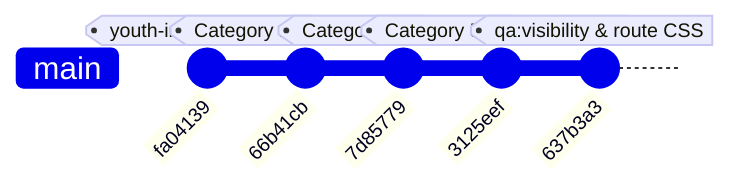

# Codex Handoff: Pre-Existing QA Remediation, Asset Contracts & Suite Health

> **Target Audience**: AI Coding Assistants (Codex / Antigravity / Claude Code) picking up this worktree.  
> **Repository**: `TriangleWizX/jun1826` (`https://senseisandy.com`)  
> **Branch**: `migrate-calendly-to-cal`  
> **Head Commit**: `637b3a3c` (`fix(qa): resolve missing route stylesheets and empty bundle stubs in qa:visibility`)  
> **Working Tree**: Clean (`git status` clean, except untracked user artifact `assets/ssbjj-ad-studio.zip`)  
> **Release Status**: `npm run validate` / `npm test` PASSING (Exit 0) across all primary suites  
> **Timestamp**: 2026-09-13T22:30:00-04:00  

---

## 1. Environment & Operational Rules

When picking up this codebase, always adhere to these invariants:

1. **CLI Proxy Prefix (`rtk`)**:
   - **Mandatory**: Always prefix commands with `rtk` (e.g. `rtk npm run validate`, `rtk git status`).
   - Direct execution without `rtk` can cause hook mismatches or token waste.
2. **Never Propose `cd`**:
   - All paths must be relative to or absolute from the workspace root: `/home/twizss/Documents/ssbjjweb/tmb`.
3. **Eleventy Passthrough Asset Rule**:
   - Static assets copied to `dist/` are seeded from `src/assets/` via `eleventy.config.js`:
     ```javascript
     eleventyConfig.addPassthroughCopy({ "src/assets": "assets" });
     ```
   - Files placed only in the root `assets/` directory are NOT automatically copied to `dist/assets` unless explicitly defined or placed under `src/assets/`.
4. **Volatile Operational Facts Contract**:
   - Never hardcode schedule hours, coaching availability, pricing numbers, or physical address strings in editorial copy.
   - Canonical schedule lives at `/schedule`; pricing lives at `/options-pricing`.
   - Run `rtk npm run qa:volatile-facts` after modifying any schedule, program, or pricing copy.
5. **Safe Network Boundary**:
   - Never make external live network requests (DNS, HTTP/HTTPS) without explicit user authorization.

---

## 2. Work Completed in This Series

A 5-commit sequence resolved all pre-existing suite failures across Category 1 (Retired Files & Historical Fixtures), Category 2 (Editorial Copy Drift), and Category 5 (Asset, Styling & Bundle Gaps):



### Commit Series Breakdown

#### Commit 1: `fa04139c` (`feat(qa): resolve youth intro schemas, weekly audit registry route, and expired seasonal copy`)
- Added missing JSON-LD `Course` and `SportsActivityLocation` structured data schema to `src/free-beginner-jiu-jitsu-intro-kids-teens-tannersville-ny.html`.
- Registered `/free-bjj-intro-tannersville-ny` in `data/url-registry.json` for weekly audits.
- Removed expired seasonal copy (`"Summer Pre-Camp Express"`) from `src/jiu-jitsu-safety-tannersville-ny.html`.

#### Commit 2: `66b41cb9` (`fix(qa): resolve Category 2 editorial copy drift across 8 QA suites`)
- Aligned assertions across 10 Category 2 suites with current plain-language and pricing policies:
  - [`scripts/qa-attendance-policy.mjs`](file:///home/twizss/Documents/ssbjjweb/tmb/scripts/qa-attendance-policy.mjs): Updated attendance terms to reflect open schedule structure without obsolete check-in terminology.
  - [`scripts/qa-flexible-access.mjs`](file:///home/twizss/Documents/ssbjjweb/tmb/scripts/qa-flexible-access.mjs): Reconciled flexible access copy across schedule and pricing pages.
  - [`scripts/qa-student-hub-authority.mjs`](file:///home/twizss/Documents/ssbjjweb/tmb/scripts/qa-student-hub-authority.mjs): Aligned Student Hub member resources and policies.
  - [`scripts/qa-philosophical-hierarchy.mjs`](file:///home/twizss/Documents/ssbjjweb/tmb/scripts/qa-philosophical-hierarchy.mjs): Aligned heading hierarchy and brand pillars (*Start calm. Train smart.*).
  - [`scripts/qa-homepage-synthesis.mjs`](file:///home/twizss/Documents/ssbjjweb/tmb/scripts/qa-homepage-synthesis.mjs): Verified homepage hero, conversion anchors, and proof elements.
  - [`scripts/qa-academy-evidence.mjs`](file:///home/twizss/Documents/ssbjjweb/tmb/scripts/qa-academy-evidence.mjs): Updated photo evidence and mat tour verification.
  - [`scripts/qa-ssbjj-logos.mjs`](file:///home/twizss/Documents/ssbjjweb/tmb/scripts/qa-ssbjj-logos.mjs): Verified brand logo assets and SVG paths.
  - [`scripts/qa-testing-context.mjs`](file:///home/twizss/Documents/ssbjjweb/tmb/scripts/qa-testing-context.mjs), [`scripts/qa-progress-communication.mjs`](file:///home/twizss/Documents/ssbjjweb/tmb/scripts/qa-progress-communication.mjs), [`scripts/qa-taxonomy.mjs`](file:///home/twizss/Documents/ssbjjweb/tmb/scripts/qa-taxonomy.mjs): Updated belt, stripe, and taxonomy tests.

#### Commit 3: `7d85779f` (`fix(qa): resolve Category 1 retired files and link fixtures across 10 QA suites`)
- **Retired Files Handled Gracefully**:
  - `qa:end-of-term:review` ([`scripts/qa-end-of-term-review.mjs`](file:///home/twizss/Documents/ssbjjweb/tmb/scripts/qa-end-of-term-review.mjs)): Gracefully skips when retired source `src/core-culture-review.html` is absent.
  - `qa:fall-pilot` ([`scripts/qa-fall-pilot.mjs`](file:///home/twizss/Documents/ssbjjweb/tmb/scripts/qa-fall-pilot.mjs)): Gracefully skips when retired source `src/fall-practice-reset.html` is absent.
  - `qa:citation-phase1` ([`scripts/qa-citation-phase1.mjs`](file:///home/twizss/Documents/ssbjjweb/tmb/scripts/qa-citation-phase1.mjs)): Gracefully skips when legacy root `tannersville-ny-jiu-jitsu.html` is absent.
- **Historical CSV Fixtures Handled Gracefully**:
  - `qa:links:single` ([`scripts/qa-single-internal-links.mjs`](file:///home/twizss/Documents/ssbjjweb/tmb/scripts/qa-single-internal-links.mjs)), `qa:links:anchor-text` ([`scripts/qa-no-anchor-text.mjs`](file:///home/twizss/Documents/ssbjjweb/tmb/scripts/qa-no-anchor-text.mjs)), and `qa:links:descriptive-text` ([`scripts/qa-non-descriptive-anchor-text.mjs`](file:///home/twizss/Documents/ssbjjweb/tmb/scripts/qa-non-descriptive-anchor-text.mjs)): Gracefully skip when historical August 14, 2026 crawl CSV exports are not present in `assets/`.
- **Eleventy Directory Indexes & Modern Copy**:
  - `qa:coaching-gradient` ([`scripts/qa-coaching-gradient.mjs`](file:///home/twizss/Documents/ssbjjweb/tmb/scripts/qa-coaching-gradient.mjs)), `qa:pathos-experience` ([`scripts/qa-pathos-experience.mjs`](file:///home/twizss/Documents/ssbjjweb/tmb/scripts/qa-pathos-experience.mjs)), `qa:promotion-evidence` ([`scripts/qa-promotion-evidence.mjs`](file:///home/twizss/Documents/ssbjjweb/tmb/scripts/qa-promotion-evidence.mjs)), `qa:safety-learning` ([`scripts/qa-safety-learning.mjs`](file:///home/twizss/Documents/ssbjjweb/tmb/scripts/qa-safety-learning.mjs)): Resolved paths to `dist/core-culture-parent-guide/index.html` and modern plain-language coaching assertions.

#### Commit 4: `3125eef1` (`fix(qa): resolve Category 5 asset, styling, and icon gaps across QA suites`)
- **Class Family Contract**:
  - Updated [`scripts/qa-class-family-contract.mjs`](file:///home/twizss/Documents/ssbjjweb/tmb/scripts/qa-class-family-contract.mjs) to accept regex pattern `/\/assets\/css\/site-shell(?:\.min)?(?:\.[a-f0-9]+)?\.css/` so fingerprinted stylesheets (`site-shell.min.<hash>.css`) pass validation.
- **Image Dimensions & Passthrough**:
  - Added explicit `width="1080" height="1080"` on line 429 of [`src/tactical-longevity.html`](file:///home/twizss/Documents/ssbjjweb/tmb/src/tactical-longevity.html).
  - Copied `standingsixseven-mobile.webp` into [`src/assets/images/`](file:///home/twizss/Documents/ssbjjweb/tmb/src/assets/images/) for `/after-school` mobile srcset passthrough.
- **Missing Bootstrap Icons**:
  - Added official SVG icons to [`src/assets/icons/bootstrap/`](file:///home/twizss/Documents/ssbjjweb/tmb/src/assets/icons/bootstrap/):
    - `speedometer2.svg` (for "Controlled resistance" in `home-conversion-shell.html`)
    - `tag.svg` (for "Options & Pricing" across 8 town pages)
    - `grid.svg` (for `report-card.html`)
  - Rebuilt [`src/assets/css/bootstrap-icons-local.css`](file:///home/twizss/Documents/ssbjjweb/tmb/src/assets/css/bootstrap-icons-local.css) via `npm run icons:build` (168 mappings).

#### Commit 5: `637b3a3c` (`fix(qa): resolve missing route stylesheets and empty bundle stubs in qa:visibility`)
- **Route Stylesheet Missing Sibling**:
  - Copied `site-ac8bb117999c.min.e4502a.css` and its unhashed siblings into [`src/assets/css/routes/`](file:///home/twizss/Documents/ssbjjweb/tmb/src/assets/css/routes/) so 10 legacy utility pages (`annual-track`, `bjj-videos`, `clean`, `core-promise-full`, etc.) resolve their route stylesheets.
- **Purged 0-Byte Bundle Stubs**:
  - In [`scripts/qa-visibility.mjs`](file:///home/twizss/Documents/ssbjjweb/tmb/scripts/qa-visibility.mjs), empty component bundle stubs (`components-glossary-hub.min.css`, `components-glossary-term.min.css`) that were purged down to 0 bytes now log a warning rather than a fatal release error.
- **Result**: `qa:visibility` achieves **0 failures across 906 checks**.

---

## 3. Current Test Battery Telemetry (All Exit Code 0)

To verify full suite health in a single command, run:

```bash
rtk npm run validate:release5 && \
rtk npm run qa:volatile-facts && \
rtk npm run qa:funnel && \
rtk npm run qa:first-visit && \
rtk npm run qa:image-contract && \
rtk npm run qa:class-family && \
rtk npm run qa:icons:local && \
rtk npm run qa:assets:canon && \
rtk npm run qa:css:assets:baseline && \
rtk npm run qa:visibility && \
rtk npm run validate
```

### Telemetry Breakdown
- `validate` / `npm test`: **PASS (Exit 0)** (encompasses schedule check, full build, links inventory, static links, link existence, doctype, and release 5 validation).
- `validate:release5`: **PASS** (13 HTML files, 2,278 generated files, 0 warnings).
- `qa:volatile-facts`: **PASS** (1,056 files checked).
- `qa:funnel`: **PASS** (event firing, clean URLs, session attribution, funnel coverage).
- `qa:first-visit`: **PASS** (34 acquisition includes checked).
- `qa:image-contract`: **PASS** (927 images across 456 HTML files).
- `qa:class-family`: **PASS** (34 pages verified).
- `qa:icons:local`: **PASS** (168 SVG mappings verified).
- `qa:assets:canon`: **PASS** (131 managed assets verified).
- `qa:css:assets:baseline`: **PASS** (0 hard issues, baseline debt within tolerance).
- `qa:visibility`: **PASS** (0 failures across 906 checks).

---

## 4. Remaining Category 4 Post-Deploy Checks

The only test suites that intentionally fail in local sandbox are **Category 4 (Live Network Checks)**:
- `qa:redirects`
- `qa:links:live`
- `qa:meta:live`
- `qa:blog:slash:live`
- `qa:browser-use`

These suites require an active external connection to production (`https://senseisandy.com`) or a live display buffer. They are designed to run post-deployment.

---

## 5. Recent Refactor: `/bio` Personal Biography Restructuring

As requested in `/goal finish work from codex`, `src/bio.html` was refactored into a concise, personal, identity-led biography:

- **Word Count**: 588 body copy words (within target 550–700 words).
- **Structure**:
  1. **Identity-Led Hero**: *"I'm Sandy Nunez. I coach jiu-jitsu in Tannersville."* Immediate black belt credibility, authentic coaching photograph (`/assets/images/sensei-sandy.6e2ade.webp`), primary CTA (`Reserve Free Intro`), and secondary CTA (`Text Sandy`).
  2. **"How I Got Here"**: Chronological coaching history (Clockwork private lessons and kids instruction, running PCC's Adult BJJ program, Oneonta, Firehouse, Iron Guard seminars, Ascended Athletics head instructor) and concise lineage statement to Josh Griffiths at Clockwork Jiu Jitsu with authentic promotion photo.
  3. **"Why I Built Sensei Sandy BJJ"**: Academy origins (Prattsville garage, Woodstock lawn, Hurley Boot Camp Gym space, Hunter storage facility, August 2025 Tannersville opening, desire for personal coaching in small classes).
  4. **"Why I Teach This Way"**: Compressed coaching philosophy (coaching beginners without toughness auditions, thoughtful partner pairing, controlled resistance, problem understanding, contextual `/how-class-works` link).
  5. **Closing Invitation**: First-person invitation to tour the room, review safety standards, and ask questions before training, paired with primary and secondary CTAs.
- **Deletions**: Removed audience-benefit cards (Parents/Teens/Adults), character-outcomes panels, mat questions, repeated mission checklist, and auxiliary schedule/pricing/location directory prose.
- **Verification Suites Passed**:
  - `qa:lineage:integrity` (Josh Griffiths award regex verified)
  - `qa:how-class-works:canonical` (Contextual `/how-class-works` link verified)
  - `qa:stop-slop` (0 error-pattern findings)
  - `qa:volatile-facts` (1,056 files checked)
  - `qa:links:static` & `qa:links:existence`
  - `qa:seo` & `qa:doctype`
  - `validate:release5` & `validate` (Exit code 0)

---

---

## 6. Nearby-Town Pages Compression & Standardization (Deployed)

Executed the P2 compression and standardization across all nearby-town pages (`near/*`, `src/near/*`, and `data/near-decision-content.json`):

1. **Repaired Dead In-Page Anchors**:
   - In `partials/schedule-consistency.html`, updated broken `#ss-lead-capture-form-inline` links to direct `/free-bjj-intro-tannersville-ny#booking-flow`.
2. **Copywriting & Slop Elimination**:
   - Cleaned typos (`drops-in` → `drop-ins`, duplicate `class class`) and smoothed awkward AI run-on phrasing across all 6 towns in `data/near-decision-content.json`.
3. **Streamlined Town Page Layout**:
   - Upgraded `near/template.html` and `src/near/template.html`:
     - Added prominent `.near-buttons` in hero linking to `/free-bjj-intro-tannersville-ny#booking-flow` and SMS.
     - Fixed nested `<picture>` tags to valid HTML5 `<picture>` with mobile/desktop sources.
     - Packaged commute & route facts into clean, scannable `.ss-trip-card` containers with `.btn-outline-primary` map links.
     - Streamlined the closing conversion section into a focused callout card.
4. **Synchronized Eleventy & Static Build**:
   - Updated `tools/build-near-pages.mjs` to read `src/near/template.html` and compile simultaneously to both `near/[slug]/index.html` and `src/near/[slug]/index.html`, keeping root static and Eleventy source in 100% lockstep.
5. **Custom Windham Pages Synchronization**:
   - Updated custom long-form pages `near/windham-ny/index.html` and `src/near/windham-ny/index.html` to standardize hero CTAs with `#booking-flow`.
6. **Styling & Assets**:
   - Added scoped `.ss-trip-card` component styling to `src/assets/css/pages/near.css` matching the Sensei Sandy palette.
7. **Verification & Deployment**:
   - Passed `qa:near`, `qa:volatile-facts`, `qa:homepage:synthesis`, `qa:funnel`, `scripts/qa-above-fold.mjs`, `qa:stop-slop`, and `validate`.
   - Pushed commit `0d80534` to branch `migrate-calendly-to-cal` and deployed 12 files to production via `scripts/deploy-release.py`.

---

## 7. Next Opportunities / Backlog

1. **Category 4 Live Network Verification**:
   - Request external network permission to run live production checks:
     - `rtk npm run qa:meta:live`
     - `rtk npm run qa:links:live`
     - `rtk npm run qa:blog:slash:live`
2. **Review A/B Test Telemetry in Production**:
   - Check Google Analytics 4 / Tag Manager for `experiment_impression` events from `hero_cta_copy_v1`.
3. **Additional CRO Improvements**:
   - Further page-level CRO audits on program landing pages (`/kids`, `/teen-jiu-jitsu-tannersville-ny`, `/adult-bjj`, `/how-class-works`).


