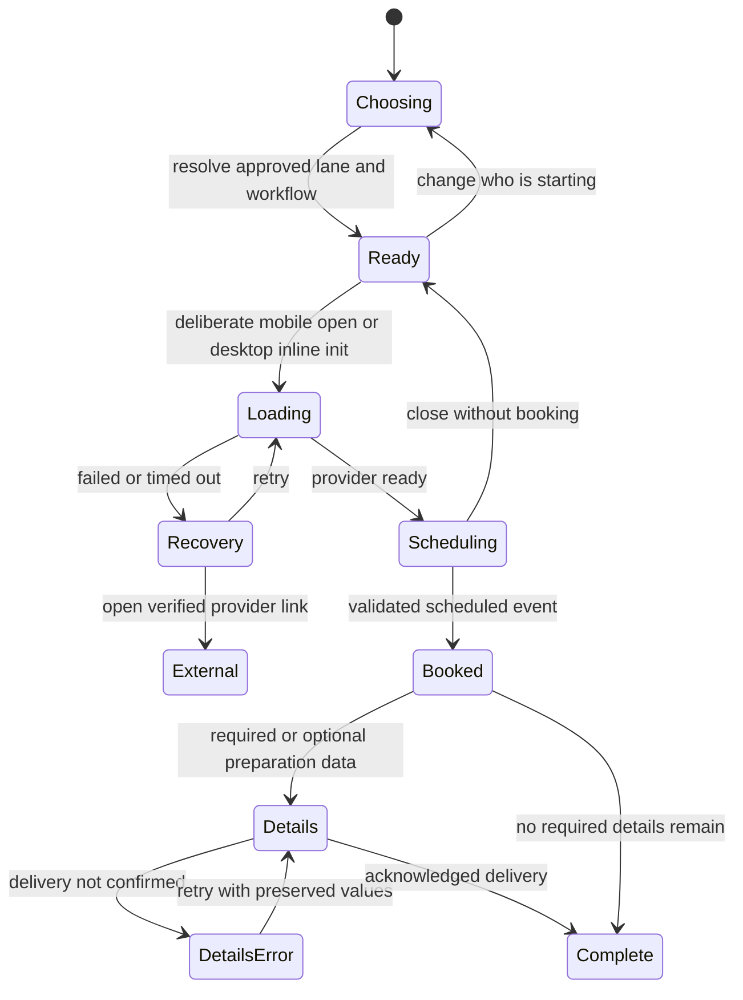

# Calendly conversion fixes: Free First Visit

<!-- Hallmark · pre-emit critique: P5 H4 E4 S5 R4 V4. Scores assess this planning artifact, not a rendered website. -->

Prepared September 10, 2026 from [CRO-CALENDLY-OPPORTUNITIES.md](CRO-CALENDLY-OPPORTUNITIES.md), with current local source inspection.

**Recommended order: establish the real appointment contract and release authority; repair routing, date preferences, mobile initialization, and confirmation ownership; then simplify the decision surface and test copy.** The primary outcome is a correctly routed, scheduled first visit that the visitor understands and attends. Calendar opens are diagnostic.

This is an implementation specification. It creates no website behavior, changes no provider settings, and authorizes no production release. The source opportunity document remains intact. Every opportunity, quick win, design concern, and T1–T6 experiment is mapped below. Open operational decisions are explicit work items for implementation; they do not prevent completion of this document.

## 1. How the skills work together

**Design read:** a beginner and parent conversion page in the existing Catskills Studio language, moving from a short Split Studio promise into a compact Workbench booking task. Preserve the established brand and Eleventy/Bootstrap implementation.

| Lens | Decision it contributes | Concrete consequence |
|---|---|---|
| Marketing: CRO + copywriting | Remove uncertainty about what the visitor is reserving before increasing persuasion. | Put appointment purpose, format, attendance, duration, and subsequent class step beside the scheduling action. |
| Marketing: offers | Reduce effort and uncertainty within the existing offer. | No new discount, guarantee, capacity promise, bonus, or scarcity device. Do not project conversion lift from generic skill benchmarks. |
| Marketing: analytics + A/B testing | Distinguish intent, provider booking, details receipt, fulfillment, and attendance. | One scheduled-conversion owner; explicit event migration; low-volume experiments can remain inconclusive. |
| Design taste | Make the important action easy to find; preserve the incumbent system. | Planning dials: `DESIGN_VARIANCE: 4`, `MOTION_INTENSITY: 2`, `VISUAL_DENSITY: 4`. No framework, font, icon, or motion-library replacement. |
| Hallmark | Use deliberate structure and consistent tokens. | Preserve one functional nested enclosure; replace repeated decorative micro-cards with clear grouping. Follow `design.md` over generic theme rotation or serif bans. |
| Impeccable: Shape | Specify complete tasks, states, feedback, and constraints before code. | A state model, mobile/desktop composition, keyboard behavior, failure recovery, and acceptance matrix are part of each fix. |

The hero is **Persuade**; the scheduler is **Operate**. Brand expression supports comprehension once the visitor is choosing a time. The deliverable itself is a **Read** surface. No new design-system or surface-brief files are needed for this documentation task.

Authority: [design.md](design.md) specifies Instrument Serif display, Lexend UI/body, forest primary action, the local Bootstrap Icon subset, named spacing, and functional double-bezel enclosures. Current CSS can override inline fonts, so an inline Geist declaration proves inconsistent source ownership, not that the browser necessarily renders Geist. Verify computed styles during implementation.

## 2. Evidence refresh: what changes the original recommendations

### Evidence limits

This review inspected current local source, existing `dist`, and the existing `/tmp/free-intro-live.html` file referenced by the input audit. It did **not** fetch production again, inspect authenticated Calendly settings, render a browser, submit a booking, or inspect student/customer records. That saved HTTP body is historical evidence; its presence is not a current live check. Existing `dist` is a snapshot, not a freshly reproduced build.

The graph already indexes this project. Graph search and the `initCalendly` snippet located the booking implementation; direct source inspection supplied template, configuration, CSS, literal-event, and current-byte evidence.

| Ref | Current local evidence | Consequence for the fixes |
|---|---|---|
| E01 | `eleventy.config.js:45–52,193–200`: `src` → `dist`; repository `js` is passed through; `src/assets` and `src/partials` are copied. | Route authoring belongs in `src/free-bjj-intro-tannersville-ny/index.html`; root route HTML is an older artifact. |
| E02 | Root route HTML contains **5** `data-profile` controls and no `booking-mobile` form field. Canonical source, existing dist, and saved HTTP body each contain **6** controls and that field. | The original audit's five-versus-six comparison is partly an authority mistake. Six-lane/details-form features already exist locally. Byte parity and current live behavior remain unproven. |
| E03 | `src/_data/free-intro.json`: general first step is a 15-minute Goal Mapping visit, normal clothes, no workout, class scheduled afterward. Combined youth visit is explicitly scoped to the specialized youth workflow. | A child/teen label alone cannot establish combined-visit entitlement or calendar format. Never apply youth class-arrival instructions to every Goal Mapping reservation. |
| E04 | `js/progressive-booking.js:125–177,205–230`: aliases map to profiles, but every profile reads the same `data-calendly-url`; template line 214 supplies Goal Mapping. | Verify actual event policy before choosing one calendar versus multiple calendars. Profile tracking is not event routing. |
| E05 | `js/progressive-booking.js:175–195,260–304`: a recognized query lane triggers `.click()` before `let mobilePopupShown` initializes; mobile `initCalendly` reads it. | Static control flow identifies a mobile deep-link temporal-dead-zone risk. Reproduce `?lane=kids`, `teens`, and `adults` before changing the UI. This is not merely an auto-popup preference. |
| E06 | Template lines 393–400 generate the first six class dates from a fixed period start, initially January 1, 2026; a later script rewrites period values. Non-`adult-beginner` profiles use Youth/Teen options. | Past dates, unmatched period keys, and service/family misclassification are correctness risks. A recurring schedule is not bookable inventory. |
| E07 | Template lines 409–419 calculate hidden avatar/economic lane at DOM ready. `leo`, family, and unresolved states lack an explicit semantic mapping. | Manual choices and later changes can leave blank/stale fields; query-selected service can be classified as youth. Build submission fields from current normalized state. |
| E08 | `js/progressive-booking.js:205–259,328–341`: `availability_displayed` fires before widget rendering and again on `event_type_viewed`; `appointment_selected` is used for both mobile open and actual date/time selection. | Current event totals cannot be read as one coherent funnel. Fix semantics before calculating drop-off. |
| E09 | `js/analytics-events.js:634–660` and the loaded `.min.js` handle scheduled messages, emit several completion names, and redirect to `/show-up-kit?booked=true` after one second. `layouts/base.njk:48` loads this asset. | The shared handler competes with the page's step-three form. Its scheduled-message branch also lacks an origin check. Give this route one verified completion controller. |
| E10 | Template lines 221–267 put name/mobile/email collection before the visible success heading; `confirmation/index.njk` says “request received.” Progressive JS can use a class preference as a fallback when event start time is absent. | Appointment booked, preference chosen, details received, and request awaiting confirmation need distinct states and labels. |
| E11 | `js/progressive-booking.js:27–40,227–239`: tracking includes `window.location.href`; arbitrary page query parameters are forwarded to Calendly. | Use an attribution allowlist and pathname-only analytics. Do not forward arbitrary query data or assume UTMs are automatically free of personal information. |
| E12 | Template lines 24–57,193–214; `book-free-intro.css:15–56,87–100`: competing type declarations, broad `!important` overrides, a single-column breakpoint, and a 320px minimum widget nested within padded containers. | Repair styles at their actual owner; test usable interior width. Hiding root overflow does not prove scheduler controls fit. |

### Snapshot identifiers

SHA-256 values recorded from existing files, without rebuilding:

| File | SHA-256 |
|---|---|
| `free-bjj-intro-tannersville-ny/index.html` | `27852c7cbd2cc1dbffe3b71f2c3dee36a958fca2a3509afdbbdd82c39842f63b` |
| `src/free-bjj-intro-tannersville-ny/index.html` | `ebe530604cd846f0e0b577f703b4b80dbdc098a147702ea2238f3e1506ffd921` |
| `dist/free-bjj-intro-tannersville-ny/index.html` | `58c181db7e59511627b7ebf9313153e55007f6cba217deb549c0676d0ade8601` |
| Historical `/tmp/free-intro-live.html` | `8940dae41d41ec7be110a41315944a22244c2a0c4199bf9d70e83204479a90c1` |

Source and generated HTML naturally have different hashes. Source-to-build equivalence is proven by reproducible generation and semantic checks; generated-to-uploaded equality can be proven by exact hashes. Apache SSI can make the HTTP response differ from the uploaded HTML file.

## 3. Opportunity-to-fix coverage and order

Use the `CAL-` prefix to avoid collisions with the separate CRO-00–CRO-10 simplification scaffold under `docs/conversion`.

| Input opportunity | Implementation tickets | Priority and reason |
|---|---|---|
| CRO-08: source/dist/live authority | CAL-00, CAL-11 | P0: establish the correct inputs and a reviewable release. |
| CRO-01: appointment clarity | CAL-01, CAL-02, CAL-06 | P0: prevent misleading booking and attendance instructions. |
| CRO-05: lane/event mapping | CAL-02, CAL-03, CAL-04 | P0: preserve the intended appointment and correct operational fields. |
| CRO-04: mobile handoff | CAL-04, CAL-08 | P0 reliability; P1 visual refinement. |
| CRO-06: post-booking completeness | CAL-06, CAL-07 | P0: resolve competing confirmation behavior and data ownership. |
| CRO-07: measurement | CAL-07, CAL-10 | P0 contract; prerequisite to experiments. |
| CRO-02: choice burden | CAL-05 | P1: regroup only after mapping and recovery work. |
| CRO-03: availability uncertainty | CAL-03, CAL-05 | P1: truthful gate explanation; preview only if verified inventory supports it. |
| Visual/accessibility opportunities | CAL-04, CAL-08 | P1, except blockers preventing task completion are P0. |
| Marketing objections, proof, copy | CAL-01, CAL-09 | P1: place verified reassurance near the action. |
| T1–T6 | CAL-10 | P2: test uncertainty after correctness fixes. |

Dependency chain: **CAL-00 → CAL-01/02 → CAL-03/04/06/07 → CAL-05/08/09 → CAL-11 release gate → CAL-10 experiments.** Establish measurement definitions early; implement them alongside the repaired flow so there is a clean baseline before experimentation.

Priority is based on failure consequences and inspected code, not measured conversion losses. Lift, traffic volume, booking rate, and attendance baselines are unknown.

## 4. Detailed fixes

### CAL-00 — Establish the authoring and release authority

**Owner:** implementation/release maintainer. **Evidence:** E01–E02. **Dependency:** none.

1. Record a fresh `git status --short` and preserve unrelated changes. At this review's start, `.codegraph/daemon.pid` was modified and the opportunity document was untracked.
2. Name the authority chain: route template → `layouts/free-intro.njk` → `layouts/base.njk` and metadata components; canonical `_data`; repository `js`; page CSS under `src/assets`; Eleventy transforms; SSI materialization and fingerprinting.
3. Inventory every script actually emitted on this route, including shared analytics, goal-mapping helpers, and repeated bridge references. Record each listener's owner, loaded file, source/minified parity, and whether it changes navigation or forms. A `.min.js` suffix is not proof of current source parity.
4. Produce an isolated baseline build from the intended inputs. Compare route structure, scripts, forms, lanes, metadata, and stylesheet references against existing dist and the historical HTTP snapshot. Classify each difference as expected generation, obsolete artifact, intentional change, or unresolved drift.
5. Before release, obtain elevated network approval and refresh production HTML plus relevant assets. Record current remote bytes separately from historical evidence. Reconcile any newer production behavior before uploading.

**Acceptance:** a file-level source/output/deploy map exists; the same chosen inputs reproduce the candidate route and dependencies; no root HTML or old fingerprint is silently treated as the editor source. Current production drift is resolved before shipping. This document does not claim that gate passed.

**Rollback:** retain the exact pre-release remote route, changed JS/CSS, referenced fingerprints, and required fragments. Revert the complete scoped manifest, not just the page HTML. Do not broadly clean stale assets.

### CAL-01 — State the exact appointment before the visitor schedules

**Owner:** marketing + academy operations; implementation wires approved data. **Evidence:** E03–E04. **Dependency:** CAL-00 and event verification in CAL-02.

1. Document for each actual event: public label, free/paid status, duration, in-person/phone/video format, who attends, location source, clothing, and whether class occurs during that appointment.
2. Keep `free-intro.primaryCtaLabel` as the page CTA authority. Current data says “Reserve Your Free First Visit.” Use the shorter “See available times” for the scheduler action. No sitewide CTA rename is part of this fix.
3. Render the approved appointment summary from canonical data above scheduling. Replace runtime hero/confirmation strings that contradict it. The template, JS, metadata description, structured data, and subsequent instructions must tell the same story.
4. Separate the broad offer from the booked object: a free coached class may be included in the journey while the current calendar reserves the planning visit. Do not label a generic event “call” or “studio visit” until its format is verified.
5. Youth language follows the verified workflow, not just age/profile. Family and unsure confirmations stay neutral until routing resolves; do not default them to “your adult visit.”

**Proposed general-path copy, conditional on verified in-person format:**

> Meet Sandy for a free first-visit plan.
>
> Your appointment is a {{ free-intro.goalMappingDurationMinutes }}-minute visit in normal clothes. See the room, talk through your goals, and plan your coached first class with Sandy afterward.

Here and below, `{{ ... }}` is specification notation: map it to valid project template syntax during implementation. Do not publish placeholder tokens or duplicate volatile values into page copy.

**Youth rule:** only a verified specialized combined workflow may say the visit includes a class. Pull its attendance/clothing instructions from the approved youth authority. A general Goal Mapping event uses the general visit contract even when the visitor books for a child.

**Acceptance:** before opening Calendly, an adult and a parent can each identify the booked activity, attendees, length, format/location, and next step without explaining BJJ terminology. Comprehension review must include the actual provider event screen. “No card,” “no pressure,” and same-day training claims require matching operational evidence.

### CAL-02 — Normalize lanes without changing calendar or eligibility policy

**Owner:** operations approves mapping; implementation owns one resolver. **Evidence:** E03–E04, E07. **Dependency:** CAL-00.

The table below describes current local behavior and the proposed normalization. It does not approve alternate event URLs.

| Entry | Current profile | Current route calendar | Required resolution |
|---|---|---|---|
| Adult choice; `lane=adult` / `adults` | `adult-beginner` | Goal Mapping | General adult visit; verify provider duration and format. |
| Child choice; `lane=kids` | `child` | Goal Mapping | Decide from existing operational authority whether this is general planning or a specialized combined youth reservation. |
| Teen choice; `lane=teen` / `teens` | `teen` | Goal Mapping | Same verification, retaining the distinct teen audience. |
| Service choice; `lane=community-service` | `leo` | Goal Mapping | Preserve service recognition; never classify as youth because the profile differs from `adult-beginner`. No new eligibility rule. |
| Family choice | `family` | Goal Mapping | Establish whether one appointment covers a household and who attends. Do not assume multiple class seats. |
| Not-sure choice | `not-sure` | Goal Mapping | Verify neutral planning/help path; never fabricate age or entitlement. |
| `lane=family`, `lane=not-sure` | No current alias | No automatic selection | Proposed explicit aliases to existing choices, after their mapping is approved. |
| Missing lane | No preselection | Visitor chooses | Show the normal chooser. |
| Unsupported/malformed lane | No recognized alias | Visitor chooses | Explain that the link did not identify a starting path; keep neutral help visible. No silent adult default. |

1. Use one normalized audience/profile/workflow model for UI, calendar selection, confirmation, staff fields, and analytics. Keep legacy aliases as compatibility inputs.
2. Validate configured event URLs against approved HTTPS Calendly hosts and exact approved event paths. Query values may supply attribution, not override event host/path, eligibility, confirmation destination, or theme configuration.
3. Keep attribution lane separate from economic eligibility and participant count. Capture age category only if required to route; do not collect birth dates or private student information for analytics.
4. Generate hidden fields when state changes and immediately before submission. Do not compute them once at DOM ready. Do not infer the economic lane for family/unsure visitors.
5. Add a visible current choice and “Change who’s starting.” A lane change invalidates incompatible preferences and active calendar context, with an explanation if a time selection must be restarted.

**Acceptance:** every row is exercised through its final state, including direct links, manual choices, changes, reload, and malformed input. Provider event label matches approved appointment summary. Staff payload uses the same lane/workflow as the UI. Existing public booking URLs remain valid.

**Decision evidence needed:** actual provider event settings and operations approval of youth/family/service handling. Configuration elsewhere containing adult/youth Calendly links is evidence to investigate, not permission to replace the route's event URL.

### CAL-03 — Make class preferences truthful and non-destructive

**Owner:** schedule/operations authority + implementation. **Evidence:** E06; `syncCalendlyPreferences` reinitializes the widget. **Dependency:** CAL-01/02.

1. Distinguish **appointment availability** (Calendly) from **recurring class schedule** (`/schedule` and its canonical data) and **visitor preference**. Label preference UI “Class days that may work for you,” with “Sandy confirms your first-class plan.”
2. Replace fixed historical period starts and label-based matching with stable keys and canonical effective dates. Generate only future candidate dates in the academy timezone, applying schedule exceptions and cancellations. Do not infer recurring private availability.
3. Do not describe schedule-derived dates as “available” seats. If real booking inventory cannot be verified, display schedule preferences or link to `/schedule`; do not simulate a calendar preview.
4. Resolve adult/service, child, teen, family, and unsure choices explicitly. Family/unsure need help or a participant decision before a class preference can be meaningful.
5. Bind change handling so dynamically rendered adult checkboxes work. Do not retain checked values from hidden/incompatible fieldsets. Replace DOM-ready label rewriting that changes values used as keys.
6. Keep preferences optional unless operations establishes a necessity. The current `required` radio inputs sit outside the details form; this is not a reliable enforced prerequisite. If needed before scheduling, explain and validate at that transition with accessible errors.
7. Freeze the calendar's initialization inputs for an active booking attempt. Changing a non-routing preference must not destroy a chosen time or reload the iframe. For a real route change, ask the visitor to restart scheduling and clear only invalid state.

**Recovery copy:** “No class preferences are listed here. Check the current schedule or text Sandy for help.” This says nothing about Calendly slot availability.

**Acceptance:** date-boundary fixtures cover September 7, 10, and 14, 2026, plus a later date, timezone rollover, and a closed day; none offers a past candidate as current availability. Changing preferences preserves an active appointment selection. Run `qa:volatile-facts`, `qa:schedule`, and applicable temporal checks after implementation; do not loosen those checks to preserve stale labels.

### CAL-04 — Make mobile opening deliberate and initialization safe

**Owner:** implementation + accessibility reviewer. **Evidence:** E05, E08. **Dependency:** CAL-02; work alongside CAL-07.

1. Initialize all booking state, timers, DOM references, and provider message handlers before applying query-lane preselection. Remove reliance on a synthetic click before initialization completes.
2. Remove the 200ms automatic opening. On mobile, a resolved lane shows a stable appointment summary and a **See available times** control; query preselection reaches the same ready state without opening the provider.
3. Use one initialization owner. Audit shared `SSCalendly` behavior so removing a timer in progressive booking does not leave another auto-open path. Load/reuse provider assets once; guard repeated taps.
4. If assets are ready, a tap opens the Calendly overlay. If they are loading, show status and a usable direct-link fallback; do not rely on a delayed `window.open` retaining browser user activation.
5. On close, preserve the normalized lane and preferences and restore focus to the initiating control. No success event fires. Reopening must not create stacked overlays or duplicate listeners.
6. Keep an ordinary anchor to the verified event, labelled “Open calendar in a new tab,” plus the canonical Text Sandy link. A Calendly overlay and a browser popup are different mechanisms: test overlay focus/close and new-tab blocking separately.

**Acceptance:** recognized mobile deep links have no initialization exception and no automatic overlay; one deliberate interaction starts opening. Test 320/375/414px portrait, landscape, breakpoint resize, slow provider load, provider blocked, close/reopen, back navigation, and rapid double tap. Focus returns; valid context survives; no booking is counted on open/close.

**Provider limitation:** do not assume a documented close event exists. Verify the supported integration mechanism; use a tested provider adapter or a simpler explicit external-link handoff if a reliable overlay lifecycle cannot be implemented. Keep credentials out of browser code.

### CAL-05 — Reduce the first decision to three understandable routes

**Owner:** marketing + UX; operations reviews edge paths. **Evidence:** E02; input CRO-02/03. **Dependency:** CAL-01–04.

Proposed first question: **Who’s starting?**

| Primary option | Follow-up only when required | Preserved path |
|---|---|---|
| An adult | Optional service-recognition disclosure | Adult beginner and service |
| A child or teen | Child / teen choice if actual routing needs it | Child and teen |
| More than one person | Household/participant clarification only as needed | Family |

Keep **Not sure? Get help choosing** as a visible secondary action adjacent to the group, not hidden in an FAQ. It preserves `not-sure`. Service recognition remains discoverable under the adult path and direct service links remain supported.

1. Show at most three primary choices. With radio-style selection, provide one primary **See available times** action once required routing information is complete. Alternatively, action rows may advance immediately when they explicitly announce that behavior; do not mix selection and navigation semantics.
2. Say why the question exists: “Tell us who’s starting so we can explain the right first visit.” Only say “show the right calendar” if calendars genuinely differ.
3. Do not require a visitor arriving on a valid lane link to classify themselves again. Show the resolved choice and a clear change control.
4. Display child/teen branching and service recognition only when relevant. Do not collapse distinct operational paths just to reduce button count.
5. Explain commitment accurately: choosing a starting path does not reserve a time. Only the provider's successful booking does.

**Acceptance:** all six existing paths remain reachable, including keyboard and assistive technology. A normal visitor sees no more than three primary choices; help remains visible. Every nested choice has a back path preserving prior valid state. Compare choice abandonment and correctly routed bookings after a measured baseline; fewer buttons alone is not proof of improvement.

### CAL-06 — Give booking confirmation and details one coherent owner

**Owner:** operations defines record requirements; implementation owns state/navigation. **Evidence:** E09–E10. **Dependency:** CAL-01/02/07.

1. Appoint the route controller as owner of successful booking UI and navigation. Make shared analytics observational on this route; remove or suppress its competing one-second redirect here while preserving explicitly verified behavior elsewhere.
2. A valid scheduled event immediately shows the booking success heading **above** any details fields. A details error cannot undo the appointment or ask the visitor to book again.
3. Separate `appointment_start`, `appointment_timezone`, `class_preference`, `details_status`, and `workflow`. Never write a guessed class preference into a field displayed as the confirmed appointment time.
4. If the provider payload does not supply a reliable display time, reference the provider's confirmation: “Your appointment is booked. Use your Calendly confirmation for the date and time.” Do not assume the embed payload contains attendee details or `start_time`. If additional API retrieval is necessary, it belongs in an approved server integration, not a browser token.
5. Resolve the follow-up form's necessity and data ownership using the table below. Explain required follow-up before scheduling. If optional, visibly label it optional. Do not promise a field-free flow until staff requirements and provider capture are verified.
6. Choose one final page/state. The existing `/free-bjj-intro-tannersville-ny/confirmation/` also serves request-only submissions; preserve those semantics. A direct visit or `?booked=true` must not assert a verified reservation. Use trustworthy state/reference or neutral copy when proof is absent.
7. Prevent duplicate details submissions, retain entered values on recoverable errors, and announce inline errors. A timeout is “delivery not confirmed,” not automatically “not received.” Use server/provider idempotency if supported; a disabled button alone cannot guarantee exactly-once delivery.

| Field/outcome | Owner and proposed handling |
|---|---|
| Appointment date/time and identity | Provider booking record; safe reference for operations. No invented time from a preference. |
| Adult/guardian name and email | Verify Calendly capture first. Reuse through a supported secure integration; otherwise state why the details form needs them. Do not scrape cross-origin iframe contents. |
| Mobile number | Operations decides whether required for text follow-up; explain purpose and preserve input on failure. |
| Student name | Collect only where staff needs it; separate guardian from student. Never send it to analytics. |
| Lane and household/workflow context | Current normalized state, recalculated at submit. Family does not imply seat count. |
| Campaign/source | Validated attribution object, separate from lane. No full query string. |
| Class preference | Optional preference unless policy says otherwise; distinct from reserved appointment. |
| Waiver | Preserve existing route and verified on-site alternative. Make it the next action only when details requirements are complete or optional. |
| Successful details delivery | Server/provider acknowledgement, with its own state/event. Native submit or redirect URL alone is insufficient evidence. |

**Acceptance:** one provider booking produces one immediate confirmation; it remains visible beyond the current one-second redirect window. Required/optional details are clear. Failure/retry/back/reload/direct-confirmation visits never fabricate bookings or discard a valid one. Family and service instructions remain accurate. Staff can resolve booking and details to the same record through an authorized private reference.

### CAL-07 — Repair measurement and attribution without silently renaming contracts

**Owner:** analytics maintainer + implementation. **Evidence:** E08–E11. **Dependency:** CAL-00/02; define before behavioral experiments.

The input's proposed event names are logical stages, not authorization to rename existing events. `calendly_scheduled` already exists in shared analytics. Inventory loaded source and minified listeners, GTM/GA4 mappings if authorized, and operational events before selecting the single owner.

| Logical stage from input | Current local names/behavior | Required final trigger |
|---|---|---|
| `intro_viewed` | `intro_page_loaded` | One route exposure per defined page/visit scope; valid denominator independent of lane selection. |
| `lane_selected` | `lane_selected`, `lane_resolved`, `profile_selected` | Distinguish manual selection/change from query resolution; do not fire a new selection whenever preferences reload the widget. |
| `availability_viewed` | `availability_displayed` at init and `event_type_viewed` | A verified provider view can mean scheduler view, not proof of free slots. Use that precise definition; remove pre-render duplicates. |
| `calendar_opened` | Mobile `appointment_selected` with `interaction=calendar_open`; direct outbound events | Distinguish open intent from verified ready/open state and from external fallback click. Desktop inline does not require a popup click. |
| `time_selected` | `appointment_selected` on `date_and_time_selected` | Provider time selection only; not a booking. |
| `calendly_scheduled` | Shared `calendly_scheduled`, `booking_complete`, `booking_completed`, `book_intro_submit`; page `booking_submitted`, `booking_confirmed` | One accepted provider booking, one selected conversion owner. Compatibility events must not each count as a separate booking. |
| `details_submitted` | Native form submission; confirmation page `generate_lead`; other shared submit tracking | Successful details delivery acknowledged by server/provider; submit attempts and client validation are separate diagnostics. |
| `intro_confirmed` | `booking_confirmed` and request/visit events have different meanings | Define as staff fulfillment confirmation if needed; do not automatically equate it to provider scheduling. |

Implementation steps:

1. Write a migration crosswalk naming retained events, corrected trigger semantics, compatibility aliases, and the exact release date/version. Separate pre-fix and post-fix baselines rather than joining incompatible counts.
2. Accept only expected provider message types, validate exact trusted origin and payload shape, and bind messages to the active iframe/booking instance where supported. The shared scheduled-message listener needs the same checks as the route controller. Malformed, unrelated, and repeated messages must not redirect or count.
3. Dedupe scheduled conversion per actual provider booking/reference, including repeat messages, multiple listeners, reload, and details-page entry. Do not dedupe all bookings per session: a family may legitimately create two distinct reservations. Dedupe limitations without a durable provider reference must be documented and reconciled operationally.
4. Keep provider URIs, names, phone numbers, email, student details, form text, and appointment-detail storage out of analytics. An opaque attempt ID is only for an approved join; do not hash email and call it anonymous. Store private joins in authorized operational systems, with no booking-detail API credentials in the page.
5. Allowlist bounded campaign values (`utm_source`, `utm_medium`, `utm_campaign`, `utm_content`, `utm_term`, and approved campaign aliases); reject personal/free-text values. Record lane separately. Preserve incoming campaign attribution rather than replacing it with `utm_campaign=<profile>`; retain onsite placement in its own field. A provider-specific UTM limitation needs an explicit mapping decision.
6. Use pathname-only `source_path` and a controlled referrer/campaign representation. Include canonical lane, workflow/event type key, device class, attribution source, and experiment variant when active. Do not blindly forward page query parameters.
7. Respect the existing consent architecture. Scheduling must work when analytics is declined or blocked. An external-link booking without a usable embed signal is a measurement gap until provider reconciliation proves it, not a zero or inferred conversion.

**Acceptance:** a controlled booking emits exactly one counted scheduled conversion; a second distinct booking can count separately. Replayed messages and details receipt produce none. Lane/campaign survive changes and provider handoff without personal data in inspected analytics requests. Current scheduled, submitted, and attendance numbers are not claimed until this contract is verified.

### CAL-08 — Refine hierarchy, accessibility, and performance within the brand

**Owner:** frontend + accessibility review. **Evidence:** E12, `design.md`, input visual checklist. **Dependency:** agreed flow in CAL-01–06.

**Mobile composition:** compact heading → one appointment explanation → chooser or resolved-lane summary → primary scheduler action → short reassurance/help → supporting studio proof. Move the existing studio photograph and longer explanation below the first booking decision at small widths. Preserve meaningful content; do not remove factual material merely to shorten the hero.

**Desktop composition:** retain asymmetric promise/action columns. The action rail becomes the focal area when `#booking-flow` is reached. One shell/core enclosure groups the task; step headings and rules separate substeps. At 768px, verify the actual single-column layout and desktop-inline scheduler combination, not just phone and wide desktop.

| Concern | Concrete specification |
|---|---|
| Primary action | One dominant forest action per visible task state. Text Sandy and change/back remain clearly secondary. Never show an acquisition sticky CTA over a provider modal or success controls. |
| Typography | Resolve inline Geist/Inter and blanket Lexend overrides at their owners. Display roles use `--font-display`; controls/body use `--font-body`. Preserve upright headings; inspect computed styles rather than assuming source declarations win. |
| Enclosures | Keep the functional double-bezel shell required by the brand. Remove decorative interior card repetition. Do not interpret Hallmark's generic nested-card ban as permission to remove the locked enclosure system. |
| Accent | Forest primary action, paper/ink contrast, supporting colours only. Pass theme values through supported Calendly options; do not attempt cross-origin CSS injection. |
| Progress | Use actual interface stages, e.g. “Who’s starting → Choose a time → Booking confirmed.” If required details remain, name them as a remaining task. The real-world class journey is separate from UI progress. |
| Controls | At least 44×44px targets; visible selected state plus text/icon, not colour alone. Use a labelled native radio group for selection or clear buttons for actions. Keep existing `aria-pressed` correct if toggle buttons remain. |
| Focus | After a step change, focus the new heading; remove hidden step controls from keyboard navigation. On back, focus the prior selected control. On overlay close, return to its opener. Announce loading/errors with restrained live regions. |
| Motion | No auto-scroll/overlay on query preselection. Necessary transitions use opacity/transform only; instant focus ring; respect reduced motion. Audit `transition: all`, blur reveals, and delayed hide timers. |
| Interior width | Remove the padded-container conflict with `min-width:320px`; retain readable controls. At narrow widths prefer the planned explicit overlay/link action. Never “fix” clipped controls by hiding overflow. |
| Loading | Reserve appropriate widget space on inline layouts, show truthful status and fallback, and avoid indefinite blank 700px space on mobile. A timeout signals loading trouble, not no availability. |
| Assets | Preserve real studio image, alt text, intrinsic dimensions, and crop protection. Keep noncritical media lazy; avoid extra font, animation, icon, or booking packages. One provider asset loader. |
| CTA labels | Keep labels short enough for 320px and zoom. Do not shrink text or truncate meaning to satisfy a no-wrap preference. If accessibility at text zoom requires wrapping, readable complete labels take precedence. |

Eight-state review: default, hover on capable pointers, focus, active, disabled, loading, error, success. Apply relevant states to the component's behavior; static links do not need invented submission states. A booking success deserves explicit confirmation even though generic microinteraction guidance prefers silent success.

**Acceptance:** screenshots and interaction evidence at 320/375/414/768/1440px; 200% text zoom and 400% browser zoom/reflow; keyboard-only completion and overlay exit; a screen-reader pass; reduced-motion mode; no obscured focus, clipped controls, or horizontal page scroll. Verify text contrast ≥4.5:1 and necessary UI/focus contrast ≥3:1. Show one visible primary action in a representative mobile first viewport; record viewport height and sticky/header state rather than claiming “above the fold” from width alone.

### CAL-09 — Put truthful reassurance and message match at the decision

**Owner:** marketing/copy + operations for factual checks. **Evidence:** source objection map and existing studio/process content. **Dependency:** CAL-01/05.

The visitor's job is to choose a safe, manageable first step for themselves or their child. The working constraint is uncertainty plus effort. This is a hypothesis supported by the flow's complexity; no visitor research or funnel baseline currently proves it is the largest conversion constraint.

| Concern | Place and proposed response | Evidence condition |
|---|---|---|
| “Is this for beginners?” | Beside chooser: “Your first class is a coached learning experience.” | Preserve the established safety/Beginner Lane meaning and pace; do not imply guaranteed injury prevention. |
| “What am I booking?” | Appointment contract immediately above the calendar action. | CAL-01/02 verified event. |
| “What if the times do not work?” | Always-visible Text Sandy help beside provider/fallback. | Use `contact.smsHref`; no invented response-time promise. |
| “Who comes with my child?” | Short youth attendance line before scheduling and on confirmation. | Operations must confirm parent/guardian attendance; do not infer it. |
| “Will I need to train or buy?” | Explain clothing/workout and later class step for the actual workflow. | Canonical offer policy; no invented no-pressure or payment-card claim. |
| “What happens after booking?” | Required/optional details explanation before open; single next action after success. | CAL-06 field contract. |

Copy candidates, all conditional on the verified event:

| Placement | Candidate | Rationale |
|---|---|---|
| General-path headline A | “Plan your first visit with Sandy.” | Plain appointment purpose. |
| General-path headline B | “Meet Sandy before your first class.” | Separates meeting from class. |
| General-path headline C | “Find a first step that fits your week.” | Schedule concern; supporting line must identify the actual appointment. |
| Calendar CTA | “See available times” | Short, clear, fits mobile after appointment explanation. |
| Back | “Change who’s starting” | Visitor language rather than “profiles.” |
| Valid scheduled state | “Your first visit is booked.” | Immediate result without implying enrollment or class-seat reservation. |
| Required details, if approved | “Your appointment is booked. Send these details so Sandy can prepare for your visit.” | Separates booking success from remaining data task. |
| Optional details, if approved | “Want to add a detail for Sandy? This is optional.” | Removes ambiguity about completion. |

Use current process proof and the existing studio photograph first. The July product-marketing context contains review/member metrics, guarantee wording, and testimonials; it is a research pointer, not current proof. Verify provenance and approved usage before introducing a named quote or number. Do not add competitor claims from that document.

For message match, request authorized aggregate entry paths/UTM mix and anonymized pre-booking questions. Code themes such as beginner anxiety, parent attendance, schedule fit, and returning after a break. Keep search intent and referral/ad copy aligned with the same true appointment. Do not export private messages or identify children in the plan.

**Acceptance:** all copy has a stated source or is marked a test hypothesis; no invented reviews, urgency, guarantee, or availability. Keep natural Tannersville relevance and existing nearby-town links without keyword stuffing. The page answers one main question: what is my next appropriate first visit and how do I reserve it?

### CAL-10 — Run the six experiments with decision rules

**Owner:** marketing/analytics; operations supplies fulfillment outcomes. **Dependency:** CAL-11 for correctness baseline and each variant.

For the main booking test metric use **unique eligible visitors with a verified scheduled booking / unique eligible exposed visitors**, with exposure and outcome windows specified before launch. Count one converting visitor in that rate even if they book twice; keep total distinct bookings as a separate operational metric. Availability and open rates diagnose mechanisms. Assess fulfilled appointments and attendance after their scheduled dates have matured.

| Test | Recommendation and variants | Primary measure | Guardrails / decision |
|---|---|---|---|
| T1: six vs three groups | After repairs, compare current accessible six-path chooser with CAL-05 grouping, preserving all routes and identical appointment copy. | Scheduled-visitor rate | Lane mix, wrong routes, time to choose, assistance requests, fulfilled bookings, attendance. Reject a click gain paired with worse fulfillment. |
| T2: availability explanation | Compare two truthful concise explanations, or explanation versus omission only if the remaining UI is still understandable. No fake slot preview. | Scheduled-visitor rate | Lane resolution/open as diagnostics; back changes, help requests, errors. |
| T3: mobile manual vs automatic | Ship the initialization/control repair as baseline. Do not retain a broken or inaccessible auto-popup as an experiment control. If both are independently accessible and deliberately approved later, a separate comparison is possible. Prefer manual overlay versus explicit full-page provider handoff. | Scheduled-visitor rate on mobile | Close/reopen, fallback use, lost context, errors, provider-attribution coverage. Do not equate unobserved external bookings with failures. |
| T4: appointment contract copy | Compare A/B headline/support variants from CAL-09 with identical verified appointment facts. | Scheduled-visitor rate | “What did I book?” questions, misrouted visits, reschedules, attendance. |
| T5: one vs lane-specific events | Hold until operations establishes equivalent promises and fulfillment. If events differ operationally, this is a routing-policy decision, not a cosmetic A/B test. | Staff-fulfillable scheduled-visitor rate | Eligibility, duration/format, lane correctness, availability capacity, no-shows. |
| T6: optional vs required details | Hold until required information is available by another reliable method or operations permits omission. Test optional supplemental context versus an equally valid required preparation step; never remove indispensable contact handling silently. | Fulfillable scheduled-visitor rate | Missing staff fields, details receipt, follow-up time, unresolved requests, attendee confusion. |

Experiment procedure:

1. Collect a post-repair baseline with numerator/denominator counts, device/lane/source mix, provider outages, and staff-confirmed outcomes. Record missing/blocked analytics coverage.
2. Pre-register one hypothesis, one primary measure, minimum worthwhile effect, randomization unit, 50/50 allocation where appropriate, exposure window, conversion window, exclusion rules for staff/tests/bots, and guardrail stop rules. Maintain a stable assignment on repeat visits where permitted; document consent limitations.
3. Calculate sample size from the actual baseline and chosen effect using a two-sided 5% significance level and 80% power, or document another chosen method before launch. Do not copy generic sample counts or forecast lift from a skill table.
4. Run across complete comparable weekly cycles; continue to the precomputed sample and wait for attendance maturation. Do not stop for an early positive result. Halt for broken routing, fabricated availability, accessibility blockers, or evidence of corrupted booking data.
5. Report absolute counts, absolute percentage-point difference, relative change, uncertainty interval, missingness, and guardrails. Diagnose source/device imbalance and sample-ratio mismatch before interpreting results. Avoid declaring segment winners from tiny samples or repeatedly testing many outcomes without adjustment.
6. If traffic cannot support a useful powered test, run a small moderated task study and a clearly labelled observational rollout. Ask visitors to explain what they booked and complete the task. Pre/post differences are directional evidence affected by season, source mix, and availability; do not call them causal uplift.

No Search Console or revenue claim follows from local QA, successful upload, or more Calendly opens.

### CAL-11 — Validate and release a scoped candidate

**Owner:** implementation/release maintainer. **Dependency:** relevant CAL-00–09 work and owner decisions resolved.

Proposed change surface, subject to the authority inventory:

| Canonical input | Purpose | Generated/deploy consideration |
|---|---|---|
| `src/free-bjj-intro-tannersville-ny/index.html` | Appointment copy, grouping, preference UI, success/form order | `dist/free-bjj-intro-tannersville-ny/index.html` |
| `js/progressive-booking.js` | State initialization, normalized routing, manual mobile control, provider listener | Passed-through JS; inventory exact emitted reference and legacy dependencies. |
| `js/analytics-events.js` and existing minification input/process | Single conversion/navigation ownership | Loaded `js/analytics-events.min.js`; shared impact requires regression checks on other booking surfaces. |
| `src/assets/css/pages/book-free-intro.css` | Scoped visual/accessibility repairs | Existing minified page CSS and any emitted fingerprint/route bundle, generated by the established tools. |
| `src/free-bjj-intro-tannersville-ny/confirmation/index.njk` | Preserve request-only state; distinguish verified booking/details success | Confirmation route stays intentionally noindex. |
| `src/_data/free-intro.json`, canonical schedule/contact data | Read existing truth; change only if an explicitly approved factual contract requires it | Do not duplicate volatile schedule/address/phone values into editorial markup. |
| `src/assets/js/funnel-events.js`, shared Calendly helpers, QA/docs | Only if the verified listener inventory requires scoped integration changes | Preserve other forms/booking routes; source/minified parity and event crosswalk required. |

Do not mechanically edit every row. Select the smallest set required by the approved implementation; no dependency additions are anticipated. Do not run a broad minify/clean/deploy command over unrelated work.

Build/validation sequence for future implementation:

1. Save the baseline manifest and source diff. Build the intended changes in an isolated copy with the repository's existing build pipeline (`rtk npm run build`); it includes Eleventy, SSI materialization, and asset fingerprinting. Do not use a shared dirty `dist` as release proof.
2. Run relevant existing checks against their actual input layers: `rtk npm run qa:funnel`, `qa:first-visit`, `qa:terminology`, `qa:volatile-facts`, `qa:schedule`, and `qa:temporal` for changed schedule-sensitive content; `qa:youth-intro` if the specialized youth workflow is affected.
3. For UI/assets, run applicable `qa:css:minified`, `qa:css:assets`, `qa:css:design-contract`, `qa:assets:fingerprint:additive`, and `qa:assets:js-parity`. Verify the project's 20KB gzipped per-route CSS target without adding unrelated CSS work. Run relevant `qa:links:static`, `qa:links:existence`, `qa:seo`, and `qa:schema` checks. Record pre-existing failures separately.
4. Add meaningful focused tests for route initialization, normalized mapping, past-date exclusion, preference changes, event dedupe, untrusted messages, and competing redirects. Existing string-based gates cannot prove these behaviors. Do not weaken legacy assertions without documenting why they conflict with an approved contract.
5. Run the browser matrix below against the generated candidate. Inspect actual emitted/minified scripts. Use one batched desktop/mobile review, fix the concrete findings together, then one confirmation pass; avoid open-ended visual polishing.
6. Review page title, description, canonical, robots, one coherent H1, FAQ/other structured data, alt text, and internal links in generated HTML. Preserve the acquisition route's indexability and the confirmation page's deliberate noindex policy. Avoid creating indexable lane or experiment duplicates.
7. Prepare a manifest with exact changed bytes and rollback files. Production upload remains a separate authorized action; obtain elevated approval before external DNS/HTTP/remote checks. Then verify upload hashes, HTTP content/SSI behavior, and rendered interactions as separate evidence layers.

## 5. State model and failure behavior

The following names describe the proposed controller; they are not additional analytics event names.

An external booking may finish outside the page; do not synthesize `Booked` on return without trustworthy evidence. `Complete` means the defined web task is complete, not that the visit was attended. A reload without reliable booking state returns neutral instructions; it never reconstructs a reservation from `selected_class` or a query flag.

| Situation | Visitor-facing treatment | Measurement rule |
|---|---|---|
| Loading | “Loading appointment times…” plus fallback access | Loading/open intent only. |
| Provider load failure/timeout | “The calendar hasn’t loaded. Try again or open it in a new tab.” Text Sandy remains available. | Provider-error diagnostic; no booking or no-availability claim. |
| No suitable times | Keep provider's real state and “No time that works? Text Sandy.” | Separate help intent; zero slots only if verified by supported provider evidence. |
| Popup closed | Same summary, choice, and opening control | No conversion; record close only if reliably observed. |
| Unsupported lane link | “Choose who’s starting, or get help deciding.” | Invalid-lane diagnostic with bounded value, not raw input. |
| Scheduled, details pending | Show confirmation first and explain remaining task | Scheduled conversion already counted once. |
| Details validation fails | Label each error, focus first invalid field, preserve values | Attempt/validation diagnostic; no successful delivery event. |
| Details request times out | “We couldn’t confirm that your details were received. Your appointment is still booked.” | Delivery unknown; retry/reconcile without another reservation. |
| Direct confirmation visit | Neutral request/next-step information | No booking conversion from page load or URL alone. |
| Analytics blocked/storage unavailable | Booking and help still work; use provider confirmation for details | Record measurement limitations externally; never block booking on analytics. |

Calendly's official [parent-window event documentation](https://developer.calendly.com/api-docs/2d6c9df9b89de-notifying-the-parent-window), retrieved through Context7 during this review, supports provider view, time-selection, scheduled, and height-change notifications. It does not establish that the local wrapper can inspect slot inventory, scrape attendee fields, or infer a human-readable start time from every scheduled message. Verify actual supported payloads and provider integration options before coding those dependencies.

## 6. Acceptance matrix for implementation

These are **future gates**, not tests passed by this document.

| Gate | Required exercise | Passing evidence |
|---|---|---|
| G01 authority | Candidate rebuilt from the named inputs; current remote comparison before release | Input/output/deploy manifest and expected semantic diff; rollback bytes retained. |
| G02 all lanes | All CAL-02 table entries, manual and direct links, changed selections | Correct UI, approved event type, staff fields, and confirmation in each case. |
| G03 time truth | Current/future dates, expiry, timezone rollover, exceptions, no schedule inventory | No past/closed preference presented as availability; no preference mistaken for a reservation. |
| G04 mobile | 320/375/414px; portrait/landscape; slow/blocked assets; double tap; close/reopen | No auto-open/initialization error, clipped controls, lost context, or stacked overlays. |
| G05 desktop/tablet | 768/1440px; inline flow; resize across 768/992 breakpoints | Widget remains usable; preference change does not destroy selection; one active instance. |
| G06 accessibility | Keyboard, screen reader, selected state, back/focus return, text/browser zoom, reduced motion | Named controls, logical focus, recoverable errors, readable contrast, no hidden focus targets or sticky overlap. |
| G07 provider failure | Load timeout, script denied, no suitable times, external fallback | Truthful distinct messages, functional Text Sandy/direct link, no false booking. |
| G08 booking completion | Valid scheduled event, duplicate/replayed/untrusted event, second legitimate booking | One conversion per real booking; immediate stable confirmation; no shared redirect race. |
| G09 details | Invalid input, server rejection, timeout, retry, double submit, reload, direct confirmation | Appointment retained; data entry retained appropriately; only acknowledged details count; no false “booked” state. |
| G10 attribution/privacy | Campaign + lane links, changed lane, arbitrary query, blocked analytics/storage | Correct bounded attribution; no PII/full URL/provider record URI in analytics; booking works without tracking. |
| G11 SEO/links | Generated metadata/schema, primary/phone/text/schedule/waiver routes, confirmation noindex | Existing public URL and SEO intent preserved; every actionable link works. |
| G12 assets/performance | Emitted references, source/minified parity, slow mobile load, layout movement | No missing CSS/JS, duplicate provider initialization, new dependency, or unbudgeted CSS; measure actual CLS/load behavior. |
| G13 operational fulfillment | Authorized controlled test booking and details receipt | Correct event, attendee context, staff reference, and follow-up requirements. Do not reserve a real slot or submit test PII without an approved test arrangement. |
| G14 release evidence | Uploaded files, live HTTP, then rendered browser | Distinct remote-byte, HTTP/content, and interaction proof; conversion/attendance impact remains a later measurement. |

Existing `qa:funnel` checks root HTML markers and selected analytics fixtures. An empty hidden `#onsite-booking-form` can satisfy a marker check; it does not prove lead capture or the new details form works. `qa:first-visit` checks canonical policy and generated strings/links, not the provider appointment format. Both passing is useful baseline evidence with limited scope.

## 7. Practical implementation batches and decisions

| Batch | Scope | Reviewable result |
|---|---|---|
| A — Establish truth | CAL-00/01/02; event/field decision sheet | Source/deploy map, actual event mapping, approved attendance copy, current drift assessment. |
| B — Repair completion | CAL-03/04/06/07 | Correct future preferences, safe direct links/mobile opening, one completion owner, deduped instrumentation, reliable details state. |
| C — Simplify presentation | CAL-05/08/09 | Three primary paths, selected context/back control, short contract copy, token-consistent responsive flow. |
| D — Verify and release | CAL-11 and G01–G14 | Candidate manifest, local/browser results, scoped rollback plan, then authorized production evidence. |
| E — Learn | CAL-10 | Measured baseline, feasible registered experiment, counts and uncertainty, operations/attendance guardrails. |

The original six quick wins are all retained: appointment contract (CAL-01), truthful step heading (CAL-01), manual mobile open (CAL-04), persistent back/change control (CAL-02/05), visible selected choice (CAL-02/08), and failure/no-suitable-times recovery (CAL-03/04 and state table). They are small candidates for the relevant batches, not proven independent fixes: mobile opening and copy both depend on initialization and appointment truth.

Decisions to settle during Batch A:

1. For each lane, which existing event/workflow is operationally valid, and who attends? Does the general page truly enter the specialized youth workflow?
2. Which information must staff receive after Calendly, what does Calendly already collect, and can the existing provider integration deliver it reliably?
3. Which existing analytics event is the sole booking conversion, and what system supplies fulfillment/attendance truth?
4. Which confirmation behavior owns this route while preserving request-only forms and other Calendly users of shared analytics?

Do not guess those answers from marketing aspirations. All work needed to make the decision concrete—source mapping, candidate copy, event/field tables, implementation diff, and QA evidence—should precede any final release approval request.

## 8. Completion of this documentation task

**Created:** `CRO-CALENDLY-FIXES.md` only. No source, CSS, provider, deployment, or analytics settings were changed for this deliverable.

**Local checks run during this review:**

- `rtk npm run qa:funnel` — passed existing funnel checks.
- `rtk npm run qa:first-visit` — passed; 34 propagated acquisition includes reported.
- `rtk proxy node --check js/progressive-booking.js` — passed syntax validation; does not disprove the identified initialization-order risk.
- Current source/old-root/dist/historical-HTTP snapshot inventory — completed; counts and hashes above.
- Markdown coverage/link/script-name/source-reference checks — performed at handoff; these validate the specification, not the proposed website behavior.

**Not run:** fresh site build, rendered-browser interaction, current live HTTP/remote-byte checks, provider-account verification, form submission, controlled booking, analytics dashboard validation, or commercial/attendance measurement. Those are explicitly assigned future implementation gates.

The document is complete when every input opportunity and experiment has an actionable fix, source evidence, dependencies, acceptance criteria, and stated uncertainty. Website remediation is complete only when the applicable implementation gates pass; this plan does not mark any ticket as shipped.
