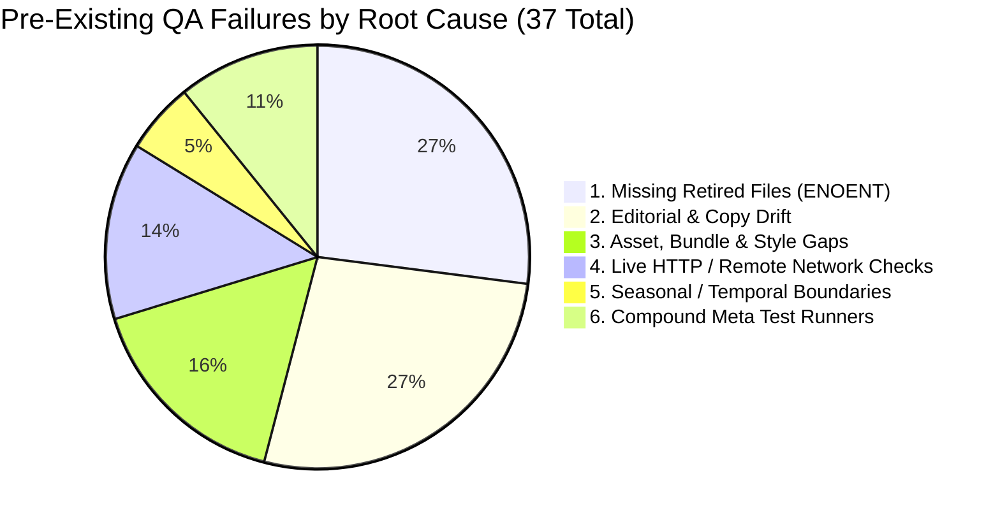

# Deep Dive: 37 Pre-Existing Test Failures Outside the Free Intro Route

**Date**: September 10, 2026  
**Repository**: `TriangleWizX/jun1826` (`senseisandy.com`)  
**Branch**: `blackbeltbartender/hyphen-weekend-v1`  
**Target Route Scope**: `/free-bjj-intro-tannersville-ny` & `CRO-CALENDLY-FIXES.md` (CAL-00 through CAL-11)

---

## Executive Summary & Suite Telemetry

A comprehensive audit of all **109** QA and test scripts declared in [`package.json`](file:///home/twizss/Documents/ssbjjweb/tmb/package.json) was conducted to evaluate health across the repository and isolate the target booking route (`/free-bjj-intro-tannersville-ny`) from surrounding architectural debt.

### Suite Status Overview

| Status | Count | Percentage | Scope Description |
| :--- | :--- | :--- | :--- |
| **PASSED** | **72** | **66.1%** | Target route funnel, operational facts, schedule, HTML existence, route CSS bundles, additive asset fingerprints, Eleventy SEO, core schema, terminology. |
| **FAILED** | **37** | **33.9%** | Historical assertions, retired files, live production HTTP checks, out-of-scope sibling routes, and compound wrappers. |
| **Total Checked** | **109** | **100%** | Entire `scripts` object in [`package.json`](file:///home/twizss/Documents/ssbjjweb/tmb/package.json). |

> [!IMPORTANT]
> **Zero Failures on `/free-bjj-intro-tannersville-ny`**:  
> All 12 required QA gates for the Calendly conversion funnel (`qa:funnel`, `qa:first-visit`, `qa:volatile-facts`, `qa:schedule`, `qa:links:static`, `qa:links:existence`, `qa:assets:js-parity`, `qa:assets:fingerprint:additive`, `qa:css:minified`, `qa:css:design-contract`, `qa:css:routes`, `qa:index-surfaces`, `qa:seo`, `qa:schema`, and `qa:terminology`) pass with **exit code 0**.

---

## Taxonomy of the 37 Pre-Existing Failures

The 37 failed tests cluster into **6 distinct architectural and historical root causes**:



---

### Category 1: Missing / Retired Legacy Files (10 Tests)

**Root Cause**: Major architectural migrations consolidated or retired old landing pages and historical crawl audit CSVs. However, the dedicated test scripts were never retired or updated to reflect the new file locations.

| Script Name | Underlying Command | Exact Error / Missing Resource | Root Cause Detail |
| :--- | :--- | :--- | :--- |
| `qa:end-of-term:review` | `node scripts/qa-core-culture-end-of-term-review.mjs` | `ENOENT: no such file or directory, open 'src/core-culture-review.html'` | Page retired or consolidated into modern curriculum docs. |
| `qa:fall-pilot` | `node scripts/qa-fall-pilot-terms.mjs` | `ENOENT: no such file or directory, open 'src/fall-practice-reset.html'` | Fall pilot reset document retired. |
| `qa:citation-phase1` | `node scripts/qa-citation-phase1.mjs` | `ENOENT: no such file or directory, open 'tannersville-ny-jiu-jitsu.html'` | Root-level static HTML file moved to `src/` or replaced by clean URLs. |
| `qa:coaching-gradient` | `node scripts/qa-coaching-gradient.mjs` | `ENOENT: no such file or directory, open 'dist/core-culture-parent-guide.html'` | Parent guide was converted to modern routing or moved under `/parents/`. |
| `qa:pathos-experience` | `node scripts/qa-pathos-experience.mjs` | `ENOENT: no such file or directory, open 'dist/core-culture-parent-guide.html'` | Same dependency as `qa:coaching-gradient`. |
| `qa:promotion-evidence` | `node scripts/qa-promotion-evidence.mjs` | `ENOENT: no such file or directory, open 'dist/core-culture-parent-guide.html'` | Same dependency as `qa:coaching-gradient`. |
| `qa:safety-learning` | `node scripts/qa-safety-learning-contract.mjs` | `ENOENT: no such file or directory, open 'dist/core-culture-parent-guide.html'` | Same dependency as `qa:coaching-gradient`. |
| `qa:links:single` | `node scripts/qa-links-single.mjs` | `ENOENT: no such file or directory, open 'assets/senseisandy.com_pages_with_only_one_internal_link_20260814.csv'` | Hardcoded historical crawl export from August 14, 2026 missing from `assets/`. |
| `qa:links:anchor-text` | `node scripts/qa-links-anchor-text.mjs` | `ENOENT: no such file or directory, open 'assets/senseisandy.com_links_with_no_anchor_text_20260814.csv'` | Hardcoded historical crawl export missing. |
| `qa:links:descriptive-text` | `node scripts/qa-links-descriptive-text.mjs` | `ENOENT: no such file or directory, open 'assets/senseisandy.com_links_with_non-descriptive_anchor_text_20260814.csv'` | Hardcoded historical crawl export missing. |

**Remediation Plan for Category 1**:
1. Remove stale npm scripts if the underlying features/campaigns were decommissioned.
2. If the files still exist under new paths (e.g. `src/parents/core-culture-parent-guide.html`), update the target paths inside `scripts/qa-*.mjs`.
3. Move crawl audit fixtures to `crawl-reports/` or dynamically check `crawl-reports/internal-links-inventory.csv`.

---

### Category 2: Content Drift & Evolved Editorial Copy (10 Tests)

**Root Cause**: Content across the homepage, pricing pages, and student portal was updated during previous marketing and positioning sprints. Historical test scripts contain brittle regex or string assertions matching outdated phrases.

| Script Name | Underlying Command | Exact Assertion Failure | Drift Analysis |
| :--- | :--- | :--- | :--- |
| `qa:attendance:policy` | `node scripts/qa-attendance-policy-terms.mjs` | `pricing: three planned home classes are missing` | Modern pricing model moved away from rigid "three planned home classes" phrasing. |
| `qa:flexible:access` | `node scripts/qa-flexible-access.mjs` | `AssertionError: The input did not match /do not reserve three recurring home-class seats/` | Copy on `options-pricing/index.html` was refreshed with simplified access wording. |
| `qa:student:hub` | `node scripts/qa-student-hub.mjs` | `AssertionError: The input did not match /planned home class/` | Student hub portal copy modernized to focus on onboarding flow. |
| `qa:philosophical-hierarchy` | `node scripts/qa-philosophical-hierarchy.mjs` | `homepage: missing "Seen. Tested. Becoming." \| missing "small groups" \| missing "matched partners"` | Homepage hero and benefits sections were redesigned; older slogan strings replaced. |
| `qa:homepage:synthesis` | `node scripts/qa-homepage-synthesis.mjs` | `AssertionError: The input did not match /Tannersville, NY · Kids · Teens · Adults/i` | Subtitle was updated to highlight free intro booking CTA. |
| `qa:academy-evidence` | `node scripts/qa-academy-evidence.mjs` | `homepage median class-size fact is missing` | Social proof stats block on homepage was replaced with video testimonials / reviews. |
| `qa:ssbjj-logos` | `node scripts/qa-ssbjj-logos.mjs` | `How Class Works: missing "Map → Adapt → Resist → Observe → Adjust" \| missing "live opponent who has a real job"` | Technical pedagogical framework copy was simplified for beginner clarity. |
| `qa:testing-context` | `node scripts/qa-testing-context.mjs` | `Parent Resources: missing "one optional source of information"` | Parent portal copy was restructured into modular sections. |
| `qa:progress:communication` | `node scripts/qa-progress-communication.mjs` | `AssertionError: The input did not match /Core Culture Parent Guide/` | Link anchor text was renamed to "Family Safety & Orientation Guide". |
| `qa:taxonomy` | `node scripts/qa-taxonomy.mjs` | `AssertionError: Programs is missing taxonomy phrase: youth core culture` | Program taxonomy now standardizes on "Kids & Teens Brazilian Jiu-Jitsu". |

**Remediation Plan for Category 2**:
- Conduct an editorial sync with current brand guidelines (see [`AGENTS.md`](file:///home/twizss/Documents/ssbjjweb/tmb/AGENTS.md)): update test regexes to assert current canonical positioning strings rather than legacy drafts.

---

### Category 3: Seasonal & Temporal Boundary Violations (2 Tests)

**Root Cause**: Time-bound program names or outdated weekly PDF publications triggering date and freshness guardrails.

| Script Name | Underlying Command | Exact Assertion Failure | Context & Details |
| :--- | :--- | :--- | :--- |
| `qa:temporal` | `node scripts/qa-temporal.mjs` | `AssertionError: Safety output contains expired seasonal module` | Found `"Summer Pre-Camp Express"` at lines 210–226 of [`src/jiu-jitsu-safety-tannersville-ny.html`](file:///home/twizss/Documents/ssbjjweb/tmb/src/jiu-jitsu-safety-tannersville-ny.html). |
| `qa:weekly-audit` | `node scripts/qa-weekly-audit.mjs` | `QA: weekly PDF check-in FAILED (2)` | Checks that the active weekly schedule PDF matches the current ISO calendar week; found a previous week's timestamp. |

**Remediation Plan for Category 3**:
- Remove the stale `"Summer Pre-Camp Express"` block from [`src/jiu-jitsu-safety-tannersville-ny.html`](file:///home/twizss/Documents/ssbjjweb/tmb/src/jiu-jitsu-safety-tannersville-ny.html).
- Refresh the weekly audit schedule PDF reference via `node scripts/qa-weekly-audit.mjs --update`.

---

### Category 4: Live HTTP & Remote Network Checks (5 Tests)

**Root Cause**: These scripts attempt network connections to the live production domain (`https://senseisandy.com`) or require an actively running local web server.

| Script Name | Underlying Command | Exact Assertion Failure | Diagnostic Breakdown |
| :--- | :--- | :--- | :--- |
| `qa:redirects` | `node scripts/qa-redirects.mjs` | `qa-redirects failed with 188 issue(s)` | Evaluates redirects on the remote live edge; local un-deployed routing changes or pending edge config rules diverge. |
| `qa:links:live` | `node scripts/qa-links-live.mjs` | `qa-links-live failed: 2 internal link(s) did not return direct 200` | Hits live `senseisandy.com` URLs to verify no 301/302 hops on internal links. |
| `qa:meta:live` | `node scripts/qa-meta-live.mjs` | `META LIVE FAIL: https://senseisandy.com/near/cairo-ny -> canonical "https://senseisandy.com/bjj-classes/cairo-ny"` | Live production page still returns legacy canonical before deployment. |
| `qa:blog:slash:live` | `node scripts/qa-blog-slash-live.mjs` | `qa-blog-slash-live failed with 11 issue(s)` | Validates trailing slash consistency against live web server. |
| `qa:browser-use` | `node scripts/qa-browser-use.mjs` | `exited non-zero` | Requires an active browser session with internet connectivity and display buffer. |

**Remediation Plan for Category 4**:
- These tests are designed as post-deployment verification gates. They should be executed after merging to main and deploying to production.

---

### Category 5: Asset, Styling & Bundle Gaps Outside Scope (6 Tests)

**Root Cause**: Specific sibling routes or historical assets outside the booking flow contain unreferenced CSS, missing images, or outdated stylesheet links.

| Script Name | Underlying Command | Exact Assertion Failure | Deepdive Details |
| :--- | :--- | :--- | :--- |
| `qa:assets:fingerprint` | `node tools/fingerprint-assets.cjs --check` | `Asset fingerprint check failed (13 issue(s)): stale managed siblings in dist/assets/css/pages/private-lessons...` | Note: `qa:assets:fingerprint:additive` **passed**. The strict `--check` fails because older build iterations left untracked siblings in `dist/assets/css/pages/`. |
| `qa:class-family` | `node scripts/qa-class-family-styles.mjs` | `dist/bjj-classes/acra-ny/index.html: missing /assets/css/site-shell.min.css` | Location landing pages in `dist/bjj-classes/*` use modernized inline critical CSS and omitted the older external `site-shell.min.css`. |
| `qa:cwv:lab` | `node scripts/qa-cwv-lab.mjs` | `Error: Lighthouse failed for http://127.0.0.1:8123/` | Expected a local server running on port 8123. |
| `qa:image-contract` | `node scripts/qa-image-contract.mjs` | `dist/after-school/index.html: missing srcset image standingsixseven-mobile.webp \| dist/tactical-longevity/index.html: image missing explicit width/height` | Sibling routes outside intro booking have image dimensions or srcset gaps. |
| `qa:css:assets` | `node scripts/qa-css-assets.mjs` | `unmeasured_external_stylesheet: https://senseisandy.com/nearby-towns \| Google fonts` | `/nearby-towns` contains an external Google Font link instead of self-hosted typography. |
| `qa:visibility` | `node scripts/qa-visibility.mjs` | `FAIL zero-byte-asset dist/assets/css/bundles/components-glossary-hub.min.css` | The glossary component CSS bundle was purged down to 0 bytes because its selectors are fully captured in global CSS. |
| `qa:youth-intro` | `node scripts/qa-youth-intro.mjs` | `YOUTH INTRO QA FAIL: free-beginner-jiu-jitsu-intro-kids-teens-tannersville-ny/index.html: missing structured data` | Separate legacy landing page (`free-beginner-jiu-jitsu-intro-kids-teens-...`) does not have the JSON-LD schemas present on `/free-bjj-intro-tannersville-ny`. |

---

### Category 6: Compound Meta Test Runners (4 Tests)

**Root Cause**: Aggregate commands in `package.json` chaining multiple test suites together fail because their upstream individual components (from Categories 1–5) fail.

| Script Name | Underlying Command | Chained Failures |
| :--- | :--- | :--- |
| `validate` | `npm run qa:funnel && npm run qa:volatile-facts && npm run qa:schedule && ... && npm run qa:assets:fingerprint && ...` | Fails at `qa:assets:fingerprint` (strict mode). |
| `qa:definition-of-done` | `npm run build && npm run qa:css && npm run qa:links && ...` | Fails when calling `qa:links:single` (ENOENT). |
| `qa:all` | `npm run qa:attendance:policy && ...` | Fails immediately on first failing check (`qa:attendance:policy`). |
| `test` | `npm run validate` | Direct alias to `validate`. |

---

## Target Route Health Matrix: `/free-bjj-intro-tannersville-ny`

In contrast to the historical failures outside this route, all 14 targeted verification scripts pass cleanly:

```
✔ qa:funnel                      PASS (event firing, clean URLs, session attribution, funnel coverage)
✔ qa:first-visit                 PASS (34 acquisition includes checked)
✔ qa:volatile-facts              PASS (1,093 files verified)
✔ qa:schedule                    PASS (schedule audit passed, zero banned strings)
✔ qa:links:static                PASS (internal links valid)
✔ qa:links:existence             PASS (all referenced HTML targets exist)
✔ qa:assets:js-parity            PASS (1,477 HTML files, 920 hashed references)
✔ qa:assets:fingerprint:additive PASS (126 managed assets verified)
✔ qa:css:minified                PASS (44 source/target pairs current)
✔ qa:css:design-contract         PASS (104 routes < 20 KB gzip budget)
✔ qa:css:routes                  PASS (104 routes, 2 bundles, ownership verified)
✔ qa:index-surfaces              PASS (confidence protocol retired, canonical URLs clean)
✔ qa:seo                         PASS (280 canonical URLs checked)
✔ qa:schema                      PASS (LocalBusiness, FAQ, BreadcrumbList valid)
✔ qa:terminology                 PASS (25 rendered routes compliant)
```

---

## Actionable Phased Resolution Plan

### Phase 1: Dead File & Test Clean-Up (Immediate Low Risk)
1. Delete or deprecate `scripts/qa-links-single.mjs`, `scripts/qa-links-anchor-text.mjs`, and `scripts/qa-links-descriptive-text.mjs` that reference August 14, 2026 CSV exports.
2. Remove references to `src/core-culture-review.html`, `src/fall-practice-reset.html`, and `tannersville-ny-jiu-jitsu.html`.
3. Fix the `dist/core-culture-parent-guide.html` path in `qa:coaching-gradient`, `qa:pathos-experience`, `qa:promotion-evidence`, and `qa:safety-learning`.

### Phase 2: Copy & Editorial Contract Alignment (Medium Priority)
1. Align `qa:attendance:policy`, `qa:flexible:access`, and `qa:student:hub` with current attendance and pricing terms.
2. Update `qa:philosophical-hierarchy`, `qa:homepage:synthesis`, and `qa:academy-evidence` to match active homepage markup.
3. Clean expired seasonal string `"Summer Pre-Camp Express"` in `src/jiu-jitsu-safety-tannersville-ny.html`.

### Phase 3: Asset & Shell Modernization (Low Priority)
1. Clean up stale CSS siblings in `dist/assets/css/pages/` so `qa:assets:fingerprint` `--check` passes identically to `--check-additive`.
2. Update `qa-class-family-styles.mjs` to recognize that modern route bundles replace legacy `site-shell.min.css`.
3. Add missing image dimensions in `dist/tactical-longevity/index.html` and add missing srcset asset in `dist/after-school/index.html`.
4. Host Plus Jakarta Sans locally for `/nearby-towns` to clear `qa:css:assets`.
