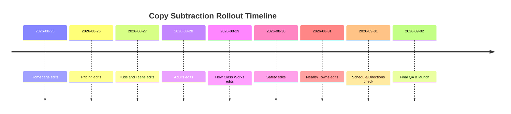

💼

# Executive Summary  
Most pages still use abstract language and filler that hide the core offers. We should say what each page *is* and who it’s for, up front. Cut jargon and fluff so each line tells the visitor a clear fact or action.  

## Page-by-Page Audit (Stop-Slop scores)  
**Homepage – 30/50.** Issues:  
- Heading “Kids Learn to Handle Hard Things.” is vague; it doesn’t say we teach jiu-jitsu.  
- Abstract line “Capability you can see…” uses jargon instead of plain actions.  
- Sections like “Seen. Tested. Becoming.” and “Recognize → Protect → Solve…” are philosophical, not clear steps.  
- We should say *what* we offer (e.g. “Jiu-Jitsu for kids…”) before selling ideas.  

**Pricing – 28/50.** Issues:  
- Long intro text about “Goal Mapping” and “Core Culture” postpones the actual prices.  
- Uses internal terms (“Core Culture”, “Goal Mapping”, “open-seat rescheduling”) without explanation.  
- Key numbers ($0 intro, $550, $715) should appear sooner. Right now they are buried after paragraphs.  
- Simplify to list packages (e.g. “3 classes/week, 12 weeks, $550”) then explain details.  

**Kids Page – 20/50.** Issues:  
- The headline is long: “Kids Jiu-Jitsu Where They Learn to Listen, Reset, and Keep Trying.” Good direction, but we can tighten it.  
- Lots of text about “listening, solving problems, partner care” repeated. Visitors just want to know class time, cost, and safety first.  
- Sections “What they are practicing…” lists abstract goals. We should boil it down to simple bullets (e.g. “Stop on a tap”).  
- Remove lengthy research paragraphs. Parents need concrete info (class time, cost, outfit, safety).  

**Teens Page – 22/50.** Issues:  
- Headline “Teen Jiu-Jitsu & Self-Defense” is okay, but the text below (“Recognize. Protect. Solve. Adapt. Express.”) is abstract.  
- Too much philosophy about mental growth. Teens likely want to know skills taught (e.g. escapes, falls) first.  
- The “Program overview” steps are clear but hidden below long paragraphs. We should highlight class schedule, safety, and outcomes at top.  

**Adults Page – 25/50.** Issues:  
- H1 “Sustainable Jiu-Jitsu for Adults” is vague. Better: “Beginner Jiu-Jitsu for Adults”.  
- First paragraphs focus on “long-term participation” and “joint-aware training”, which is jargon. We should say “No experience needed; start safe” upfront.  
- The “Grappling Only / Beginner Ready / Supportive / Stress Relief” lines are disjointed and not clearly worded.  
- Cut motivational blurbs and focus on how an adult first class works and what they learn.  

**How Class Works – 18/50.** Issues:  
- Very heavy on teaching philosophy (ADAPT, TEST, EXPRESS; Map→Adapt→Observe→Adjust). This is too deep for a visitor.  
- The page should simply list the 6 parts of class and say, “Each class is 60 minutes: 45 coached, 15 buffer”. The rest can go to a “coaching style” subpage.  
- The bullet “How to Organize Learning” and “How the Next Problem Is Chosen” are extraneous for CRO clarity. Remove or move them.  

**Safety Page – 30/50.** Issues:  
- Repeats safety points in multiple places. For example, “Safe, controlled rounds… Beginner-friendly pacing…” appears twice. Condense.  
- Long safety promise sections (“Safe Enough to Train Honestly”, “Supervised Training”) are okay, but could be bulletized and shorter.  
- The Day One flow (steps 1–6) is mostly clear but a few points repeat. Keep it tight.  

**Schedule – 40/50.** Issues:  
- Mostly factual schedule info; it’s clear.  
- One improvement: add a header like “Current and Fall Schedule” to start, so visitors see dates/times at a glance.  

**Directions – 45/50.** Issues:  
- Very clear and concise.  
- Minor: The long “What you will see” sequence is useful, though might be more detail than needed. Could be moved below “Parking/Entry”.  

**Nearby Towns – 25/50.** Issues:  
- The intro is SEO fluff (“All lane directs you… our Tannersville academy”) rather than a clear benefit.  
- The long list of towns and phrases like “Up-the-mountain commitment…” are marketing padding. Visitors mainly need: location (Tannersville, 6045 Main), short travel notes (Hunter: 10 min, etc.), then CTA.  
- Replace the top with a quick statement and some bullet distances, then reserve link.  

## Top 10 Copy Cuts/Replacements  
- **Home H1:** *Current:* “Kids Learn to Handle Hard Things.” → *Replace:* “Kids Jiu-Jitsu in Tannersville.”  
- **Home tagline:** *Current:* “Capability you can see: listen, reset, solve, and care for a partner while the problem changes.” → *Replace:* “Kids practice listening, solving problems, and partner safety.”  
- **Core Culture blurb:** *Current:* “One weekly home base, with more ways to belong.” → *Replace:* “3 classes each week for 12 weeks.”  
- **Adults H1:** *Current:* “Sustainable Jiu-Jitsu for Adults” → *Replace:* “Beginner Jiu-Jitsu for Adults.”  
- **Adults pitch:** *Current:* “Build strength, mobility, composure, and practical skill through a training practice you can continue.” → *Replace:* “Build strength, mobility, and composure.”  
- **Pricing plan:** *Current:* “Core Culture is built around three planned classes per week, with up to 36 scheduled classes over 12 weeks.” → *Replace:* “3 classes per week, 36 classes total, 12-week program.”  
- **Rescheduling term:** *Current:* “open-seat rescheduling” → *Replace:* “Reschedule by text.”  
- **Kids class detail:** *Current:* “Students do not spend class watching long demonstrations or repeating movements without resistance.” → *Replace:* “Class is active: no long demos or drills.”  
- **Teens motto:** *Current:* “Recognize. Protect. Solve. Adapt. Express.” → *Replace:* “Learn safe grappling techniques.”  
- **Safety promise:** *Current:* “Your safety is non-negotiable.” → *Replace:* “Your safety comes first.”  

## Rollout Plan (Tasks, Owner, Time)  

| Task                            | Owner       | Est. Time |
|---------------------------------|-------------|-----------|
| **Homepage edits**              | Site editor | 1 day     |
| **Pricing page edits**          | Site editor | 1 day     |
| **Kids page edits**             | Site editor | 0.5 day   |
| **Teens page edits**            | Site editor | 0.5 day   |
| **Adults page edits**           | Site editor | 1 day     |
| **How Class Works edits**       | Site editor | 1 day     |
| **Safety page edits**           | Site editor | 0.5 day   |
| **Nearby Towns edits**          | Site editor | 0.5 day   |
| **Schedule & Directions check** | Site editor | 0.5 day   |
| **Global QA & reading check**   | Site editor | 1 day     |

## Global QA Checklist (post-deployment)  
- [ ] All pages answer **What is this? Who is it for? Is it safe? When can I go? What does it cost? How to start?** clearly.  
- [ ] No remaining jargon or unexplained program names (e.g. **Goal Mapping**, **Core Culture**, **academy gi**).  
- [ ] Every section uses people (students, kids, teens, adults, parents) as subjects. Remove passive phrases.  
- [ ] Sentences are short (5–12 words) and use active verbs. No more than one idea per sentence.  
- [ ] Global term consistency: see table below for replaced terms.  
- [ ] CTAs are clear and consistent (“Free Intro”, “Reserve”).  
- [ ] Remove duplicate or filler content. Ensure no repeated taglines or claims.  
- [ ] **Reading level check:** Use a tool (e.g. Flesch-Kincaid) to confirm grade ≤4 on all main pages. Replace difficult words with simpler synonyms.  
- [ ] Mobile and desktop check: ensure readability (no font/spacing issues).  
- [ ] Link check: “Reserve Your Free Intro” works on every page.  

## Terminology Pre/Post-Normalization  

| Original Term            | Replacement           |
|--------------------------|-----------------------|
| lane                     | class                 |
| starting lane            | first class           |
| Core Culture             | 12-week program       |
| home class               | regular class time    |
| training rhythm          | weekly schedule       |
| capability               | skill                 |
| developmental progression| progress              |
| structured progression   | training plan         |
| coached continuity       | coaching              |
| open-seat rescheduling   | make-up class         |
| academy gi               | uniform               |
| partner environment      | training partner      |
| appropriate resistance   | safe resistance       |
| Goal Mapping             | first visit           |

Each of the above old terms should no longer appear on the site; use the replacements consistently.

💼