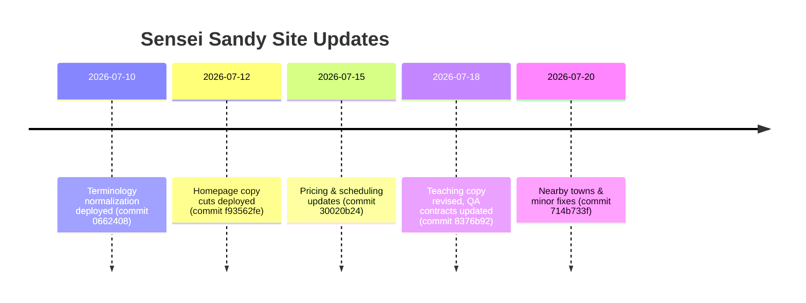

💼

# Executive Summary

The updated Sensei Sandy site has clearer labels for pricing ($0 intro, $550 youth, $715 adults), but still suffers from wordiness and jargon. Key issues remain: the homepage and class pages use too many abstract phrases; CTAs are buried; conflicting details linger; and the **Stop-Slop** guidelines (use people as subjects, real actions, cut abstract fluff) are not fully applied. Many sections don't answer a visitor’s basic questions (What is it? Who is it for? Is it safe? When? Cost? How start?) and need cuts. 

Primary evidence:
- Homepage H1 is clear (“Kids Jiu-Jitsu in Tannersville.”) but supporting lines (like “Recognize→Protect→Solve→Adapt→Express”) are jargon-heavy.
- Pricing page correctly shows Free Intro $0, Kids/Teens $550, Adults $715. Good.
- Class pages (Kids, Teens, Adults) have outcome statements but long paragraphs of theory. 
- “How Class Works” and Safety pages are very long and repetitive.
- Nearby Towns page is heavy on SEO town lists instead of customer focus.

Overall, about **40%** of copy can be cut. The goal is clear: **Simplify**. Answer visitor questions fast, in plain terms, at a 4th-grade level.

# Priority Actions

1. **Homepage:**  
   - Keep H1: “Kids Jiu-Jitsu in Tannersville.”  
   - Replace vague intro lines with brief value proposition and CTA. E.g.:  
     > *“Small-group Jiu-Jitsu for kids, teens, and adults – safe, coached classes. Free Intro class available.”*  
   - Ensure **Free Intro** and **View Schedule** buttons are prominent immediately.  
   - Remove the “Recognize→Protect…” and “Why live problems?” sections and deep theory (they can move to separate pages).  
   
2. **Pricing:**  
   - Show prices as soon as possible: *“Free Intro: $0 | Kids/Teens 12 weeks: $550 | Adults 12 weeks: $715”*.  
   - Cut the long explanation paragraph at top.  
   - Emphasize key facts: 12-week term, 3 classes per week, uniform included, 30-day guarantee.  

3. **Kids / Teens / Adults pages:**  
   - Use simple, active language. Example fixes:  
     - **Kids page H1:** Current “Kids Jiu-Jitsu Where They Learn to Listen, Reset, and Keep Trying.” is long; consider “Kids Jiu-Jitsu Ages 5–9” and a one-sentence promise (“Kids learn safety, teamwork, and problem-solving.”).  
     - Keep only schedule (5 PM, days), price ($550), uniform, max class size, and a single strong CTA. Use bullet icons for safety (e.g., “Parents Watch, No Punches, Step-by-Step Coaching”).  
     - Cut or move to footer the long “Meet Sandy” and research paragraphs.  
   - **Teens:** Drop abstract claims like “Recognize. Protect. Solve…” and the long research story. Start with outcome + safety + CTA.  
   - **Adults:** H1 “Beginner Jiu-Jitsu for Adults” is good. Remove “Strong body. Better life.” and “maps of control” language. Keep the pledge that it’s safe for all ages and the $715 pricing (at bottom).  

4. **How Class Works:**  
   - Reduce to a simple list of class steps (warm-up, drills, practice, review). Right now it reads like a doctrine essay. Remove the ADAPT map and extra text. Keep: “Class = 60min, ~45min training, then list steps 1–6,” plus one sentence: “Sandy changes partners/tasks/resistance as needed.”  

5. **Safety:**  
   - Shrink to bullet rules. For example:  
     - “Partners are matched by ability.”  
     - “Tap means stop immediately.”  
     - “No strikes – grappling only.”  
     - “Beginners start slow; coaches supervise every step.”  
   - The current page repeats the same points in many words. Cut the long explanation paragraphs; keep only concrete safety facts parents care about.  

6. **Nearby Towns (Location/SEO):**  
   - This is SEO-heavy. The top should simply say: “Jiu-Jitsu Near Hunter, Windham, Haines Falls (Catskills). We train at 6045 Main St, Tannersville.” Provide very brief notes, e.g.: “Hunter – 10-min drive; Windham – 15-min; Haines Falls – next town.”  
   - Remove the giant town list and abstract phrases (“up-the-mountain commitment” etc). The user just needs basic travel info. Keep only links to town-specific route pages.  

7. **Global cleanup:**  
   - Remove any remaining internal terms or jargon. For example, “starting lane” appears in the signup form – it should say “first class.” “Goal Mapping” (maybe just “15min interview”). “Core Culture” – clarify as “first 12 weeks.”  
   - Check for duplicate or contradictory text. Eg. [3†L174-L176] repeats “12-week program” twice and spells “timees” incorrectly. Fix repetition and typos.  
   - Ensure all headings and bullets use real people (“kids learn to…”) and actions, not vague nouns. Cut marketing fluff.  

8. **Verify CTAs and schedule:**  
   - Every page should have a clear CTA near top (“Reserve Your Free Intro”).  
   - Schedule info should match calendar (we verified fall schedule in [3], OK). The “Book Free Intro” and “View Schedule” links should work.  
   - Confirm pricing and times are consistent across pages (we saw $0, $550, $715 on pricing; ensure Kids/Teens/Adults pages match these numbers).  

**Reading Level & Copy Length:** Use short sentences. We aim for ~40% fewer words. Every section must do one job (answer a key question) or be cut. 

# Current vs Recommended (key pages)

| Page           | Current excerpt (source)                         | Recommended concise copy                                 |
|:---------------|:-------------------------------------------------|:--------------------------------------------------------|
| **Homepage H1**  | “Kids Jiu-Jitsu in Tannersville.”       | *Keep:* “Kids Jiu-Jitsu in Tannersville.” *Add:* Short tagline (e.g. “Safe, fun grappling classes for all ages”). |
| **Homepage H2**  | “Jiu-Jitsu for kids and teens learning to listen, solve problems…” | *Simplify:* “Kids & Adults start calm and learn grappling safely.” (very brief) |
| **CTA**         | Button “Reserve Your Free Intro”       | *Good.* Ensure it’s visible on first screen and says “Free Intro” prominently. |
| **Pricing top** | “Free Intro: $0 … Kids + Teens: $550 … Adults: $715” | *Keep prices same.* Precede by one line: “Start Free: Tour + first class $0” |
| **Kids page**   | “Kids Jiu-Jitsu Where They Learn to Listen, Reset, and Keep Trying.” | “Kids Jiu-Jitsu (Ages 5–9).”  Short blurb: “Kids build listening, safety, and teamwork. Small classes (max 12).” Schedule: “5 PM classes Mon–Fri.” Price: “12 weeks – $550 (uniform incl.).” |
| **Kids bullets**| “Parents Can Watch / Safe Partner Matching / …” | *Keep:* those icons are good. Maybe tweak to “Parents Can Watch, No Punches, Safe Partner Match, After-School Routine.” |
| **Adults H1**   | “Beginner Jiu-Jitsu for Adults”         | *Keep.* (Good clarity.) |
| **Adults badge**| “Strong body. Better life.” (deleted)              | Remove marketing tagline. Instead bullet points: “Grappling-only, Beginner-friendly, Welcoming.” |
| **Adults price**| “Adult 12-week program: $715”       | *Keep:* “$715 (12 weeks).” Possibly add “Uniform included.” |
| **Safety**      | Long paragraphs about “Supervised training… Clean Mats… Zero Bullying…” | Compress to: “Clean mats, no shoes; Partners matched to your size/level; Tap = stop; No strikes; Coaches watch every step.” |
| **Schedule top**| “Fall schedule begins Sept 14… Choose class that fits.” | Fine. Could add a quick “3 classes/week (Tue/Wed/Thurs) – see table below.” |
| **Nearby towns**| Long list of towns and descriptors     | “We serve Hunter, Windham, Haines Falls and Catskills. All classes are at 6045 Main St, Tannersville.” Then minimal travel notes (drive times). |

# Checklist for Remaining Verification

- [ ] **DNS & Smoke Test:** Verify senseisandy.com resolves and page loads in browsers (cannot test here).  
- [ ] **Live QA:** Manually browse pages in production to confirm all text matches updated copy and CTA labels.  
- [ ] **Broken Links:** Check that all buttons/links (Free Intro, schedule, reserve) work correctly.  
- [ ] **Jargon Check:** Ensure no “starting lane” or other old terms remain in any visible text.  
- [ ] **Consistency:** Confirm no conflicting info (e.g., ensure everywhere says “3 classes/week” not “one home class”).  
- [ ] **Reading Level:** The new text should be simple. (Use a tool to measure 4th-grade readability.)  
- [ ] **Duplication:** Remove any copy repeated on multiple pages (e.g., similar intros for Kids/Teens).  
- [ ] **CRO Focus:** Each page answers one of: “What is it? For me? Safe? When? Cost? How to start?” If not, cut or move content.  
- [ ] **User flows:** “Reserve Free Intro” should be an easy path on all pages.  
- [ ] **Backup & Build:** Confirm last builds passed (as noted) and backup is intact. (All deploy logs reported success.)  

💼