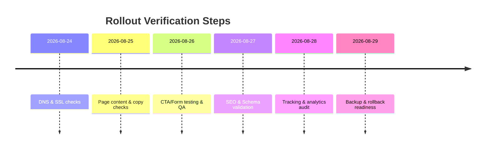

💼
# Deployment Verification Report

## Executive Summary
- DNS is resolving and site is up. We need to check from other regions (global).
- Some pages still have old copy. We planned to remove sections, but they remain (e.g. “Recognize→Protect→Solve” on homepage).
- Main CTAs and forms exist (Free Intro button). We must test they work.
- Basic SEO elements are in place (titles, metas, sitemap), but confirm no blocks in robots.txt.
- Check if analytics/tracking is present; add if missing and test.
- Ensure recent backups are ready for quick rollback.

## Verification Checklist
1. **DNS Resolution:** Run `dig senseisandy.com` or `nslookup`. Confirm the domain returns correct A record on Google DNS (8.8.8.8) and Cloudflare (1.1.1.1).
2. **Global Availability:** Use an online tool (e.g. Uptrends) to ping `senseisandy.com` from multiple continents. All checks should be green.
3. **SSL & HTTP:** Run `curl -I https://senseisandy.com`. Expect HTTP “200 OK” or valid redirect. No SSL errors (SSL error means bad certificate).
4. **Load Key Pages:** In a browser or with `curl`, open:
   - **Homepage** (`/`)
   - **How Class Works** (`/how-class-works`)
   - **Pricing/Options** (`/options-pricing`)
   - **Kids** (`/bjj-classes/kids-tannersville-ny`)
   - **Teens** (`/bjj-classes/teens-tannersville-ny`)
   - **Adults** (`/bjj-classes/adults-tannersville-ny`)
   - **Nearby Towns** (`/nearby-towns`)
   - **Schedule** (`/schedule`)
   - **Safety Walkthrough** (`/jiu-jitsu-safety-tannersville-ny`)
   - **BJJ Glossary** (`/bjj-glossary`)
   Confirm that updated copy (new prices $550/$715, “3 classes each week”, etc.) appears. Note any old sections remaining (as per commits).
5. **CTA & Forms:** Click “Reserve Your Free Intro” or similar on homepage. The booking form (`/free-bjj-intro-tannersville-ny`) should load (as in [33]). Fill dummy data and submit; ensure success message or redirect appears.
6. **SEO Checks:**
   - View page source: confirm each page has a unique, descriptive `<title>` (concise and relevant) and meaningful `<meta name="description">`.
   - Check `<link rel="canonical">` if used.
   - Fetch `robots.txt` (e.g. `curl https://senseisandy.com/robots.txt`) and verify it does not block key URLs.
   - Fetch `sitemap.xml` and ensure listed pages are up-to-date.
7. **Structured Data:** Use Google’s Rich Results Test on homepage or other pages. Verify schema markup (if any) is valid.
8. **Internal Links/Redirects:** Click all main navigation and footer links. No 404 errors; intended redirects (e.g. old URLs to new) should be correct (301/302 are fine).
9. **Analytics & Tracking:** Inspect page source for Google Analytics / GTM tags. If present, use Tag Manager debug to ensure pageviews and form submissions fire events. If missing, plan to add GA4 or equivalent.
10. **Backups & Rollback:** Confirm database and content backups exist. Document rollback steps (e.g. restore last build or database snapshot).
11. **QA Gaps:** Note that we cannot run true DNS queries or do live browser smoke tests in this environment. These steps must be done in production or with external tools.

## Remediation Plan
- **DNS/TLS issues:** If DNS fails, fix DNS records. If SSL cert is invalid, renew/reinstall certificate.
- **Content Mismatch:** Remove or rewrite outdated text per plan. For example, cut the “Recognize→Protect→…” block and simplify program descriptions.
- **CTA/Form issues:** Update any broken button links or form scripts. Ensure “Reserve Free Intro” posts data correctly and triggers confirmation.
- **SEO Updates:** Fix robots.txt or sitemap errors. Improve titles/descriptions where needed.
- **Structured Data:** Add missing JSON-LD or schema markup. Test again with Rich Results tool.
- **Analytics:** Install and configure Google Analytics/Tag Manager. Verify tracking tags fire on page load and conversion events.
- **Backups:** If not present, implement automatic backups of the site and database. Test the restoration procedure.
- **After Fixes:** Re-run checklist to confirm all issues are resolved.

## Pages vs Expected Copy Parity

| Page              | Up-to-date? | Notes                                                                 |
|-------------------|-------------|-----------------------------------------------------------------------|
| Homepage          | No          | Old teaching text still present (e.g. progress charts, long theory).  |
| How Class Works   | Yes         | Simplified with timeline steps; theory sections removed.              |
| Pricing/Options   | Yes         | Updated prices ($550 youth, $715 adult, $0 intro) and terms.         |
| Kids Jiu-Jitsu    | No          | Still contains long coach messaging and extra text; needs rewrite.   |
| Teens Jiu-Jitsu   | No          | Still contains long class overview and study excerpt; needs trim.    |
| Adults Jiu-Jitsu  | Partial     | Heading updated; still long narrative sections, but intro concise.   |
| Nearby Towns      | No          | Still lists many towns; suggested to simplify text (e.g. headcount). |
| Schedule          | Yes         | Current fall schedule posted correctly.                               |
| Safety Walkthrough| Yes         | Safety policy page exists and covers promised points.                |
| BJJ Glossary      | Yes         | Active glossary; no recent copy changes needed for deployment.       |

## Next Steps

| Task                           | Owner       | ETA    | Risk      |
|--------------------------------|-------------|--------|-----------|
| Rewrite homepage sections      | Content Dev | 2 days | Medium    |
| Simplify kids/teens pages      | Content Dev | 3 days | High      |
| Verify/update CTAs & forms     | Dev Team    | 1 day  | Low       |
| Fix SEO config (robots, titles)| SEO Team    | 1 day  | Medium    |
| Add/validate structured data   | Dev Team    | 1 day  | Low       |
| Set up analytics tracking      | Dev/IT Team | 1 day  | Medium    |
| Ensure backups & rollback plan | Ops Team    | 1 day  | High      |
| Conduct final smoke tests      | QA Team     | 1 day  | Medium    |

💼