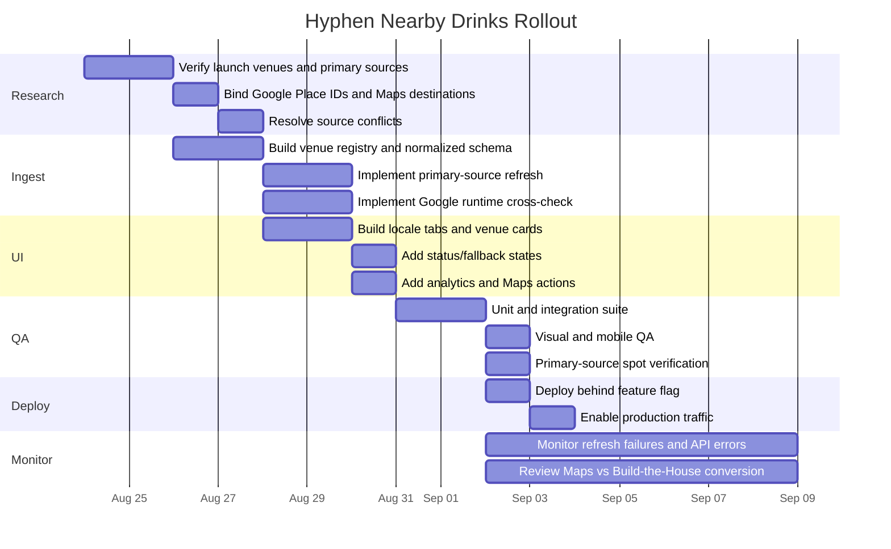

# Hyphen Weekend Live Nearby-Drinks Rollout

## Executive summary

The right product is **not a generic “nightlife guide.”** It is a small, operationally trustworthy module that reinforces Hyphen’s core argument:

> **There are good bars around the mountains. The late-night options thin out fast. The rest of the night usually happens back at the house.**

Fresh research on August 22, 2026 supports that framing without exaggeration. Around Hunter, Windham and Belleayre, several well-established drinking options publish Friday/Saturday closing times around **9–10 PM**—including Jägerberg at 9 PM, Hunter Tavern at 10 PM, Windham Local at 9 PM, and Peekamoose at 10 PM—while a smaller set stays later: TapHouse Grille publishes midnight every day, The Print House publishes 11 PM Friday/Saturday, and Ralph’s Bar & Bowling publishes 11 PM Friday–Sunday. Slopes and Union + Post explicitly market later bar service, but do not publish a reliable exact weekend bar-closing time on their primary websites. citeturn0search4turn0search2turn1search4turn10search1turn2search5turn10search2turn16search0turn6search4turn11search5

The implementation should therefore show **real closing information without claiming that “nothing is open late.”** The useful truth is that choices contract sharply as the evening goes on.

The recommended V1 is a **“Tonight Near the Mountains”** block positioned immediately after the page’s “the night ends at the house” argument and before the main build/configurator path. It should default to a coarse location tab—Hunter, Windham or Belleayre—and display three or four nearby venues sorted by tonight’s verified closing time. Each venue gets an **Open / Closing soon / Closed / Hours unconfirmed** state, published closing time when known, an official-source link, and an **Open in Google Maps** action.

The data architecture should remain conservative. Store the venue registry, official URLs, Google Place IDs, source metadata and normalized hours derived from primary venue sources. Use Google Places **at runtime as a current-state cross-check**, not as a datastore: Google’s Places policies prohibit caching or storing Places API content beyond specified exceptions, while Place IDs may be stored indefinitely. Google currently exposes `currentOpeningHours`, `regularOpeningHours`, `businessStatus`, and `googleMapsUri` through Places API (New). citeturn12view0turn8search4turn8search11

Yelp should be a secondary validation source rather than the canonical source. Yelp’s Places API provides business hours through Business Details, and its search endpoint can filter by `open_now` or `open_at`; that makes it useful for discrepancy detection, but primary venue information should win unless a dated venue announcement overrides the regular schedule. citeturn9search0turn9search2turn9search8

**Recommended rollout scope:**

| Layer | V1 decision |
|---|---|
| Locales | Hunter/Tannersville, Windham, Belleayre corridor |
| Initial venues | 9 |
| Canonical hours | Primary venue website or official venue social account |
| Google Maps | Required map link for every venue; Places API runtime check recommended |
| Yelp | Secondary QA/discrepancy source |
| “Open now” | Calculated in `America/New_York` |
| Exact “closes at” | Only when source gives an exact closing time |
| Unknown “open late” | Never converted into a guessed clock time |
| GPS/user location | Not requested |
| Embedded map | Defer to V2; use Maps links first |
| Refresh | Primary-source ingest daily, extra Fri/Sat refresh; Google live check at render/request |
| Failure behavior | Fall back to last recent primary-source schedule, otherwise “Check tonight’s hours” |
| Deployment | Behind feature flag with instant rollback |

The module should make Hyphen more credible, not make the page dependent on third-party nightlife data.

## Verified initial venue set

The initial set should deliberately contain both the genuinely later options and representative places that close at 9–10 PM. That gives the module informational value while making the local pattern visible.

The hours below were verified from the venues’ own sites or official social accounts on **August 22, 2026**. Where the primary source does not publish an exact closing time, that uncertainty is preserved rather than filled in from inference.

### Recommended launch venues

| Locale | Venue | Verified published hours | Primary source | Google Maps |
|---|---|---|---|---|
| Hunter / Tannersville | **Slopes Hunter Mountain** | Wed/Thu/Sun 12–9 PM; Fri/Sat **12 PM–“Close”**. Official Facebook also advertises a late-night bar menu until midnight, but the website does not publish an exact Fri/Sat closing time. citeturn6search4turn6search13 | [Official site](https://www.slopeshuntermountain.com/) | [Google Maps](https://www.google.com/maps/search/?api=1&query=Slopes+Hunter+Mountain+6002+Main+Street+Tannersville+NY+12485) |
| Hunter | **Hunter Tavern** | Thu 5–9 PM; Fri 4–10 PM; Sat 4–10 PM; Sun 5–9 PM. citeturn0search2 | [Official site](https://www.huntertavern.com/) | [Google Maps](https://www.google.com/maps/search/?api=1&query=Hunter+Tavern+7433+Main+Street+Hunter+NY+12442) |
| Hunter | **Jägerberg Beer Hall & Alpine Tavern** | Mon 5–8 PM; Tue 5–8:30; Wed closed; Thu 5–8:30; Fri/Sat 5–9; Sun closed. citeturn0search4turn0search12 | [Official site](https://jagerberghall.com/) | [Google Maps](https://www.google.com/maps/search/?api=1&query=Jagerberg+Beer+Hall+7722+Main+Street+Hunter+NY+12442) |
| Windham | **TapHouse Grille** | **Every day, noon–midnight.** The venue explicitly describes itself as a community bar/restaurant and “life of the party by night.” citeturn1search9turn2search5 | [Official site](https://www.taphousegrillewindham.com/) | [Google Maps](https://www.google.com/maps/search/?api=1&query=TapHouse+Grille+5359+Main+Street+Windham+NY+12496) |
| Windham | **Union + Post** | Restaurant Fri/Sat 4–10:30 PM; official site says **“bar open late”** but gives no exact bar closing time. citeturn11search5 | [Official restaurant page](https://www.unionandpost.com/restaurant/) | [Google Maps](https://www.google.com/maps/search/?api=1&query=Union+and+Post+5098+NY-23+Windham+NY+12496) |
| Windham | **The Windham Local** | Mon 8–3; Tue closed; Wed/Thu 8–3; Fri/Sat 8 AM–9 PM; Sun 8 AM–8 PM. citeturn1search4 | [Official site](https://www.thewindhamlocal.com/) | [Google Maps](https://www.google.com/maps/search/?api=1&query=The+Windham+Local+5410+Main+Street+Windham+NY+12496) |
| Belleayre / Fleischmanns | **The Print House** | Mon/Tue 4–9 PM; Wed closed; Thu 4–9; Fri 3–11; Sat noon–11; Sun noon–9. Current hours are published on the venue’s official Instagram account. citeturn10search2turn4search7 | [Official Instagram](https://www.instagram.com/printhouseny/) | [Google Maps](https://www.google.com/maps/search/?api=1&query=The+Print+House+1070+Main+Street+Fleischmanns+NY+12430) |
| Belleayre / Big Indian | **Ralph’s Bar & Bowling** | Mon–Thu 3–9 PM; **Fri–Sun 3–11 PM**. Urban Cowboy states Ralph’s is open to everyone; a recent Times Union review confirms the same bar schedule and the 822 Oliverea Road location. citeturn16search0turn16search3 | [Urban Cowboy official dining page](https://www.urbancowboy.com/catskills/eat-drink) | [Google Maps](https://www.google.com/maps/search/?api=1&query=Ralphs+Bar+and+Bowling+822+Oliverea+Road+Big+Indian+NY+12410) |
| Belleayre / Big Indian | **Peekamoose Restaurant & Tap Room** | Mon/Thu/Sun 5–9 PM; Fri/Sat 5–10; Tue/Wed closed. Tap Room & Lounge uses the same published service period. citeturn10search1turn3search11 | [Official site](https://www.peekamooserestaurant.com/) | [Google Maps](https://www.google.com/maps/search/?api=1&query=Peekamoose+Restaurant+8373+State+Route+28+Big+Indian+NY+12410) |

The Google Maps URLs above are deterministic search links built from verified venue names and addresses. For production API output, prefer the `googleMapsUri` returned by Google Place Details rather than hand-maintaining destination links; Google lists `googleMapsUri` and `googleMapsLinks` as supported Places API fields. citeturn8search4

### Why these nine

This set gives each locale three useful data points rather than selecting only the latest-closing bar. It captures the actual contrast:

**Hunter/Tannersville:** normal dinner/bar operations often end around 9–10 PM, with Slopes representing the later-night exception. citeturn0search2turn0search4turn6search4

**Windham:** TapHouse is a clear midnight outlier; Union + Post explicitly offers a late bar without publishing an exact close; Windham Local ends at 9 PM. citeturn2search5turn11search5turn1search4

**Belleayre corridor:** The Print House and Ralph’s reach 11 PM on weekend nights, while Peekamoose ends at 10 PM. citeturn10search2turn16search0turn10search1

That makes the page’s defensible claim **“late-night options thin out”**, not “there are no bars.”

### Expansion rule

Do not immediately auto-discover every bar in a broad radius. Start curated, then expand only when a venue satisfies all of these conditions:

| Requirement | Rule |
|---|---|
| Relevance | Meaningful drink service for weekend visitors |
| Geography | Clearly associated with Hunter/Tannersville, Windham, or the Belleayre/Route 28 corridor |
| Primary source | Working official website or actively maintained official social account |
| Hours | At least regular service hours can be verified |
| Business status | Not permanently closed; ambiguous closures are held from publication |
| Google identity | Stable Google Place ID or unambiguous Maps listing |
| Staleness | Primary hours verified during the last 7 days for live-status eligibility |
| Value | Adds coverage, a later close, or a materially different geographic option |

Discovery candidates can come from Google Nearby Search, Yelp Search and tourism directories, but no discovered venue should go live until its primary source is manually bound to the venue registry. Google Nearby Search returns place objects and supports `businessStatus`, while Yelp search can filter by category and current/open-at time. citeturn8search10turn9search2

## Data architecture and source policy

### Source hierarchy

The system should distinguish **regular hours** from **date-specific exceptions**.

For normal weekly schedules:

> official website → Google Places → Yelp → official social → tourism/other discovery source

For a particular holiday, event or announced schedule change:

> dated official venue post → date-specific official website notice → Google current hours → regular official schedule → Yelp

An official social announcement should therefore beat an old website schedule **only for the date or range explicitly covered by that post**. It should not silently rewrite the venue’s permanent weekly schedule.

Slopes illustrates the rule well: its site says Friday and Saturday are open “to Close,” while its social presence advertises late-night service. The UI should not fabricate “midnight” as a permanent close merely because some social/event material mentions midnight. citeturn6search4turn6search13turn7search9

Union + Post requires the same treatment: “bar open late” is useful qualitative data, but it is not an exact closing time. citeturn11search5

### Data fields and schema

| Field | Type | Persistence | Purpose |
|---|---|---:|---|
| `id` | string slug | permanent | Internal stable venue key |
| `name` | string | permanent | Customer display name |
| `locale` | enum | permanent | `hunter`, `windham`, `belleayre` |
| `address` | string | permanent | Verified business address |
| `timezone` | IANA string | permanent | Always `America/New_York` for V1 |
| `lat` / `lng` | number | permanent | Optional for grouping/map V2 |
| `officialUrl` | URL | permanent | Primary venue source |
| `officialSocialUrl` | URL/null | permanent | Venue-owned update channel |
| `googlePlaceId` | string | permanent | Google business identity |
| `yelpBusinessId` | string/null | permanent | Secondary verification identity |
| `mapsSearchUrl` | URL | permanent | Fallback Google Maps search link |
| `weeklyHours` | schedule | yes | Normalized primary-source schedule |
| `specialHours` | schedule[] | yes | Explicit date overrides from primary source |
| `sourceKind` | enum | yes | `official_site`, `official_social`, etc. |
| `sourceUrl` | URL | yes | Evidence used for current canonical schedule |
| `sourceObservedAt` | ISO datetime | yes | When Hyphen last verified source |
| `sourcePublishedAt` | ISO datetime/null | yes | Date of social/special-hours announcement |
| `confidence` | enum | yes | `high`, `medium`, `unverified` |
| `businessStatus` | enum | primary persistent / Google ephemeral | Operational/closed state |
| `statusNow` | computed | no | `open`, `closing_soon`, `closed`, `unknown` |
| `closesAt` | computed | no | Exact time only when determinable |
| `opensAt` | computed | no | Next known opening |
| `closePrecision` | enum | computed | `exact`, `late_unspecified`, `unknown` |
| `googleCheckedAt` | datetime/null | ephemeral/log metric only | Monitor runtime freshness |
| `lastSuccessfulRefresh` | datetime | yes | Pipeline health |
| `stale` | boolean | computed | Suppresses live claims when old |

Recommended repository shape:

```text
data/
  hyphen/
    nightlife-venues.json
    nightlife-hours.json

lib/
  hyphen/
    nightlife/
      normalize-hours.ts
      compute-status.ts
      resolve-sources.ts
      google-places.ts
      schemas.ts

app/
  api/
    hyphen/
      nightlife/
        route.ts

components/
  hyphen/
    NightlifeModule.tsx
    NightlifeLocaleTabs.tsx
    NightlifeVenueCard.tsx
    NightlifeStatusBadge.tsx
    NightlifeHeatmap.tsx
```

### Normalized schedule

Do not encode closing times as strings that require ad-hoc parsing in React.

```json
{
  "venueId": "taphouse-grille-windham",
  "timezone": "America/New_York",
  "weeklyHours": {
    "monday": [
      {
        "open": "12:00",
        "close": "00:00",
        "closeDayOffset": 1
      }
    ],
    "tuesday": [
      {
        "open": "12:00",
        "close": "00:00",
        "closeDayOffset": 1
      }
    ],
    "friday": [
      {
        "open": "12:00",
        "close": "00:00",
        "closeDayOffset": 1
      }
    ],
    "saturday": [
      {
        "open": "12:00",
        "close": "00:00",
        "closeDayOffset": 1
      }
    ]
  },
  "canonicalSource": {
    "kind": "official_site",
    "url": "https://www.taphousegrillewindham.com/",
    "observedAt": "2026-08-22T15:00:00-04:00"
  }
}
```

Cross-midnight support matters even if the initial venues rarely require it. Yelp’s own hours data model explicitly permits closing times earlier than opening times to represent businesses closing the following day. citeturn9search1turn9search10

### Runtime API payload

A page response should already contain resolved customer-facing states:

```json
{
  "generatedAt": "2026-08-22T21:15:00-04:00",
  "timezone": "America/New_York",
  "locale": "windham",
  "venues": [
    {
      "id": "taphouse-grille-windham",
      "name": "TapHouse Grille",
      "status": {
        "state": "open",
        "label": "Open",
        "closesAt": "00:00",
        "closesAtDisplay": "Midnight",
        "closingSoon": false,
        "precision": "exact"
      },
      "verification": {
        "canonicalSource": "official_site",
        "primaryVerifiedAt": "2026-08-22T15:00:00-04:00",
        "googleCrossCheck": "matched",
        "stale": false
      },
      "links": {
        "official": "https://www.taphousegrillewindham.com/",
        "googleMaps": "https://www.google.com/maps/search/?api=1&query=TapHouse+Grille+5359+Main+Street+Windham+NY+12496"
      }
    },
    {
      "id": "union-post",
      "name": "Union + Post",
      "status": {
        "state": "open",
        "label": "Bar open late",
        "closesAt": null,
        "closesAtDisplay": null,
        "closingSoon": false,
        "precision": "late_unspecified"
      }
    }
  ]
}
```

That distinction between `exact` and `late_unspecified` prevents the UI from turning “bar open late” into a fake 11 PM or midnight close.

### Google Places implementation

Use Google Places API (New), not legacy Places. Google describes Places API (New) as the current version. citeturn8search8

For a known venue:

```http
GET https://places.googleapis.com/v1/places/{PLACE_ID}
X-Goog-Api-Key: ...
X-Goog-FieldMask: id,displayName,businessStatus,currentOpeningHours,regularOpeningHours,googleMapsUri
```

Google requires field masks and assigns fields such as `currentOpeningHours` and `regularOpeningHours` to specific billing tiers, so request only the fields required for this feature. citeturn8search0turn8search4

Store:

```text
googlePlaceId
```

Do **not** persist:

```text
currentOpeningHours
regularOpeningHours
googleMapsUri
Google rating
Google reviews
Google photos
```

as your own reusable dataset unless Google’s applicable terms explicitly permit that use. Google’s current Places policy says Places content generally must not be pre-fetched, cached or stored, while Place IDs are explicitly exempt. citeturn12view0turn8search11

If Google-derived content appears in the UI without an actual Google map, Google requires visible Google Maps attribution and says Google Maps content must be visually distinguishable from non-Google content. citeturn12view0

That is one reason the simplest V1 is:

**Hyphen-owned normalized official hours + an “Open in Google Maps” link**, with Google live status used as a runtime verification layer rather than copied into the long-lived database.

## UI placement, copy and visual system

### Placement on the current Hyphen page

Based on the page architecture established in this thread, place the module in this sequence:

```text
HERO
Your weekend is already too short.

↓

PROBLEM
You came up here to get away.

↓

THE NIGHT ENDS AT THE HOUSE
local-behavior argument

↓

NEW: TONIGHT NEAR THE MOUNTAINS
live operational venue hours

↓

WEDDING / WEEKEND USE CASE

↓

BOTTLE MATCH + CONFIGURATOR
```

Do **not** place it beneath the configurator or footer. Its job is to provide evidence for the problem before Hyphen presents the solution.

It should also not become more visually dominant than Bottle Match.

### UI components and copy variants

| Component | Function | Recommended copy | Alternate |
|---|---|---|---|
| Section eyebrow | Establish context | `TONIGHT NEAR THE MOUNTAINS` | `GOING OUT FIRST?` |
| H2 | Core local truth | **There are bars around. The late-night options thin out fast.** | **Go out. Come back. Keep the night going.** |
| Intro | Avoid anti-local-business tone | `There are good places for a drink around Hunter, Windham and Belleayre. Here’s what the current published hours look like tonight.` | `A few places stay later. A lot of them don’t. Check tonight before you head out.` |
| Locale tabs | Reduce list size | `Hunter` · `Windham` · `Belleayre` | Same |
| Exact open card | Operational status | `OPEN · UNTIL 10 PM` | `Open now · closes 10 PM` |
| Late unspecified card | Honest ambiguity | `BAR OPEN LATE · EXACT CLOSE NOT PUBLISHED` | `Open late · check tonight` |
| Closing soon | Urgency without hype | `CLOSING SOON · 10 PM` | `Open until 10 PM` |
| Closed | Useful context | `CLOSED FOR TONIGHT` | `Closed now` |
| Stale/unknown | Safe fallback | `TONIGHT'S HOURS NOT CONFIRMED` | `Check before you go` |
| Primary venue action | Navigation | `OPEN IN GOOGLE MAPS` | `MAP + DIRECTIONS` |
| Secondary venue action | Evidence | `VENUE HOURS` | `OFFICIAL SITE` |
| Section footer | Accuracy disclaimer | `Mountain-town hours change with the season, weather and events. Check the venue before heading out.` | `Hours can change. Verify tonight before you go.` |
| Hyphen bridge CTA | Return to conversion | **`OR HAVE THE HOUSE READY →`** | **`BUILD THE HOUSE →`** |

Recommended complete section:

> **TONIGHT NEAR THE MOUNTAINS**
>
> ## There are bars around. The late-night options thin out fast.
>
> There are good places for a drink around Hunter, Windham and Belleayre. Here’s what the current published hours look like tonight.
>
> **Hunter · Windham · Belleayre**
>
> `OPEN · UNTIL MIDNIGHT`  
> **TapHouse Grille**
>
> `OPEN · UNTIL 9 PM`  
> **The Windham Local**
>
> `BAR OPEN LATE`  
> **Union + Post**  
> Exact closing time isn’t published.
>
> Mountain-town hours change with the season, weather and events. Check the venue or Google Maps before you head out.
>
> **OR HAVE THE HOUSE READY →**

This is more credible than:

> Bars close early here.

and far more defensible than:

> Nothing is open late.

### Status logic

Use:

```ts
type VenueOperationalState =
  | "open"
  | "closing_soon"
  | "closed"
  | "unknown";
```

Recommended threshold:

```ts
closingSoonMinutes = 60;
```

For an exact close:

```text
> 60 min left → OPEN · UNTIL 10 PM
≤ 60 min left → CLOSING SOON · 10 PM
after close → CLOSED FOR TONIGHT
```

For Union + Post / Slopes-style ambiguity:

```text
BAR OPEN LATE
Exact close not published.
```

Never generate a countdown from `closePrecision !== "exact"`.

### Sorting

Within a locale, sort tonight by:

```text
1. Open venues with known latest close
2. Open venues with "late unspecified"
3. Closing soon
4. Closed venues
5. Unverified / stale
```

Do not sort by review rating, sponsorship or subjective “best” in V1.

That keeps the component operational rather than editorial.

### Map and chart recommendations

**V1 should not embed a full map.** Each venue already has a Google Maps action, and an embedded Google map adds payload, billing, attribution and interaction complexity. Google requires appropriate Maps attribution whenever Places content is displayed. citeturn12view0

A V2 **pin cluster** could show the three mountain zones rather than the user’s location:

```text
      WINDHAM
     ● ● ●

HUNTER ● ● ●        BELLEAYRE
                   ● ● ●
```

Do not request browser geolocation to render it.

The more interesting visual is an **availability heatmap**:

```text
                8 PM   9 PM   10 PM   11 PM   12 AM
Hunter Tavern     █      █       █
Jägerberg         █      █
Slopes            █      █       ?       ?       ?
TapHouse           █      █       █       █       █
Windham Local      █      █
Print House        █      █       █       █
Ralph's            █      █       █       █
Peekamoose         █      █       █
```

The production heatmap should be generated directly from normalized schedules. Use a hatched/unknown state for qualitative hours such as “bar open late”; do not visually imply a verified interval.

On mobile, omit the heatmap and show venue cards only.

## Refresh, caching, privacy and analytics

### Update cadence

“Live” should mean **the current open/closed state is calculated live from recently verified operating data**, not that Hyphen continuously scrapes every business every minute.

| Data source | Refresh policy | TTL / storage |
|---|---|---|
| Official regular-hours pages | Scheduled daily at ~6 AM ET | Normalized result valid 24h |
| Official regular-hours pages Fri/Sat | Additional check around 3 PM ET | Replace same-day snapshot |
| Dated official social announcements | Manual/automated discovery Thu–Sat, human validation for overrides | Persist only announced dates/range |
| Google Place ID | Store permanently; refresh identity annually | Google says Place IDs are exempt from caching restrictions and recommends refreshing older IDs. citeturn8search11 |
| Google `currentOpeningHours` | Runtime cross-check only | **No persistent cache** |
| Google `businessStatus` | Runtime safety check | **No persistent cache** |
| Google `googleMapsUri` | Runtime or use maintained Maps search URL fallback | Do not build a persistent copied Places dataset |
| Yelp | QA/discrepancy check | Follow applicable Yelp plan/license; do not make it canonical |
| Tourism directories | Discovery only | Never live-status source |

Google’s current policy explicitly says not to pre-fetch, cache or store Places API content beyond the allowed exceptions. citeturn12view0

Therefore, do not implement:

```text
Redis: googleCurrentOpeningHours 24h
Database: googleRegularOpeningHours
localStorage: Google venue response
Service worker: cached Places JSON
```

without confirming a permitted use under the applicable Google agreement.

A reasonable system is:

```text
stored official schedule
        +
current server time
        ↓
base Open/Closed state
        +
runtime Google cross-check
        ↓
render
```

### Conflict handling

Use a deterministic resolver:

```ts
if (datedOfficialOverrideApplies) {
  use(datedOfficialOverride);
} else if (freshOfficialHours) {
  use(freshOfficialHours);
} else if (googleLiveHoursAvailable) {
  displayGoogleHoursWithAttribution();
} else if (freshYelpHoursAvailableAndLicensed) {
  useAsFallbackWithSourceLabel();
} else {
  showUnknown();
}
```

Google or Yelp disagreement with a fresh primary venue source should create an internal `SOURCE_CONFLICT` alert rather than silently switching the published schedule.

Example:

```json
{
  "venueId": "example",
  "type": "SOURCE_CONFLICT",
  "canonical": {
    "source": "official_site",
    "close": "22:00"
  },
  "google": {
    "close": "23:00"
  },
  "detectedAt": "2026-08-22T16:02:14-04:00"
}
```

A developer/operator then checks the official social feed or calls the business if necessary.

### Failure and fallback behavior

| Failure | Public behavior |
|---|---|
| Google request times out | Use fresh official schedule; no error visible |
| Google quota exceeded | Same |
| Official source fetch fails, last verified <24h | Continue with existing schedule |
| Official source fetch fails, schedule 1–7 days old | Show schedule but label `Last verified …`; suppress aggressive “live” language |
| Schedule older than 7 days | `Tonight's hours not confirmed · Check Google Maps` |
| Exact close missing | `Bar open late · exact close not published` |
| Both official and secondary sources disagree | `Check tonight's hours` rather than choosing secretly |
| `businessStatus` indicates temporarily closed | Remove from normal “open tonight” ordering; display `Temporarily closed` if surfaced |
| Business disappears/permanent closure | Disable venue in registry and remove from public list |
| Nightlife API fails entirely | Render copy-only module and Hyphen CTA; never block page/configurator |

The core Hyphen page must be independent of this feed.

### Privacy and PII

No feature-level reason exists to collect visitor GPS coordinates.

Use only:

```text
Hunter
Windham
Belleayre
```

as coarse user-selected locales.

Do not send the following to Google, Yelp or analytics:

```text
Airbnb address
House Drop address
guest name
phone
email
reservation dates tied to identity
exact visitor GPS
configuration notes
```

The nightlife module should operate from the selected mountain locale, not the user’s configured property address.

Analytics should use internal venue slugs, never customer information.

If Google Places API content is incorporated, Google currently requires the application to provide publicly accessible Terms of Use and a Privacy Policy that incorporate Google’s applicable Terms and Privacy Policy. citeturn12view0

### Analytics events

Recommended events:

```text
hyphen_nightlife_module_viewed
hyphen_nightlife_locale_selected
hyphen_nightlife_venue_viewed
hyphen_nightlife_maps_clicked
hyphen_nightlife_official_source_clicked
hyphen_nightlife_fallback_shown
hyphen_nightlife_source_conflict
hyphen_nightlife_build_house_clicked
```

Example Maps click:

```json
{
  "event": "hyphen_nightlife_maps_clicked",
  "properties": {
    "locale": "windham",
    "venue_id": "taphouse-grille-windham",
    "status_bucket": "open",
    "close_bucket": "midnight",
    "canonical_source": "official_site",
    "hours_age_bucket": "under_24h"
  }
}
```

Example module impression:

```json
{
  "event": "hyphen_nightlife_module_viewed",
  "properties": {
    "locale": "hunter",
    "venue_count": 3,
    "open_count": 2,
    "unknown_count": 0,
    "day_of_week": "saturday"
  }
}
```

Example conversion bridge:

```json
{
  "event": "hyphen_nightlife_build_house_clicked",
  "properties": {
    "locale": "belleayre",
    "open_venues_visible": 1,
    "latest_verified_close_bucket": "11pm"
  }
}
```

Do not include the user’s IP, address, email, telephone number or precise property coordinates in feature analytics.

The most strategically useful KPI is not venue click-through by itself. Compare:

```text
nightlife module viewers
→ Google Maps clicks

versus

nightlife module viewers
→ BUILD THE HOUSE clicks
→ configurator starts
→ inquiry submissions
```

That tells you whether the utility strengthens Hyphen conversion or distracts from it.

## QA, deployment and acceptance

### Unit and contract tests

The core time library needs deterministic tests independent of network calls.

| Test | Expected |
|---|---|
| `17:00–22:00`, now 21:00 | `open`, closes 10 PM |
| `17:00–22:00`, now 21:15 | `closing_soon` |
| `17:00–22:00`, now 22:00 | `closed` |
| `12:00–00:00 +1`, now 23:45 | open until midnight |
| cross-midnight `17:00–02:00 +1` | correct next-day state |
| multiple intervals same day | both supported |
| closed weekday | next opening calculated |
| `closePrecision=late_unspecified` | no countdown |
| no hours | `unknown` |
| schedule >7 days old | live status suppressed |
| date-specific override | override beats weekly hours |
| expired override | weekly schedule restored |
| DST start/end | correct `America/New_York` interpretation |
| venue source conflict | conflict emitted, no silent overwrite |

Use fixed clocks in tests:

```ts
computeVenueStatus({
  now: "2026-08-22T21:15:00-04:00",
  timezone: "America/New_York",
  schedule
});
```

Do not test status calculations with the machine’s actual clock.

Google contract tests should mock only documented fields such as `businessStatus`, `currentOpeningHours`, `regularOpeningHours` and `googleMapsUri`. citeturn8search4turn8search7

### Integration tests

Run the complete route with fixtures representing:

```text
official only
official + matching Google
official + conflicting Google
official fetch failure
Google timeout
Google 429
Google 500
temporarily closed
missing exact close
stale schedule
no venues in locale
```

Verify that a Google outage never breaks `/hyphen-weekend`.

Add a test that fails if Google Places payloads are accidentally written to your persistent data store.

Example assertion:

```ts
expect(persistedVenue).not.toHaveProperty("google.currentOpeningHours");
expect(persistedVenue).not.toHaveProperty("google.regularOpeningHours");
expect(persistedVenue.googlePlaceId).toBeDefined();
```

That enforces the caching design derived from Google’s current Places policies. citeturn12view0turn8search11

### Visual QA

Test:

```text
1440
1024
768
430
390
375
320
```

Required states:

```text
Open until exact time
Closing soon
Closed
Bar open late / time unknown
Hours unconfirmed
Google outage fallback
Long venue name
Three locale tabs
All venues closed
```

At 320 px:

```text
venue name
status
closing time
Maps action
official source action
```

must fit without horizontal scrolling.

Status must not rely solely on color. Screen readers should receive copy such as:

```text
TapHouse Grille is open and is scheduled to close at midnight.
```

or:

```text
Union and Post reports that its bar is open late. An exact closing time is not published.
```

### Rollout timeline



### Deployment and rollback

Ship behind:

```ts
HYHEN_NIGHTLIFE_HOURS_V1=true
```

Prefer a route-level feature flag that can be disabled without a rebuild.

Deployment sequence:

```text
venue registry
→ time/status library
→ server endpoint
→ component disabled
→ staging QA
→ production deploy disabled
→ production API smoke test
→ enable component
```

The production smoke test should verify all nine registered venues, all three locale filters, and at least one each of exact-close, early-close and unspecified-late states.

Rollback is:

```text
HYHEN_NIGHTLIFE_HOURS_V1=false
```

The rest of `/hyphen-weekend` should immediately return to its previous layout.

Do not make the hero, configurator, pricing or inquiry flow depend on the nightlife API.

### Monitoring thresholds

Alert internally when:

```text
official refresh failure > 1 cycle
Google runtime error rate > 10%
source conflict persists > 24h
venue schedule age > 7 days
zero venues render for a configured locale
unknown-state share > 30%
```

Also monitor Google request volume because Places fields are SKU-dependent and field masks affect what is requested and billed. citeturn8search4turn8search10

### Acceptance criteria

| Gate | Pass condition |
|---|---|
| Geographic coverage | Hunter, Windham and Belleayre each have at least 3 registered venues |
| Verified data | Every live venue has a primary source URL |
| Google Maps | Every venue has a working Maps action |
| Current Maps integration | Production can use stored Place IDs and runtime Place Details |
| Timezone | All state calculations use `America/New_York` |
| Exactness | “Closes at X” appears only where an exact time exists |
| Slopes | No fabricated Fri/Sat closing time |
| Union + Post | No fabricated bar-closing time |
| Staleness | Data older than 7 days is not represented as confidently live |
| Google policy | Place IDs may persist; Places content is not silently persisted/cached |
| Attribution | Any displayed Google-derived content receives required Google Maps attribution |
| Failure safety | Third-party outage does not affect Hyphen ordering/configurator |
| Privacy | No GPS permission or rental-address transmission |
| Analytics | All defined events fire without PII |
| Accessibility | Status is available as text, keyboard controls work, tabs are accessible |
| Mobile | No horizontal overflow at 320 px |
| Conversion | “Build the House” remains visually stronger than venue-navigation actions |
| Rollback | One feature flag removes the module |
| Primary claim | Page says late-night choices **thin out**, not that bars do not exist |

The final customer-facing logic should be extremely simple:

> **There are good bars around.**
>
> **A few stay later. A lot of them wind down around 9 or 10.**
>
> **Check what’s open tonight.**
>
> **And when the night comes back to the house, have the house ready.**

That statement matches the currently published operating patterns across the selected Hunter, Windham and Belleayre venues while leaving room for clear exceptions such as TapHouse, The Print House, Ralph’s, Slopes and Union + Post. citeturn2search5turn10search2turn16search0turn6search4turn11search5