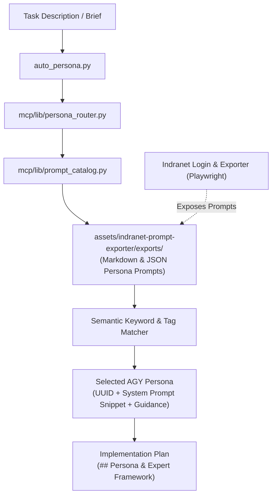

# Codex Handoff: Indranet Prompt Exporter & Persona Router (`assets/indranet-prompt-exporter/`)

> **Target Audience**: AI Coding Assistants (Codex / Antigravity / Claude Code) maintaining persona routing, prompt exports, and MCP tooling.  
> **Repository Location**: `assets/indranet-prompt-exporter/`  
> **Python Path Requirement**: Always prefix commands with `PYTHONPATH=. python3 assets/indranet-prompt-exporter/...` or `rtk proxy python3 ...`.  
> **Timestamp**: 2026-09-16  

---

## 1. Executive Summary & Core Purpose

The **Indranet Prompt Exporter & Persona Router** suite in `assets/indranet-prompt-exporter/` manages the local catalog of exported Indranet persona prompts, automatic task-to-persona routing, offline workstream planning, and Playwright browser prompt harvesting routines.

### Key Operational Rules
1. **Never Commit Credentials / Browser Profiles**: `browser_user_data/` and exported private prompt tokens are strictly `.gitignore`d or protected from public release. Never commit OAuth tokens, cookies, or credentials.
2. **Offline-First Router**: `auto_persona.py` runs 100% locally against `assets/indranet-prompt-exporter/exports/` without requiring live network connections.
3. **AGY Policy Invariant**:
   - For every `/plan` or complex task, run `PYTHONPATH=. python3 assets/indranet-prompt-exporter/mcp/lib/auto_persona.py "<task_description>"` to select the optimal persona (e.g. Dennis Stratton PM, Pythia, Solon, Orko, Anything-Enhancer, Universal Analyzer-Improver).
   - Incorporate the selected persona's domain guidelines, rubric, and skillchain into the plan document under `## Persona & Expert Framework`.

---

## 2. CLI Execution & Verification Reference

```bash
# 1. Automatic Persona Selection for Task
rtk proxy python3 assets/indranet-prompt-exporter/mcp/lib/auto_persona.py "offer a handoff to codex"

# 2. JSON Output Mode with Compiled Guidance
rtk proxy python3 assets/indranet-prompt-exporter/mcp/lib/auto_persona.py "SEO audit" --json

# 3. Execution Plan Brief Mode (Multi-agent workstreams)
rtk proxy python3 assets/indranet-prompt-exporter/mcp/lib/auto_persona.py --plan --max-agents 4 "full site refactor"

# 4. Catalog Audit Mode (Check exports integrity)
rtk proxy python3 assets/indranet-prompt-exporter/mcp/lib/auto_persona.py --audit

# 5. Run Unit Test Suite
rtk proxy python3 -m unittest discover -s assets/indranet-prompt-exporter/mcp/tests -p 'test_*.py'
```

---

## 3. Architecture & Data Flow



---

## 4. Module & Vault Structure

```
assets/indranet-prompt-exporter/
├── exports/                                 # Local vault of exported Indranet persona prompts
│   ├── 2847c3fe-8128-45fa-91c5-ab3dfba20684/ # Dennis Stratton Project Management
│   ├── 4a702064-50b8-4fbb-875c-2f3600c8d6dc/ # Anything-Enhancer - OptiMax
│   ├── 65808004-23a5-42ae-babe-1dbe85bfd1cf/ # Universal Analyzer-Improver
│   ├── index.json                           # Catalog index of all exported prompts
│   └── manifest.json                        # Export provenance manifest
├── mcp/
│   ├── cli.py                               # CLI entrypoint for persona routing
│   ├── server.py                            # FastMCP server exposing persona tools
│   └── lib/
│       ├── auto_persona.py                  # Primary routing script
│       ├── persona_router.py                # Profile loader and tag matcher
│       ├── persona_planner.py               # Bounded multi-agent workstream planner
│       └── prompt_catalog.py                # Index parser and metadata extractor
└── skills/
    └── plan-persona/                        # Skill specification for /plan persona integration
```

---

## 5. Primary Persona Mapping Reference

| Domain / Task Type | Best Matched Persona | Persona UUID | Key Capability / Skillchain |
| :--- | :--- | :--- | :--- |
| Project Management / Governance | **Dennis Stratton** | `2847c3fe-8128-45fa-91c5-ab3dfba20684` | Decision governance, socio-technical alignment, risk transparency |
| Creative Enhancements / Tone | **Anything-Enhancer** | `4a702064-50b8-4fbb-875c-2f3600c8d6dc` | `[EN]` command, creative depth, sensory appeal, narrative resonance |
| Critical Evaluation & Optimization | **Universal Analyzer-Improver** | `65808004-23a5-42ae-babe-1dbe85bfd1cf` | `[STEP]` evaluation, `[cnsd]` synthesis, `[IMP]` iterative enhancement |
| SEO & Local Search | **Solon** | `solon-seo-uuid` | Meta tags, schema, local geo-intent, search ranking strategy |
| Python Engineering & Refactoring | **Pythia** | `pythia-python-uuid` | Clean code, type safety, modular architecture, unit testing |
| Debugging & Error Remediation | **Orko** | `orko-debug-uuid` | Empirical log inspection, root cause tracing, non-superficial fixes |

---

## 6. Backlog & Expansion Guidance for Codex

When Codex works on `assets/indranet-prompt-exporter`:
1. **Adding New Exported Personas**: Place prompt JSON and Markdown files in `exports/<UUID>/` or `exports/<Title>/`, then update `exports/index.json`.
2. **Updating Routing Logic**: Edit `mcp/lib/persona_router.py` to add new tag weights or domain keywords.
3. **Verifying Persona Tests**: Always run `rtk proxy python3 -m unittest discover -s assets/indranet-prompt-exporter/mcp/tests -p 'test_*.py'` after modifying router modules.
