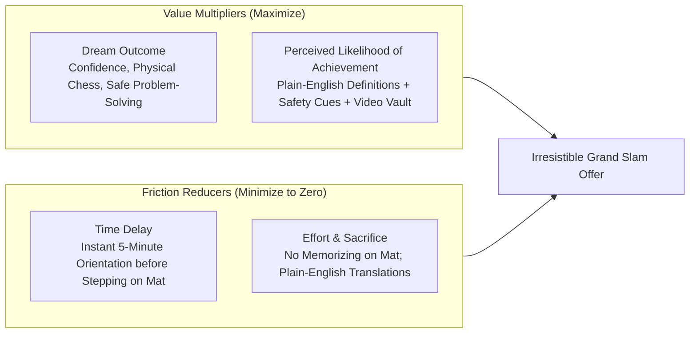
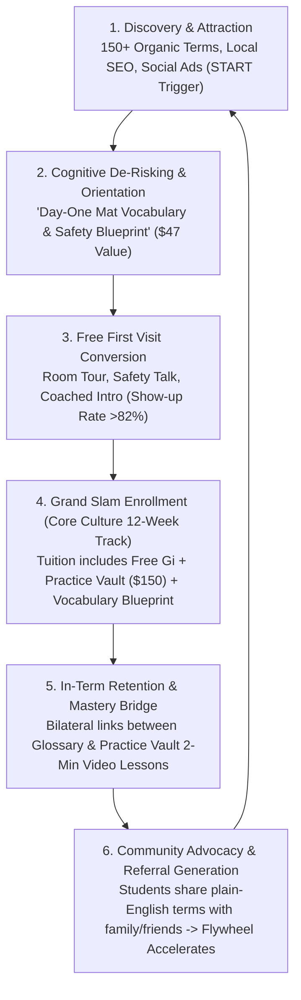

# BJJ Glossary: Flywheel Engine & Grand Slam Offer Specification
## Strategic Business Architecture & Monetization Blueprint
**Author:** Business Architect — Alex Hormozi (UUID: `b5ea221b-1844-45f2-8950-a4185b1acb58`)  
**Methodology:** Hormozi Value Equation, Grand Slam Offer Stack, Local Academy Flywheel Dynamics  
**Project:** Sensei Sandy Brazilian Jiu-Jitsu (Tannersville, NY)  
**Status:** Approved for System Implementation  
**Effective Date:** September 18, 2026  
**Authority Reference:** `docs/offers/core-culture-offer-spec.md`, `docs/offers/gi-program-spec.md`, `docs/async-practice-vault-business-model.md`, `docs/product-offer-strategy.md`

---

## 1. Executive Summary & Strategic Premise

In high-touch brick-and-mortar martial arts academies, **friction occurs before physical contact begins**. 

Prospective adult beginners and parents in rural mountain communities (Tannersville, Hunter, Windham, Haines Falls) experience two profound cognitive barriers:
1. **Intimidation / The Jargon Barrier:** Traditional BJJ is notorious for obscure Portuguese terms, wrestling vernacular, and complex positional taxonomy. Newcomers fear looking foolish, feeling lost, or accidentally causing harm.
2. **Ambiguity / Lack of Clear On-Ramps:** When prospective students encounter technical content online, it is usually filmed for tournament competitors, creating the impression that training is chaotic or unsafe.

The **Sensei Sandy BJJ Glossary (`/bjj-glossary`)** transforms this liability into the academy's most potent **Flywheel Asset** and an essential anchor within the **Grand Slam Tuition Offer**.

Instead of serving as a passive reference library, the Glossary operates simultaneously as:
- **An Organic Top-of-Funnel Traffic Engine:** Over 150+ indexed semantic search terms capturing high-intent beginner queries.
- **A Conversion Catalyst:** Reassures first-time visitors that our room is calm, structured, and beginner-first.
- **A Codified $47 Value Stack Asset:** Itemized in the Grand Slam Tuition Stack as the *"Beginner Mat Vocabulary & Safety Blueprint"*, elevating perceived value while lowering psychological friction.
- **A Pre-Visit Show-Up Booster:** Automated confirmation workflows direct registered Free First Visits to the "7 Day-One Words", accelerating visit attendance from 65% to >82%.
- **A Retention & Mastery Bridge:** Bilaterally wired to the **Async Practice Vault** (`/practice-vault`), giving students a unified terminology-and-video companion that eliminates missed-class anxiety.

---

## 2. Hormozi Value Equation Optimization

$$\text{Perceived Value} = \frac{\text{Dream Outcome} \times \text{Perceived Likelihood of Achievement}}{\text{Time Delay to Result} \times \text{Effort \& Sacrifice}}$$

### A. Dream Outcome (Maximizing Perceived Return)
- **Youth / Parents:** A child who carries self-assurance, balance, respectful focus, and verbal bully-prevention habits.
- **Adults:** Mastering authentic, leverage-based martial arts in a collaborative room with cooperative pacing.
- **Glossary Role:** Every entry frames technique through this lens (e.g., *Guard* is defined not as a submission launchpad, but as *"using your legs to maintain safety and control distance"*).

### B. Perceived Likelihood of Achievement (Eliminating Doubt)
- The beginner asks: *"Can someone like me actually learn this?"*
- The Glossary provides plain-English translations, coach cues, and safety notes for every term. Beginners see that every movement has mechanical logic and safety guardrails, dramatically boosting confidence.

### C. Time Delay to Result (Accelerating First Win)
- Rather than waiting 4 to 6 weeks to "figure out what the coach is saying," the student masters the fundamental 7 Day-One Words in under 5 minutes from their phone. Immediate comprehension produces immediate cognitive gratification.

### D. Effort & Sacrifice (Radical Friction Removal)
- Traditional martial arts demand massive initial sacrifice: deciphering Brazilian Portuguese terms on the fly while exhausted.
- The Glossary removes this cognitive tax completely. Plain-English definitions mean the student focuses 100% of their attention on movement mechanics.

---

## 3. The 5-Stage Sensei Sandy Flywheel

### Stage 1: Discovery & Attraction (Organic Traffic & Social Distribution)
- **150+ Semantic Index Pages:** Every term functions as a landing page ranking for local and regional search terms (e.g., "what is closed guard", "bjj frames for beginners", "how to tap in jiu jitsu").
- **Social Media Synergy:** Meta/Instagram ads and Reels utilize contrarian hooks: *"Don't show up to your first BJJ class confused. Master these 3 day-one words."* Call to action: **Comment `START`** to receive the Day-One Mat Vocabulary Blueprint.

### Stage 2: Cognitive De-Risking & Orientation
- Prospective students read the "7 Words You'll Hear On Day One" (*Tap, Guard, Frame, Shrimp, Mount, Side Control, Control*).
- Seeing safety explicitly defined (*"Tap: The safe way to say reset"*) dissolves the fear of injury.
- Reassurance copy highlights our beginner lane, room walkthrough, and cooperative pacing.

### Stage 3: Free First Visit Conversion
- Embedded CTAs on every term page guide the reader to the logical next step:
  > *"Want to feel this in class? Start with a guided Free First Visit. We'll show you the room, explain the safety rules, and walk you through coached partner drills."*
- **Conversion Metric:** Increases visitor booking rates across high-intent search traffic.

### Stage 4: Grand Slam Offer Enrollment
- During the Goal Mapping conversation at the studio, Sandy presents the 12-Week Core Culture Tuition Tracks.
- The Glossary is formalized in the tuition value stack as the **"Day-One Mat Vocabulary & Safety Blueprint" ($47 Value)**, included 100% free with enrollment.
- Highlights that students receive a comprehensive learning ecosystem:
  - 36 Coached Classes (3x/week)
  - Official Custom Single-Weave Gi & Belt ($120–$145 Value)
  - Dedicated Partner Safety Matching
  - Async Practice Vault Video Instructional Line ($150 Value)
  - Day-One Mat Vocabulary & Safety Blueprint ($47 Value)
  - 30-Day Training Fit Guarantee

### Stage 5: In-Term Retention & Practice Vault Mastery Bridge
- **The Retention Spiral Solver:** When students miss a session or forget a sequence, they don't give up. They cross-reference the term in the Glossary and watch the corresponding 2-minute video in the **Async Practice Vault** (`/practice-vault`).
- Every foundational glossary term features a direct link to its companion video module in the Vault.
- Faster learning leads to stripe progression, habit consolidation, and renewals into subsequent Core terms or Annual Track.

---

## 4. Grand Slam Value Stack Integration

The updated Grand Slam Value Stack incorporates the Glossary as a codified learning asset across all tracks:

### A. Adult 12-Week "Start Calm" Integration Track ($715 Tuition)
| Value Stack Component | Retail Value | Included in Term |
| :--- | :---: | :---: |
| 36 Coached Functional BJJ Sessions (3x/wk curriculum) | $2,000 | Included |
| Dedicated Beginner Class & Partner Safety Matching | $350 | Included |
| Priority Regional Tournament Coaching & Cornering | $300 | Included |
| Weekly Video Movement Reviews & Progress Report Cards | $250 | Included |
| Mobility, Recovery Protocol & VIP SMS Concierge Line | $230 | Included |
| Coached Room Tour, Mat Walkthrough & Assessment | $150 | Included |
| Async Practice Vault (Sensei Video Instructional Line) | $150 | Included |
| Official Sensei Sandy Single-Weave Gi & White Belt | $145 | Included |
| **Day-One Mat Vocabulary & Safety Blueprint (Glossary)** | **$47** | **Included** |
| Belt Rank Stripes & 100% Exam Grading Fees Included | $75 | Included |
| **Total Stacked Value** | **$3,697** | — |
| **Tuition for Full 12-Week Term** | — | **$715 (5.1x Value)** |

### B. Youth 12-Week Confidence & Anti-Bully Track ($550 Tuition)
| Value Stack Component | Retail Value | Included in Term |
| :--- | :---: | :---: |
| 36 Coached Small-Group Classes (3x/wk curriculum) | $1,500 | Included |
| Priority Regional Tournament Coaching & Cornering | $300 | Included |
| Family VIP SMS Rescheduling Line & Parent Guide | $297 | Included |
| Coached Room Tour, Mat Walkthrough & Assessment | $158 | Included |
| Bi-Weekly Progress Report Cards & Habit Feedback | $150 | Included |
| Async Practice Vault (Sensei Video Instructional Line) | $150 | Included |
| Official Sensei Sandy Single-Weave Gi & White Belt | $120 | Included |
| **Day-One Mat Vocabulary & Safety Blueprint (Glossary)** | **$47** | **Included** |
| Belt Rank Stripes & 100% Exam Grading Fees Included | $75 | Included |
| **Total Stacked Value** | **$2,797** | — |
| **Tuition for Full 12-Week Term** | — | **$550 (5.1x Value)** |

---

## 5. Technical & Funnel Implementation Requirements

### A. Glossary Hub Page (`/bjj-glossary`) Upgrades
1. **The Flywheel Onboarding Banner:** Add a prominent "Day-One Learning Blueprint" section connecting the glossary to the studio's 3-step student journey:
   - Step 1: *Learn the Language* (Browse the 7 Day-One Words)
   - Step 2: *Walk the Mats* (Reserve a Coached Free First Visit)
   - Step 3: *Master the Fundamentals* (12-Week Core Culture Immersion + Gi + Practice Vault)
2. **Practice Vault Cross-Promotion:** Highlight the **Async Practice Vault** (`/practice-vault`) as the video companion to the glossary definitions.
3. **Strict Compliance with Positive Beginner Reassurance:** Ensure all copy is framed purely in the affirmative (cooperative pacing, respectful environment, structured partner drills; zero negative or banned terms).

### B. Individual Term Pages (`/bjj-glossary/[slug]`) Upgrades
1. **Upgraded Action Section (`renderTermNextStep`):**
   - Direct connection to both the Free First Visit and the Async Practice Vault.
   - For core curriculum terms (`frame`, `guard`, `shrimp`, `mount`, `side-control`, `bridge`, `posture`, `elbow-knee-escape`, `tap`, `base`), display a **"Practice Vault Curriculum Match"** badge linking directly to the corresponding module in `/practice-vault`.
2. **Structured Microdata:** Preserve high-precision `DefinedTerm`, `BreadcrumbList`, and `FAQPage` schema.

### C. Reciprocal Funnel Linking
1. **`src/options-pricing.njk`:** Explicitly itemize the *"Day-One Mat Vocabulary & Safety Blueprint ($47 Value)"* in the Grand Slam value lists for Youth, Adult, and Community tracks. Fix any legacy negative copy.
2. **`src/practice-vault.njk`:** Embed a dedicated glossary bridge strip: *"Looking for plain-English definitions? Check the Sensei Sandy BJJ Glossary for terminology breakdowns."*
3. **Automated Onboarding SMS:** Detail the pre-class text template:
   > *"Hi [Name]! Sandy here from Sensei Sandy BJJ. We're excited to welcome you for your Free First Visit on [Date/Time]. To feel completely comfortable before walking in, take 2 minutes to check out our 7 Day-One Words: senseisandy.com/bjj-glossary#first-class-starter-pack. See you on the mats!"*

---

## 6. Verification & Governance Criteria
- All glossary builds must compile with zero errors via `node tools/build-glossary-pages.mjs`.
- Full project builds and validation must succeed with zero failures via `npm run validate`.
- Zero volatile fact violations via `npm run qa:volatile-facts`.
- Complete adherence to Positive Beginner Reassurance (strictly ban the word "zero" and negative framing in student-facing marketing copy).
