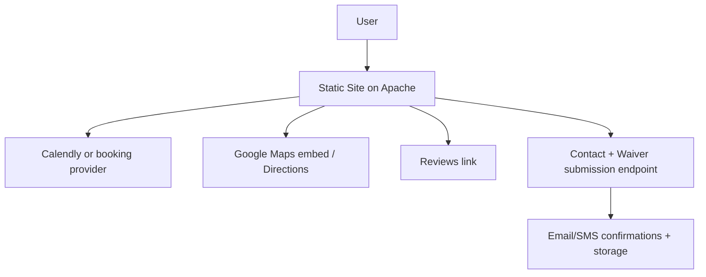

# SenseiSandy.com Design Bible v0.1

- Product: Sensei Sandy BJJ website
- Primary goal: `Reserve Free Intro (Beginner Friendly)` for the right lane with minimal friction
- Secondary goals: Reduce no-shows via Show-Up Kit + Waiver completion
- Voice: Calm, confident, beginner-friendly, no-ego, real human replies

## 1. Non-Negotiables

These rules stay consistent sitewide.

### Primary CTA dominance
- Button label: `Reserve Free Intro (Beginner Friendly)`
- Always visible above the fold on lane pages
- CTA appears again after key sections (reviews, pricing, FAQ)

### Lane logic is sacred
- Default paths: Kids (`5-9`), Teens (`10-17`), Adults (`18+`)

### No-show reduction path is explicit
- Repeat: `Book -> Show-Up Kit -> Waiver` anywhere booking is mentioned

### Beginner safety is explicit
- Keep this near booking and schedule: `Beginner Lane = skill-based resistance activities begin at the right pace from day one`

## 2. Primary User Journeys

### Journey A: Reserve Free Intro (Beginner Friendly)
- Entry: Home / Schedule / Contact / any lane page
- Flow:
1. User picks lane
2. Confirms spot
3. Receives Show-Up Kit
4. Completes Waiver
- Success metrics: Booking completion rate, waiver completion rate

### Journey B: Nervous beginner reassurance
- Entry: Home / Contact / Show-Up Kit
- Proof blocks: Reviews, beginner-safe pacing, no-robot responses, simple what-to-wear instructions

### Journey C: Price and schedule clarity
- Entry: Schedule / Contact / Options-Pricing
- Goal: Show same simple times + 12-week plan overview + guarantee

## 3. Information Architecture

### Global nav (stable)
- Programs
- Schedule
- Options / Pricing
- Gallery
- Contact
- `Reserve Free Intro (Beginner Friendly)` (button)

### Sitemap spine
- `/` Home
- `/book-free-intro` Lane picker booking hub
- `/schedule` Weekly schedule grid + lane sections
- `/options-pricing` Plans + 12-week overview
- `/show-up-kit` No-show reducer + first day instructions
- `/waiver` Registration + waiver
- `/contact` Fast replies + form + address
- `/blog/...` Local SEO + education + internal links

## 4. Reusable Page Sections

Treat these as composable blocks.

### Section A: Lane picker
- Purpose: Pick the correct age lane quickly
- Required content:
- Headline: `Pick your lane`
- Buttons: Kids / Teens / Adults
- Micro-proof: Safety-first + reschedule by text

### Section B: Promise block
- Purpose: Reduce anxiety and establish trust quickly
- Must include:
- Beginner-safe pacing
- Clean mats + supervised rounds
- Reschedule by text / easy communication

### Section C: Reviews village
- Purpose: Social proof without clutter
- Include: 3 featured review cards + `Read all reviews` link

### Section D: After Free Intro block
- Purpose: Bridge booking to paid plans
- Include: `Core Culture 12 Weeks` + `30-Day Money-Back Guarantee`

### Section E: Flow strip
- Purpose: Teach next steps in one line
- Copy: `Book -> Confirmation -> Show-Up Kit -> Waiver (~2 minutes)`

## 5. Design System

### Brand attributes
- Calm confidence
- Minimal intimidation
- Fast clarity
- Local, real human help

### Layout rules
- Mobile-first, centered content blocks
- One primary action per section
- Short headings, short paragraphs, scannable bullets

### Components
- Buttons: Primary (`Reserve Free Intro (Beginner Friendly)`), secondary (`Text`, `Call`)
- Cards: Review card, lane card, pricing card
- Accordion: FAQs
- Optional high-ROI pattern: Sticky mobile bottom bar (`Book`, `Text`, `Call`)

## 6. Content and SEO Rules

Follow Google guidance: pages should be easy to understand, clearly structured, and helpful to real visitors first.

### On-page SEO standards
- One clear H1 per page
- Descriptive titles and meta descriptions per page
- Internal link path: Home -> Schedule -> Book -> Show-Up Kit -> Waiver
- Use local modifiers where appropriate (Tannersville, Hunter, Catskills)

### Structured data
- Use JSON-LD
- Match visible page content
- Follow Google structured data guidance
- Base business schema on Schema.org `LocalBusiness` fields

## 7. Data Model

### Lead data (contact form)
- Full name
- Email
- Optional phone
- Message
- Interest lane

### Waiver data
- Required:
- Name
- DOB
- Phone
- Email
- Emergency contact name
- Emergency contact relationship
- Emergency contact phone
- Signature
- Date
- Optional:
- Address
- Prior BJJ
- Prior school
- Injuries/conditions
- Consent:
- Media release choice

## 8. Analytics and Tracking Spec

### Events to track
- `cta_book_free_intro_click`
- `cta_text_click`
- `cta_call_click`
- `lane_pick_kids`
- `lane_pick_teens`
- `lane_pick_adults`
- `show_up_kit_view`
- `waiver_start`
- `waiver_submit`

### UTM rules
- Every `Reserve Free Intro (Beginner Friendly)` link should include:
- `utm_source`
- `utm_medium`
- `utm_campaign`
- `utm_content` (placement descriptor)
- If redirecting or embedding a scheduler, preserve UTMs based on vendor support

## 9. Performance Targets

Track and protect Core Web Vitals (`LCP`, `INP`, `CLS`).

### Rules
- Use correctly sized WebP/AVIF images
- Lazy-load below-the-fold images
- Minimize third-party scripts on booking-critical pages
- Cache static assets aggressively

## 10. Accessibility Standard

Target WCAG 2.2 AA patterns:
- Visible focus states
- Labels for all form fields
- Readable contrast
- Keyboard navigability

## 11. Security Baseline

Use an OWASP Top 10 mindset for common web risks, including mostly-static pages.

### Minimum header targets
- `Content-Security-Policy`
- `Referrer-Policy`
- `X-Content-Type-Options`
- `X-Frame-Options` (or `frame-ancestors` via CSP)
- `Strict-Transport-Security` (when HTTPS is enforced)

## 12. Standard Diagrams

### Funnel map
```mermaid
flowchart LR
A[Home, Schedule, Contact, Blog] --> B[Reserve Free Intro (Beginner Friendly)]
B --> C[Confirmation]
C --> D[Show-Up Kit]
D --> E[Waiver]
E --> F[Arrive + Train]
F --> G[Core Culture 12 Weeks]
```

### System architecture


## 13. Acceptance Criteria

A release passes when:
- Every page has a visible `Reserve Free Intro (Beginner Friendly)` CTA above the fold
- Lane picker always routes correctly to Kids/Teens/Adults
- Flow strip appears on booking and waiver-context pages
- Contact form fields are labeled and success state is clear
- Waiver required fields match the displayed required set
- Structured data validates and matches visible content
- Core Web Vitals are not obviously harmed by new scripts/media

## Improvements

Highest-ROI next upgrades:
1. Componentize the spine:
Create reusable partials for Lane Picker, Flow strip, After Free Intro, Reviews village.
2. Schema pack:
Implement LocalBusiness + FAQ + Breadcrumb + Article (blog), all aligned with visible content and Google guidance.
3. Analytics hardening:
Ensure GA4 events and UTMs exist on every CTA placement.
4. Performance sweep:
Audit images and reduce script weight on booking-critical pages.
5. Apache security headers:
Add CSP starter, referrer policy, and baseline header protections.
