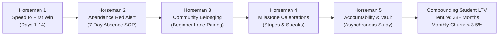
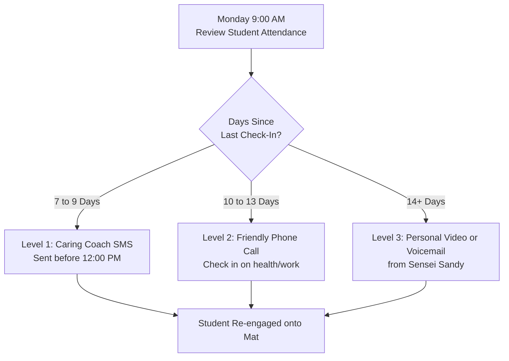

# Sensei Sandy BJJ: Member Retention & Student Journey Playbook
**The Five Horsemen of Retention Adapted for Brazilian Jiu-Jitsu Academies**
*Derived from Alex Hormozi's Gym Launch Secrets (Chapter 16) and Infographic Framework 12*

---

## 1. The Mathematics of Martial Arts Retention

In the martial arts industry, most academies struggle with **7% to 10% monthly student attrition**. At 10% churn, the average student only trains for 10 months. The academy is forced into a exhausting treadmill: enrolling 15 new students every month just to replace the 14 who quietly drop out.

By implementing the **Five Horsemen of Retention**, Sensei Sandy BJJ targets a monthly churn rate of **under 3.5%**, extending average student tenure from 10 months to **over 28 months**:

---

## 2. Horseman 1: Speed to First Win (The 14-Day Onboarding Journey)

The first 14 days dictate whether a student becomes a lifelong practitioner or drops out due to soreness, intimidation, or self-doubt.

### The 14-Day Student Onboarding Schedule

| Day | Touchpoint | Action & Channel | Purpose |
|---|---|---|---|
| **Day 0** | Consultation & Enrollment | Hand over official academy gi, team patch, and Practice Vault access credentials. | Immediate physical reinforcement; eliminates buyer's remorse. |
| **Day 1** | Post-Enrollment Welcome | Personal SMS from Sandy: *"Incredible having you on the team, [Name]! Your mat journey starts [Day]."* | Affirms membership and validates decision. |
| **Day 3** | First Class Follow-up | Personal SMS: *"How are your muscles feeling today? Remember to hydrate—your body adapts fast!"* | Normalizes early physical adaptation. |
| **Day 7** | The First Technical Win | In-class milestone: coach guides the student through their first clean escape or guard recovery. Coach praises them publicly during closing circle. | Delivers unmistakable proof that the training works. |
| **Day 14** | 2-Week Progress Check-in | Coach checks in 5 minutes before class: *"Two weeks in the books! Which movement has felt most natural so far?"* | Reinforces personal coach relationship. |

---

## 3. Horseman 2: Attendance Red Alerts (The 7-Day Inactivity Protocol)

Over **80% of student cancellations occur after 14 consecutive days of silence**. Students do not cancel because they had a bad class; they miss a week due to work or family, feel guilty or out of rhythm, and assume the academy will not notice if they drift away.

### The Weekly Monday Audit
Every Monday at 9:00 AM, the academy administrator or lead coach reviews attendance logs:

### Level 1 Script: The 7-Day Caring Text
*Send via personal SMS (Day 7–9 of absence):*
> "Hey [First Name], Sandy here! We missed your energy on the mats this past week. I hope work and family have been going great! We are drilling side control escapes on [Day] at [Time]. Can I save your spot in the Beginner Lane?"

*Why this script works:*
1. Purely positive and caring (pure encouragement, free of guilt or pressure).
2. Specifies the technical theme so the student knows what to expect.
3. Asks a simple question (*"Can I save your spot?"*) prompting an easy reply.

### Level 2 Script: The 10-Day Friendly Call
*If no reply to Level 1 after 72 hours:*
> "Hi [First Name], Sandy from the academy! Just giving you a quick call to check in and make sure you're feeling healthy. No pressure at all—we just value having you in the room and wanted to see how life is treating you. Give me a text whenever you get a free moment!"

### Level 3 Script: The 14-Day Personal Video
*Send a short 15-second selfie video from the academy mat:*
> *"Hey [First Name], Sandy here from the gym in Tannersville! Just finished class and the team was asking about you. We'd love to see you back on the mats whenever your schedule frees up. Have a wonderful week!"*

---

## 4. Horseman 3: Cultural Belonging & The Beginner Lane

Martial arts can feel socially intimidating. To create deep belonging:

### 1. The Senior Partner Pairing Rule
- Never allow two complete beginners to train together during their first month.
- Always pair a new white belt with a patient, disciplined blue or purple belt who understands cooperative drilling.
- The senior student's job is not to win; their job is to provide clean, realistic mechanical resistance that helps the beginner learn.

### 2. The Name Recognition Standard
- Every instructor must speak the first name of every student on the mat at least **twice per class**:
  - Once during arrival / warm-up.
  - Once during partner drills with specific positive technical feedback (*"Nice hip escape, Dave!"*).

### 3. Purely Positive Mat Agreements
- **Respect the tap immediately**: Trust is our primary asset.
- **Leave ego in the entryway**: We train to learn together, not to defeat teammates.
- **Pristine hygiene**: Clean gis, trimmed nails, and barefoot-only mats.

---

## 5. Horseman 4: Milestone Celebrations & Advancement Cadence

Students drop out when they feel stuck on an endless plateau. Public milestone recognition provides visible progress markers:

### Milestone Architecture

| Milestone | Recognition Format | Tangible Reward |
|---|---|---|
| **Class 10** | End-of-class coach announcement | Team high-fives + First stripe evaluation |
| **Class 25** | Social media feature + Mat announcement | Sensei Sandy BJJ Academy Sticker / Patch |
| **Class 50** | Mid-term progress review with Sandy | Custom Academy Water Bottle or T-shirt |
| **Class 100** | Formal promotion ceremony | Century Mat Club certificate + Belt advancement |

### The Stripe Promotion SOP
- Stripe evaluations occur during the last week of every month.
- Every student who met attendance consistency benchmarks receives public recognition and direct feedback on what they have mastered.

---

## 6. Horseman 5: Proactive Accountability & Asynchronous Vault

To reinforce in-person attendance, integrate the digital **Practice Vault** (`senseisandy.com/practice-vault`):

1. **Curriculum Review**: When a student struggles with a specific position in class (e.g. guard retention or elbow escapes), the coach recommends the exact 2-minute video module in the Practice Vault.
2. **Vacation / Business Trip Bridge**: When a student travels, encourage them to watch one Practice Vault module per week so their mental connection to the academy remains active.
3. **Parental Reinforcement**: Parents of youth students receive weekly curriculum emails showing the core movement drilled that week, allowing parents to praise their child's technical progress at home.

---

## 7. Operational Scorecard & Weekly Retention Review

Every Friday afternoon during the coach meeting, review these core retention indicators:

| Retention KPI | Target Benchmark | Current Academy Status |
|---|---|---|
| **Monthly Churn Rate** | < 3.5% | Tracked via CRM active roster |
| **7-Day Absence Count** | < 5% of active roster | Reviewed and contacted every Monday |
| **14-Day Student Retention** | 95%+ | Tracked per beginner cohort |
| **90-Day Retention Floor** | 85%+ | Tracked per enrollment class |
