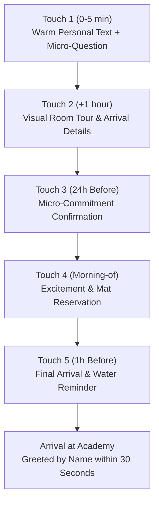

# Sensei Sandy BJJ: Show-Up & Intro Conversion Playbook
**Operational Standard for Converting Free Intro Bookings into Lifelong Students**
*Adapted from Alex Hormozi's Gym Launch Secrets & Infographic Sales Frameworks for Brazilian Jiu-Jitsu*

---

## 1. The Core Purpose & The Show-Up Problem

In local martial arts academies, **over 50% of booked Free Intros fail to show up** if left to passive automated calendar emails.

Prospective students and parents do not skip their introductory appointment because they forgot; they skip because **fear, intimidation, and friction overcome initial desire**. A beginner imagines walking into an aggressive room of seasoned competitors, feeling out of place, or being pressured into a sale.

This playbook establishes a **calm, hospitality-first show-up and consultative enrollment process** designed to:
1. Lift Free Intro show-up rates from ~50% to **85%+**.
2. Dissolve beginner anxiety before they step through the door.
3. Conduct an empathetic, diagnostic consultation (the BJJ C-L-O-S-E-R Method) that converts 75%+ of attendees into enrolled members.
4. Uphold all Sensei Sandy BJJ brand standards: calm culture, cooperative pacing, positive reassurance, and family-first focus.

---

## 2. Speed-to-Lead Protocol (< 5 Minutes)

When an inquiry or Free Intro booking arrives via `senseisandy.com`, the contact clock begins immediately. Research proves contacting a lead within 5 minutes yields a **900% higher contact rate** than waiting 30 minutes.

### Standard First Touch (SMS)
*Sent within 5 minutes of booking:*

> "Hi [First Name], Sensei Sandy here from Sensei Sandy BJJ in Tannersville! I saw you just reserved your Free Intro for [Day, Time]. We are excited to welcome you onto the mats. Quick question so I can prepare your coach: have you ever trained martial arts before, or is this your first time trying Jiu-Jitsu?"

### Why This Works (Hormozi Show-Up Psychology):
1. **Immediate human connection**: Comes directly from Sandy, not an impersonal automated bot.
2. **Open-ended micro-commitment**: Ending with an easy question prompts an immediate one-word or one-sentence reply ('Brand new!', 'Did karate as a kid'), shifting the booking from an abstract task to an active personal conversation.
3. **Paves the way for reassurance**: Allows Sandy to immediately assign them to the Beginner Lane.

---

## 3. The 5-Touch Show-Up Cadence

To guarantee an 85%+ show rate, execute this 5-touch sequence between booking and class time:

### Touch 1: Immediate Connection (0–5 Minutes)
*(As outlined above)*

### Touch 2: Visual Room Tour & Friction Removal (1 Hour Later)
*Send via SMS with photo/link:*
> "Awesome, [First Name]! You are going to love the room. We keep everything calm and cooperative. Here is what to expect: wear comfortable athletic pants and a t-shirt, bring a water bottle, and park right along Main Street in front of the academy. When you walk in, slip off your shoes in the entryway and I will meet you right there. See you [Day]!"

### Touch 3: 24-Hour Micro-Commitment Confirmation
*Sent 24 hours prior to class:*
> "Hey [First Name]! Sandy here. We have your spot reserved for tomorrow at [Time] in our Beginner Lane. Can you reply with a quick 'CONFIRM' so I know you're all set?"

*If they reply 'CONFIRM':*
> "You are locked in! Looking forward to meeting you tomorrow."

*If no reply after 4 hours:*
A quick friendly follow-up phone call: *"Hey [First Name], Sandy from the academy! Just making sure tomorrow at [Time] still works great for your schedule."*

### Touch 4: Morning-of Mat Reservation (Morning of Class)
*Sent at 9:00 AM on training day:*
> "Good morning [First Name]! Today is the day. Your mat spot is prepped for [Time] tonight. Let me know if any traffic or weather delays pop up on the mountain. See you soon!"

### Touch 5: 1-Hour Arrival Alert
*Sent 60 minutes prior:*
> "Hey [First Name], class starts in an hour at [Time]! Take your time driving in. See you on the mats!"

---

## 4. First 5 Minutes: The Frictionless Arrival SOP

The moment a trial student or parent steps through the front door sets the entire psychological frame for their experience.

### Arrival Checklist:
1. **Greet by Name within 30 Seconds**: Coach or desk staff steps forward with a genuine smile: *"Hi! Are you Marcus? I'm Sandy, so glad you made it!"*
2. **The Facility Walkthrough**:
   - Show where shoes and coats go.
   - Point out restrooms and changing areas.
   - Show the parent viewing lounge (for kids/teens) or mat seating area.
3. **The Beginner Lane Reassurance**:
   - Hand them their loaner uniform or confirm their athletic wear.
   - Introduce them to their senior training partner: *"Marcus, this is Dave. Dave has been training with us for a year and is one of our most patient partners. He is going to be your training buddy tonight."*
4. **Framing the Session**:
   - *"Tonight is purely about experiencing how the movements feel. Everything is cooperative, coached at your pace, with pure mechanical leverage. If you ever need a water break, step off anytime."*

---

## 5. The BJJ C-L-O-S-E-R Method (Consultative Enrollment)

After the class concludes, invite the prospect into the consultation lounge for a 10-to-15 minute diagnostic conversation. Do not hand them an unguided price sheet. Walk through the **C-L-O-S-E-R framework**:

### Step 1: Clarify (Why Are They Here?)
*Ask open diagnostic questions:*
- *"How did that feel on the mats tonight?"*
- *"What originally inspired you to look into Jiu-Jitsu this week?"*
- Listen deeply. Note whether their real driver is stress relief, functional fitness, self-protection, finding a positive community, or helping their child build quiet confidence.

### Step 2: Label (State the Problem)
*Summarize their core challenge in their own words:*
- *"It sounds like between long work hours and family responsibilities, you've felt your energy dropping and you want a workout that actually engages your mind while keeping your joints healthy."*
- Wait for them to nod and say: *"Yes, exactly."*

### Step 3: Overview (Examine Past Attempts)
*Uncover why past solutions didn't stick:*
- *"What have you tried in the past to stay consistent? Gym memberships, running, fitness apps?"*
- *"Why do you think those didn't keep you engaged long-term?"*
- Highlight the contrast: traditional gyms lack community, coaching, and mental problem-solving.

### Step 4: Sell the Vacation (The Transformation)
*Connect training to their transformed daily life:*
- *"Imagine six months from now: you have lost that sluggish work fatigue, your back and hips feel loose and agile, and twice a week you spend an hour with great friends where work stress completely disappears. You leave feeling calm, clear, and energized."*
- Focus on how they will *feel*, not on grueling training mechanics.

### Step 5: Explain Away Concerns (Objection Resolution & Guarantees)
*Introduce the membership structure, anchor value, and provide risk reversal:*
- *"Our regular adult program provides structured coaching 3 to 4 days a week, our complete online Practice Vault for reviewing techniques at home, and personal progress tracking."*
- State tuition clearly: reference current schedules and programs at `/schedule`.
- Present the **14-Day Mat Guarantee**: *"We back every new enrollment with our 14-day 100% satisfaction guarantee. If after your first two weeks you don't feel completely welcomed, energized, and supported, we refund your tuition immediately."*

### Step 6: Reinforce the Decision (Immediate Onboarding)
*Celebrate their commitment immediately:*
- Congratulate them with a warm handshake or high-five.
- Present their official academy gi / uniform and team patch.
- Schedule their next class on the calendar: *"We'll see you Friday at 6:00 PM for session two!"*
- Send a welcome text that evening: *"Incredible work on the mats tonight, [Name]! Proud to have you on the team. Rest up and see you Friday!"*

---

## 6. Universal Objection Overcomes (Positive Beginner Reassurance)

*All scripts strictly adhere to the Positive Beginner Reassurance Rule: purely positive framing and supportive language.*

### Objection 1: "I need to get in shape first before starting."
- **The School Reframe**:
  > "I completely understand that feeling. But thinking you need to be in shape before starting Jiu-Jitsu is like thinking you need to know algebra before going to math class! Jiu-Jitsu is the vehicle that builds your endurance, mobility, and core strength. In our Beginner Lane, movements are cooperative and coached at your personal pace from day one. You build fitness while learning real skill."

### Objection 2: "I'm worried about getting hurt."
- **The Cooperative Pacing Reframe**:
  > "Safety is the foundation of our entire academy. Our classes prioritize calm, structured partner drills and pure mechanical leverage. You work with experienced, respectful training partners who guide your movements smoothly. You have full control over your pacing, and skill-based resistance activities begin at the right pace from day one under direct coach supervision."

### Objection 3: "I need to talk to my spouse/partner."
- **The Acknowledge & Risk-Reverse Protocol**:
  > "I respect that completely—family support is essential. If your spouse is on board, are you excited to train? Wonderful. Let's reserve your mat spot today with our 14-day complete satisfaction guarantee. Take your uniform home, show your family what you're doing, and come train. If your spouse isn't completely supportive after seeing how energized and happy you are, let us know and we refund every penny."

### Objection 4: "I work irregular hours / unpredictable shifts."
- **The Multi-Lane Schedule Reframe**:
  > "Many of our adult students are local business owners, mountain staff, and healthcare professionals with shifting hours. That's why our membership includes access to all scheduled adult classes, including weekday evenings and Saturday mornings. Even attending consistently two days a week delivers remarkable physical results and stress relief. You can review current class times directly at `/schedule`."

### Objection 5: "My child is shy and hesitant to join a group."
- **The Gentle Onboarding Protocol**:
  > "Many of our most confident youth students started out feeling shy. We begin every child with a gentle room tour and pair them with a supportive, friendly partner. Our youth classes emphasize fun movement games, mutual respect, and celebrated small wins. Your child can watch as much as they like from the side until they feel eager to step onto the mat."

---

## 7. Operational KPI Tracking

Every Friday, review the academy show-up and intro metrics:

| Metric | Calculation | Healthy Benchmark |
|---|---|---|
| **Speed to First Touch** | Time from web booking to personal coach SMS | **< 5 Minutes** |
| **Intro Show-Up Rate** | (Attended Intros / Booked Intros) x 100 | **80% – 85%+** |
| **Intro Close Rate** | (Enrolled Members / Attended Intros) x 100 | **70% – 80%+** |
| **Day-1 Welcome Touch** | % of new students receiving uniform & welcome text | **100%** |
