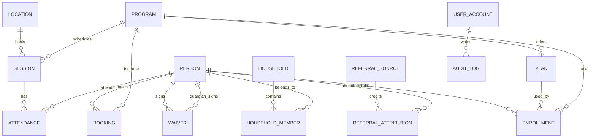

# SwiftAttend Data Model (MVP)

This model is implemented in SQLite-first form in `api/lib/db.php` and is designed to stay portable to MySQL.

## Core lifecycle

`lead -> person -> enrollment -> session -> attendance`

## ERD (Mermaid)

## Security and compliance rules

- Minor waiver rule: when `person.is_minor = 1`, `waiver.guardian_id` is required.
- Household guardrail: guardian must share a household with the minor.
- PII minimization: collect only operational fields in `person`; keep high-risk files outside the DB.
- Waiver storage: DB stores `storage_uri` + `file_sha256`; signed files live in encrypted storage.
- Vendor neutrality: integration references use `source + external_id` (for bookings and vendor mirrors).

## API map

- `POST /api/leads`: captures legacy lead row and upserts canonical `person` lead.
- `GET /api/students`: students list with enrollment/program/plan joins.
- `GET /api/sessions`, `POST /api/sessions`: class session listing and creation.
- `GET /api/attendance`, `POST /api/attendance` (`/api/attendance/checkin` alias): attendance query/check-in upsert.
- `GET /api/waivers`, `POST /api/waivers`: waiver metadata reads/writes.
- `GET /api/exports/attendance.csv`: export joined attendance rows.
