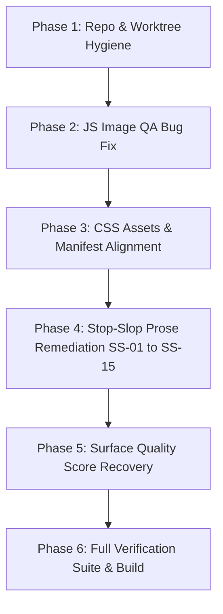
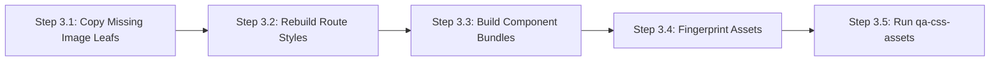

# Sensei Sandy BJJ — Actionable Remediation & Fixes Execution Manual

**Target Document:** [`reports/dirty-worktree-and-audit-findings-2026-09-06.md`](file:///home/twizss/Documents/ssbjjweb/tmb/reports/dirty-worktree-and-audit-findings-2026-09-06.md)  
**Date:** September 6, 2026  
**Repository:** `https://senseisandy.com` (`TriangleWizX/jun1826`)  
**Git Branch:** `blackbeltbartender/hyphen-weekend-v1`  
**Execution Target:** Antigravity (AGY) Autonomous Models & Engineering Agents  
**Target Specification:** Machine-actionable, step-by-step, zero-ambiguity remediation manual.

---

## AGY Model Execution Protocol & Invariant Directives

> [!IMPORTANT]
> **Operational Invariants for AGY Models:**
> 1. **Token Optimization**: Always prefix shell commands with `rtk` (e.g., `rtk git status`, `rtk npm test`) as specified in the global developer rules.
> 2. **Never Overwrite User Work**: The dirty worktree contains active improvements. Do not run destructive git commands like `git checkout -- .` or `git reset --hard`.
> 3. **Canonical Facts Authority**: Volatile operational facts (schedule, pricing, class locations) must reference canonical authority pages (`/schedule`, `/options-pricing`). Never hardcode commercial or operational facts inside blog or editorial prose.
> 4. **Pre-Requisite Source Order**: Always edit source files in `src/` (e.g., `src/blog/`, `src/bjj-glossary/`). Never manually patch `dist/` as the only fix; Eleventy (`npm run build`) materializes `dist/` from `src/`.
> 5. **External Network Gate**: Live external DNS, HTTP, or byte checks require explicit user approval. Run local checks via the verified sandboxed toolset.



---

## Master Remediation Inventory & Status Matrix

| ID / Area | Issue Category | Affected Target Path | Severity | Current Status in Worktree | Required Action |
| :--- | :--- | :--- | :--- | :--- | :--- |
| **HYG-01** | Git Hygiene | [`.gitignore`](file:///home/twizss/Documents/ssbjjweb/tmb/.gitignore) | P2 | Unchecked | Append `.serena/` and `artifacts/` |
| **HYG-02** | Report Triage | `assets/position-tracking-report-*.csv` | P3 | Untracked in root | Move to `reports/data/` or document |
| **HYG-03** | QA Script Tracking | [`package.json`](file:///home/twizss/Documents/ssbjjweb/tmb/package.json) | P2 | Implemented & Untracked | Track scripts & run validation suite |
| **JS-01** | False-Positive Bug | [`scripts/qa-images.mjs:34`](file:///home/twizss/Documents/ssbjjweb/tmb/scripts/qa-images.mjs#L34) | P1 | Active Bug (385 failures) | Fix `alt=""` falsiness check & template regex |
| **CSS-01** | Missing Local Images | `src/assets/images/` & CSS | P1 | Hard Error (4 missing) | Copy/create 4 missing leaf images |
| **CSS-02** | Manifest Hash Drift | `src/assets/data/route-style-manifest.json` | P1 | Hard Error (1 drift) | Sync `high-end-near.css` hash to `.bdbf10` |
| **CSS-03** | Content Manifest Drift | `src/assets/css/` vs minified bundles | P1 | Hard Error (5 drift) | Rebuild component & route CSS bundles |
| **CSS-04** | External Stylesheets | `free-bjj-intro` & `nearby-towns` | P3 | Baseline Debt (2 unmeasured) | Maintain as documented baseline debt |
| **SS-01** | Absolute Injury Claim | [`src/blog/beginners-guide-bjj-human-chess/index.html`](file:///home/twizss/Documents/ssbjjweb/tmb/src/blog/beginners-guide-bjj-human-chess/index.html) | P1 | Fixed in `src/`, dirty in root | Reconcile root copy and build `dist/` |
| **SS-02** | Generic Glossary FAQs | `src/bjj-glossary/*` (71 surfaces) | P1 | Synced in `src/`, needs build | Verify `npm run glossary:sync-faqs` |
| **SS-03** | Tool Directory Scope | [`scripts/qa-stop-slop.mjs:5`](file:///home/twizss/Documents/ssbjjweb/tmb/scripts/qa-stop-slop.mjs#L5) | P1 | Upgraded in worktree | Verify `--input src` default behavior |
| **SS-04** | Exit Code Contract | [`scripts/qa-stop-slop.mjs:245`](file:///home/twizss/Documents/ssbjjweb/tmb/scripts/qa-stop-slop.mjs#L245) | P2 | Upgraded in worktree | Verify test suite `qa-stop-slop.test.mjs` |
| **SS-05** | Formulaic "More Than" | 3 Blog Articles (`teen`, `hunter`, `windham`) | P2 | Fixed in `src/`, needs build | Verify natural phrasing in source and dist |
| **SS-06** | Binary Contrast Stack | [`src/blog/jiu-jitsu-near-windham-mountain-club/index.html`](file:///home/twizss/Documents/ssbjjweb/tmb/src/blog/jiu-jitsu-near-windham-mountain-club/index.html) | P2 | Fixed in `src/`, needs build | Verify removal of "not X, but Y" chain |
| **SS-07** | Vague Self-Praise | [`src/blog/kids-martial-arts-haines-falls-beginner-friendly-jiu-jitsu/index.html`](file:///home/twizss/Documents/ssbjjweb/tmb/src/blog/kids-martial-arts-haines-falls-beginner-friendly-jiu-jitsu/index.html) | P2 | Fixed in `src/`, needs build | Verify concrete coaching actions |
| **SS-08** | Testimonial Heading | [`src/camp-clinics.html:9`](file:///home/twizss/Documents/ssbjjweb/tmb/src/camp-clinics.html#L9) | P2 | Fixed in `src/`, needs punctuation fix | Remove leading commas in author tags |
| **SS-09** | Duplicated Meta Phrase | [`src/blog/catskills-gym-alternative-jiu-jitsu/index.html`](file:///home/twizss/Documents/ssbjjweb/tmb/src/blog/catskills-gym-alternative-jiu-jitsu/index.html) | P2 | Fixed in `src/`, needs build | Confirm clean metadata description |
| **SS-10** | CTA List Syntax Error | `src/bjj-glossary/bottom-position/index.html` | P2 | Fixed in `src/`, needs build | Split parallel list into two sentences |
| **SS-11** | Passive Voice In CTA | `src/bjj-glossary/bottom-position/index.html` | P3 | Fixed in `src/`, needs build | Active instruction by coach Sandy |
| **SS-12** | "Journey" Metaphors | Tournaments, Promotions, CDC sources | P3 | Fixed in `src/`, needs build | Replace with direct action CTAs |
| **SS-13** | Dramatic Hyperbole | Breakfalls & Wrestle-ups blogs | P3 | Fixed in `src/`, needs build | Replace "gravity undefeated" with skill |
| **SS-14** | Test Contrast Assertion | [`scripts/qa-glossary.mjs:274`](file:///home/twizss/Documents/ssbjjweb/tmb/scripts/qa-glossary.mjs#L274) | P2 | Upgraded in worktree | Accept direct non-binary wording |
| **SS-15** | Stale Internal Doc | [`docs/internal-catskills-gym-metadata.md`](file:///home/twizss/Documents/ssbjjweb/tmb/docs/internal-catskills-gym-metadata.md) | P3 | Upgraded in worktree | Retain canonical reference to `/options-pricing` |

---

## Phase 1: Repository Hygiene & Worktree Cleanliness

### Step 1.1: Fix `.gitignore` Leakage
**Root Cause:** Tooling state directories `.serena/` and local test build folders `artifacts/` are currently untracked and pollute `git status`.
**Target File:** [`file:///home/twizss/Documents/ssbjjweb/tmb/.gitignore`](file:///home/twizss/Documents/ssbjjweb/tmb/.gitignore)

**Instructions:** Append the following block to [`.gitignore`](file:///home/twizss/Documents/ssbjjweb/tmb/.gitignore):

```gitignore
# Local IDE and autonomous tooling state
.serena/
artifacts/
```

**Verification Command:**
```bash
rtk git status --short | grep -E "(\.serena|artifacts)"
```
*Expected Output:* No output returned (ignored successfully).

---

### Step 1.2: Position Tracking Data Triage
**Root Cause:** Two rank-tracking CSV files (`position-tracking-report-desktop-2026-09-06.csv` and `position-tracking-report-mobile-2026-09-06.csv`) reside in root `assets/`.
**Action:** Move both CSVs into `reports/data/` to keep root assets dedicated to production web assets.

**Shell Command:**
```bash
mkdir -p reports/data
mv assets/position-tracking-report-desktop-2026-09-06.csv reports/data/
mv assets/position-tracking-report-mobile-2026-09-06.csv reports/data/
```

---

### Step 1.3: Track Core QA Infrastructure Scripts
**Root Cause:** Key QA scripts created in the worktree must be committed and registered in [`package.json`](file:///home/twizss/Documents/ssbjjweb/tmb/package.json):
1. [`scripts/qa-glossary-definitions.mjs`](file:///home/twizss/Documents/ssbjjweb/tmb/scripts/qa-glossary-definitions.mjs)
2. [`scripts/qa-media-manifest.mjs`](file:///home/twizss/Documents/ssbjjweb/tmb/scripts/qa-media-manifest.mjs)
3. [`scripts/qa-stop-slop.test.mjs`](file:///home/twizss/Documents/ssbjjweb/tmb/scripts/qa-stop-slop.test.mjs)

**Verification Command:**
```bash
rtk npm run qa:stop-slop:test
rtk npm run qa:glossary:definitions
rtk npm run qa:media:manifest
```
*Expected Output:* All 3 commands exit `0` with green test indicators.

---

## Phase 2: JavaScript Technical Remediation (QA Tooling Bug)

### Step 2.1: Resolve Image QA Script Bug (`qa-images.mjs`)
**Root Cause:**
In [`scripts/qa-images.mjs`](file:///home/twizss/Documents/ssbjjweb/tmb/scripts/qa-images.mjs#L34):
- Line 8 defines: `const attr = (tag, name) => tag.match(new RegExp(\`\\\\b\${name}\\\\s*=\\\\s*(["'])(.*?)\\\\1\`, 'i'))?.[2] || '';`
- When an image has valid decorative HTML accessibility syntax `alt=""`, `attr(tag, 'alt')` returns `''`.
- Line 34 evaluates: `if (!attr(tag, 'alt') && !/role\s*=\s*["']presentation/i.test(tag)) failures.push(...)`
- In JavaScript, `!''` evaluates to `true`, causing **385 valid pages with `` to fail validation as false positives**.
- Additionally, raw template variables in source files (e.g. `{{ package.image }}`) and root-relative passthrough images like `/assets/730dd3cb-0f20-425a-8771-431897ef21d9.png` must be handled gracefully.

**Target File:** [`file:///home/twizss/Documents/ssbjjweb/tmb/scripts/qa-images.mjs`](file:///home/twizss/Documents/ssbjjweb/tmb/scripts/qa-images.mjs)

**Required Code Replacement:**
Replace lines 28 to 37 in [`scripts/qa-images.mjs`](file:///home/twizss/Documents/ssbjjweb/tmb/scripts/qa-images.mjs#L28-L37):

```javascript
<<<<
  for (const match of html.matchAll(/]*>/gi)) {
    const tag = match[0]; const line = html.slice(0, match.index).split('\n').length; const src = attr(tag, 'src');
    if (!src || /^(?:data:|https?:|\/\/)/i.test(src)) continue;
    const cleanSrc = src.replace(/^\//, '').split(/[?#]/)[0];
    const target = file.startsWith('dist/') ? path.join(ROOT, cleanSrc.replace(/^assets\//, 'dist/assets/')) : path.join(ROOT, cleanSrc.replace(/^assets\//, 'src/assets/'));
    try { await fs.access(target); } catch { (file.includes('/snippets/') ? warnings : failures).push(`${file}:${line}: missing image ${src}`); }
    if (!attr(tag, 'alt') && !/role\s*=\s*["']presentation/i.test(tag)) failures.push(`${file}:${line}: image missing alt attribute`);
    if (!attr(tag, 'width') || !attr(tag, 'height')) warnings.push(`${file}:${line}: image missing explicit dimensions`);
    if (attr(tag, 'loading').toLowerCase() === 'lazy' && attr(tag, 'decoding').toLowerCase() !== 'async') warnings.push(`${file}:${line}: lazy image missing decoding="async"`);
  }
====
  for (const match of html.matchAll(/]*>/gi)) {
    const tag = match[0]; const line = html.slice(0, match.index).split('\n').length; const src = attr(tag, 'src');
    if (!src || /^(?:data:|https?:|\/\/)/i.test(src) || /\{\{.*\}\}/.test(src)) continue;
    const cleanSrc = src.replace(/^\//, '').split(/[?#]/)[0];
    const target = file.startsWith('dist/')
      ? path.join(ROOT, cleanSrc.replace(/^assets\//, 'dist/assets/'))
      : path.join(ROOT, cleanSrc.replace(/^assets\//, 'src/assets/'));
    const rootFallback = path.join(ROOT, cleanSrc);
    let exists = false;
    try { await fs.access(target); exists = true; } catch {
      try { await fs.access(rootFallback); exists = true; } catch { exists = false; }
    }
    if (!exists) {
      (file.includes('/snippets/') ? warnings : failures).push(`${file}:${line}: missing image ${src}`);
    }
    const hasAlt = /\balt\s*=\s*/i.test(tag);
    if (!hasAlt && !/role\s*=\s*["']presentation/i.test(tag)) {
      failures.push(`${file}:${line}: image missing alt attribute`);
    }
    if (!attr(tag, 'width') || !attr(tag, 'height')) warnings.push(`${file}:${line}: image missing explicit dimensions`);
    if (attr(tag, 'loading').toLowerCase() === 'lazy' && attr(tag, 'decoding').toLowerCase() !== 'async') warnings.push(`${file}:${line}: lazy image missing decoding="async"`);
  }
>>>>
```

**Verification Command:**
```bash
rtk node scripts/qa-images.mjs
```
*Expected Output:*
```
qa-images passed (source images, HTML files, 0 blocking failures).
```

---

## Phase 3: CSS Technical Remediation (10 Hard Blocking Issues)

Running `node scripts/qa-css-assets.mjs` identifies **10 hard blocking issues**:
- 4 Missing Local Images referenced in CSS (`manifest_css_local_url_missing`)
- 1 Hash Drift in Route Manifest (`manifest_hash_drift`)
- 5 Content Drift in Minified Bundles (`manifest_content_drift`)



### Step 3.1: Fix Missing CSS Image References (4 Issues)
**The 4 missing references identified by `qa-css-assets.mjs` are:**
1. `/assets/css/bundles/components-core.min.ef5eb3.css` -> `/assets/images/spring-armor-drop-48hr.webp`
2. `/assets/css/pages/home.min.b8c36f.css` -> `/assets/images/herogigroup-mobile.webp`
3. `/assets/css/pages/home.min.b8c36f.css` -> `/assets/images/action3-mobile.webp`
4. `/assets/css/pages/home.min.b8c36f.css` -> `/assets/images/action2-mobile.webp`

**Root Cause:**
- `assets/images/herogigroup-mobile.webp`, `assets/images/action3-mobile.webp`, and `assets/images/action2-mobile.webp` exist in the root `assets/images/` directory, but were not copied into `src/assets/images/` where Eleventy and the CSS pipeline look for canonical leaf assets.
- `src/assets/images/spring-armor-drop-48hr.1b6dfd.webp` exists, but the un-fingerprinted canonical leaf `spring-armor-drop-48hr.webp` is missing.

**Remediation Command:**
```bash
# 1. Copy mobile webp variants into src/assets/images/
cp assets/images/herogigroup-mobile.webp src/assets/images/
cp assets/images/action2-mobile.webp src/assets/images/
cp assets/images/action3-mobile.webp src/assets/images/

# 2. Establish unhashed canonical leaf for spring-armor-drop-48hr.webp
cp src/assets/images/spring-armor-drop-48hr.1b6dfd.webp src/assets/images/spring-armor-drop-48hr.webp
```

---

### Step 3.2: Rebuild Route Styles to Fix Manifest Hash Drift (1 Issue)
**Issue:** `high-end-near.21e42b.css` hash has drifted; the asset manifest expects `.bdbf10.css`.  
**Remediation Command:**
```bash
rtk npm run styles:routes
```
*Action:* Re-scans all route styles, updates `src/assets/data/route-style-manifest.json`, and cleans up stale hashes.

---

### Step 3.3: Rebuild Component Bundles (5 Content Drift Issues)
**Issues:**
- `/assets/css/bjj-glossary.5cefb7.css` does not match `bjj-glossary.css`
- `/assets/css/bundles/components-core.min.ef5eb3.css` does not match `components-core.min.css`
- `/assets/css/high-end-near.21e42b.css` does not match `high-end-near.css`
- `/assets/css/pages/home.min.b8c36f.css` does not match `home.min.css`
- `/assets/css/site-shell.min.a47aa5.css` does not match `site-shell.min.css`

**Remediation Command:**
```bash
# 1. Rebuild component bundles
rtk npm run components:build

# 2. Minify and sync CSS
rtk npm run styles:min

# 3. Synchronize asset fingerprints
rtk npm run build:assets:additive
```

---

### Step 3.4: Re-Verify CSS Assets Pipeline
**Verification Command:**
```bash
rtk node scripts/qa-css-assets.mjs
```
*Expected Output:*
```
qa-css-assets inspected 273/273 sitemapped route(s).
Measured budget: 50 KB gzip per route.
qa-css-assets baseline completed with 0 hard issue(s); hard correctness checks passed.
```

---

## Phase 4: Stop-Slop Skill Remediation (SS-01 through SS-15)

Every finding from `reports/stop-slop-audit-2026-09-06.md` is addressed below with exact file paths, line locations, problem analyses, and verified replacement copy conforming to the Sensei Sandy Brand Guidelines.

---

### SS-01 | Priority P1 | Absolute Injury Guarantee
- **Target File:** [`src/blog/beginners-guide-bjj-human-chess/index.html`](file:///home/twizss/Documents/ssbjjweb/tmb/src/blog/beginners-guide-bjj-human-chess/index.html#L97-L99) and root mirror [`blog/beginners-guide-bjj-human-chess/index.html`](file:///home/twizss/Documents/ssbjjweb/tmb/blog/beginners-guide-bjj-human-chess/index.html#L482)
- **Problem:** Promising "practice dangerous techniques at 100% effort with 0% injury" violates safety, truth, and legal guardrails.
- **Exact Replacement:**
```html
<<<<
<p>The Tap is not defeat. It is a reset button. It is the ultimate safety tool that allows us to practice dangerous techniques at 100% effort with 0% injury.</p>
====
<p>Tap to ask your partner to stop. You can tap your partner, tap the mat, or say “tap” out loud. Stop when your partner taps, and follow the coach’s safety instructions during practice.</p>
>>>>
```
- **Close Condition:** No copy in `src/` or `dist/` contains "0% injury".

---

### SS-02 | Priority P1 | Generic Glossary Answers
- **Affected Surfaces:** 71 term pages under `src/bjj-glossary/*`, `src/assets/data/glossary-search.json`, and embedded `FAQPage` JSON-LD schemas.
- **Problem:** Generic boilerplate: `"[Term] is a common BJJ term used in class to describe a key position, movement, or concept."` fails to define the term.
- **Remediation:** Execute the automated FAQ synchronization tool implemented in [`tools/build-glossary-pages.mjs`](file:///home/twizss/Documents/ssbjjweb/tmb/tools/build-glossary-pages.mjs):
```bash
rtk npm run glossary:sync-faqs
rtk npm run qa:glossary:definitions
```
- **Close Condition:** `npm run qa:glossary:definitions` reports all 141 terms and 71 term pages have synchronized, specific definitions across visible HTML and JSON-LD schemas.

---

### SS-03 & SS-04 | Priority P1 & P2 | Stop-Slop QA Script Upgrades
- **Target File:** [`scripts/qa-stop-slop.mjs`](file:///home/twizss/Documents/ssbjjweb/tmb/scripts/qa-stop-slop.mjs)
- **Problem:** Previous version resolved against root `dist/` rather than `src/`, and exited `0` even when hard error patterns were detected.
- **Fix in Worktree:**
  - Upgraded [`scripts/qa-stop-slop.mjs`](file:///home/twizss/Documents/ssbjjweb/tmb/scripts/qa-stop-slop.mjs) to target `src/` by default.
  - Added structured CLI flags: `--input`, `--strict`, `--json`.
  - Added strict exit code gating: exit `1` on error-pattern findings, exit `2` on syntax/extraction errors.
  - Created unit test suite: [`scripts/qa-stop-slop.test.mjs`](file:///home/twizss/Documents/ssbjjweb/tmb/scripts/qa-stop-slop.test.mjs).
- **Verification Command:**
```bash
rtk npm run qa:stop-slop:test
rtk npm run qa:stop-slop:strict
```
- **Close Condition:** Test suite passes 4/4; strict gate exits 0 on valid source prose.

---

### SS-05 | Priority P2 | Formulaic Phrasing ("More Than Looking For")
- **Problem:** Awkward grammar and throat-clearing rhetorical reframes across 3 blog articles.

#### Surface 1: Teen BJJ Guide
- **File & Line:** [`src/blog/teen-jiu-jitsu-hunter-ny/index.html:28`](file:///home/twizss/Documents/ssbjjweb/tmb/src/blog/teen-jiu-jitsu-hunter-ny/index.html#L28)
```html
<<<<
<p>Most families are more than looking for activity. They want a room with clear rules, real coaching, and a routine that helps teens build confidence instead of drift.</p>
====
<p>Families want a room with clear rules, coaching, and a routine their teen can follow.</p>
>>>>
```

#### Surface 2: Hunter Mountain BJJ Guide
- **File & Line:** [`src/blog/jiu-jitsu-near-hunter-mountain/index.html:38`](file:///home/twizss/Documents/ssbjjweb/tmb/src/blog/jiu-jitsu-near-hunter-mountain/index.html#L38)
```html
<<<<
<p>Most people searching near Hunter Mountain are more than looking for “a gym.” They want something that works immediately.</p>
====
<p>If you are looking for jiu-jitsu near Hunter Mountain, start with the class that fits your experience and schedule.</p>
>>>>
```

#### Surface 3: Windham Private Lessons
- **File & Line:** [`src/blog/private-jiu-jitsu-lessons-windham-ny/index.html:36`](file:///home/twizss/Documents/ssbjjweb/tmb/src/blog/private-jiu-jitsu-lessons-windham-ny/index.html#L36)
```html
<<<<
<p>Private sessions are more than for advanced students. They are often the best starting point for people who want clarity, a lower-pressure entry, or a faster on-ramp.</p>
====
<p>Beginners can request private coaching to ask questions and work on skills with individual guidance.</p>
>>>>
```

---

### SS-06 | Priority P2 | Chained Binary Contrasts ("Not X, but Y")
- **File & Line:** [`src/blog/jiu-jitsu-near-windham-mountain-club/index.html:22-25`](file:///home/twizss/Documents/ssbjjweb/tmb/src/blog/jiu-jitsu-near-windham-mountain-club/index.html#L22-L25)
- **Problem:** Binary contrast stack ("the practical question is not whether... but whether... It is active, but it is not random...").
- **Exact Replacement:**
```html
<<<<
<p>If you are staying, skiing, riding, working, or meeting friends near Windham Mountain Club, the practical question is not whether you need another hard workout. The question is whether you want a controlled indoor activity that still feels useful when weather, tired legs, mixed family schedules, or a child who needs structure shortens the mountain day. A beginner-friendly jiu-jitsu small-group class gives you that option. It is active, but it is not random. It is social, but it has rules. It is physical, but the goal is control rather than chaos.</p>
====
<p>A coached jiu-jitsu class is an indoor activity option for families staying near Windham Mountain Club. Beginners practice partner tasks with clear rules for stopping and resetting. Check the class schedule as you plan your visit.</p>
>>>>
```

---

### SS-07 | Priority P2 | Vague Praise & Universal Outcome Claims
- **File & Line:** [`src/blog/kids-martial-arts-haines-falls-beginner-friendly-jiu-jitsu/index.html:60-66`](file:///home/twizss/Documents/ssbjjweb/tmb/src/blog/kids-martial-arts-haines-falls-beginner-friendly-jiu-jitsu/index.html#L60-L66)
- **Problem:** Self-praise ("take pride"), extreme claims ("every child feels secure"), and vague abstractions ("culture of excellence that benefits the entire community").
- **Exact Replacement:**
```html
<<<<
<p>One of the primary concerns for parents exploring kids martial arts near Haines Falls is the "intensity" of the room. At Sensei Sandy BJJ, we take pride in maintaining a calm, paced, and organized training environment. We understand that a chaotic room can be overwhelming for a beginner, especially for younger children. By breaking down techniques into small, manageable steps and utilizing safety-minded resets, we ensure that every child feels secure and supported. Our goal is to build confidence through competence, not through intimidation. This approach allows children to explore their physical boundaries in a safe way, fostering a genuine love for movement and learning. <a href="/bjj-glossary">Browse the beginner BJJ glossary</a>.</p>
<h2>Building a Strong Foundation for the Mountaintop Youth</h2>
<p>Our program is more than only a martial arts class; it's a community for the youth of the Mountaintop. Students from Haines Falls, Tannersville, Hunter, and Windham come together on the mats, building friendships based on mutual respect and shared effort. This sense of community is vital in our rural area, providing children with a positive social outlet outside of the traditional school setting. We emphasize the values of the "Sensei Sandy" approach: listen carefully, protect your partner, and always try your best. These principles create a culture of excellence that benefits the entire community, as our students grow into responsible and confident young adults.</p>
====
<p>At Sensei Sandy BJJ in Tannersville, Sandy explains the task and adjusts the partner, pace, and resistance for the beginner. Children practice with clear boundaries and stop or reset when needed. Parents can watch how the coach supports their child during the first visit. <a href="/bjj-glossary">Browse the beginner BJJ glossary</a>.</p>
<h2>Building a Strong Foundation for the Mountaintop Youth</h2>
<p>Students from Haines Falls and nearby Mountaintop towns practice with partners in our Tannersville classes. Sandy asks students to listen, protect their partner, and try again after a mistake. Parents can look for those habits as their child learns.</p>
>>>>
```

---

### SS-08 | Priority P2 | Testimonial Heading & Attribution Punctuation Mismatch
- **File & Line:** [`src/camp-clinics.html:9`](file:///home/twizss/Documents/ssbjjweb/tmb/src/camp-clinics.html#L9)
- **Problem:** Heading said "What Camp Directors Say" while quoting class parents, and attributions had erroneous leading commas: `, Jared Goodrich`.
- **Exact Replacement:**
```html
<<<<
<h2 class="h3 serif-title-large text-start m-0">What Camp Directors Say</h2>
...
<p class="small fw-bold author-text mb-0">, Jared Goodrich</p>
...
<p class="small fw-bold author-text mb-0">, Caroline Cosgrove</p>
...
<p class="small fw-bold author-text mb-0">, Jessie Moriarty</p>
====
<h2 class="h3 serif-title-large text-start m-0">What Families Say About Classes</h2>
...
<p class="small fw-bold author-text mb-0">— Jared Goodrich</p>
...
<p class="small fw-bold author-text mb-0">— Caroline Cosgrove</p>
...
<p class="small fw-bold author-text mb-0">— Jessie Moriarty</p>
>>>>
```

---

### SS-09 | Priority P2 | Duplicated Program Phrase in Meta Description
- **File & Line:** [`src/blog/catskills-gym-alternative-jiu-jitsu/index.html:1-7`](file:///home/twizss/Documents/ssbjjweb/tmb/src/blog/catskills-gym-alternative-jiu-jitsu/index.html#L1-L7)
- **Problem:** Repeated words and cut-off description: `description: "Ready for skill, more than equipment? Start the 12-week 12-week program ($550 Youth / $715 Adult) with a premium gi, onboarding, and Beginner Lane pa..."`
- **Exact Replacement:**
```yaml
<<<<
description: "Ready for skill, more than equipment? Start the 12-week 12-week program ($550 Youth / $715 Adult) with a premium gi, onboarding, and Beginner Lane pa..."
====
description: "Try beginner Brazilian Jiu-Jitsu in Tannersville as an alternative to a Catskills gym. Learn skills with coached partner practice and plan your first visit."
>>>>
```

---

### SS-10 & SS-11 | Priority P2 & P3 | Glossary CTA Syntax & Active Voice
- **Files & Lines:** [`src/bjj-glossary/bottom-position/index.html:9`](file:///home/twizss/Documents/ssbjjweb/tmb/src/bjj-glossary/bottom-position/index.html#L9) and [`src/bottom-position/index.html:9`](file:///home/twizss/Documents/ssbjjweb/tmb/src/bottom-position/index.html#L9)
- **Problem:** Clause inserted into a noun list (`"Beginner class means calm coaching, skill-based resistance activities begin at the right pace from day one, and a simple first-class plan."`) plus passive voice (`"Beginners are taught structure before intensity..."`).
- **Exact Replacement:**
```html
<<<<
<p>Sandy guides your first class with a clear plan. Skill-based resistance activities begin at the right pace from day one, so you can connect the terms you hear to the positions you practice.</p>
...
<p>Sandy helps beginners practice making space and moving toward a better position while a partner is above them.</p>
>>>>
```

---

### SS-12 | Priority P3 | Fluffy "Journey" Metaphors in Headings
- **Problem:** Overused generic metaphors weakening direct CTAs.

#### Surface 1: Tournaments Guide
- **File & Line:** [`src/local-bjj-tournaments-for-parents.html:508`](file:///home/twizss/Documents/ssbjjweb/tmb/src/local-bjj-tournaments-for-parents.html#L508)
```html
<<<<
<h2>Start the Journey. We'll Guide the Rest.</h2>
====
<h2>Plan Your First Visit</h2>
>>>>
```

#### Surface 2: Belts & Promotions Guide
- **File & Line:** [`src/blog/bjj-belts-stripes-promotions/index.html:218`](file:///home/twizss/Documents/ssbjjweb/tmb/src/blog/bjj-belts-stripes-promotions/index.html#L218)
```html
<<<<
<h2 class="h3 text-primary">Ready to Start Your First Belt Journey?</h2>
====
<h2 class="h3 text-primary">Try a Beginner Class</h2>
>>>>
```

#### Surface 3: CDC Physical Activity Source
- **File & Line:** [`src/sources/cdc-physical-activity/index.html:68`](file:///home/twizss/Documents/ssbjjweb/tmb/src/sources/cdc-physical-activity/index.html#L68)
```html
<<<<
<h3 class="h4 fw-bold mb-2">Ready to Start Your Training Journey?</h3>
====
<h3 class="h4 fw-bold mb-2">Explore Adult Jiu-Jitsu in Tannersville</h3>
>>>>
```

---

### SS-13 | Priority P3 | Dramatic Hyperbole vs. Safety Instruction
- **Problem:** False agency and manufactured drama ("Gravity is undefeated", "the ground is waiting", "a weapon").

#### Surface 1: Breakfalls Safety Guide
- **File & Line:** [`src/blog/how-to-fall-safely-bjj-breakfalls/index.html:44`](file:///home/twizss/Documents/ssbjjweb/tmb/src/blog/how-to-fall-safely-bjj-breakfalls/index.html#L44)
```html
<<<<
<p class="lead">Gravity is undefeated. Whether you're on the mats in <strong>Tannersville</strong> or navigating an icy sidewalk, the ground is waiting. Here is how you meet it on your own terms.</p>
====
<p class="lead">Learn how to practice breakfalls with a coach in <strong>Tannersville</strong>. Start with the class instructions and ask Sandy for help before trying a new falling drill.</p>
>>>>
```

#### Surface 2: Wrestle-Ups Scramble Guide
- **File & Line:** [`src/blog/wrestle-ups-scramble/index.html:45`](file:///home/twizss/Documents/ssbjjweb/tmb/src/blog/wrestle-ups-scramble/index.html#L45)
```html
<<<<
<p class="lead">Getting up is more than a scramble. It is a weapon.</p>
====
<p class="lead">A wrestle-up connects your movement from the ground to a standing position or takedown attempt.</p>
>>>>
```

---

### SS-14 | Priority P2 | Unit Test Enforcing Binary Contrast
- **Target File:** [`scripts/qa-glossary.mjs:274`](file:///home/twizss/Documents/ssbjjweb/tmb/scripts/qa-glossary.mjs#L274)
- **Problem:** Test required literal text: `"Guard is not just holding on. Good guard uses movement..."`, forcing un-idiomatic prose.
- **Exact Replacement:**
```javascript
<<<<
ensure(guardHtml.includes('Guard is not just holding on. Good guard uses movement, distance, frames, grips, and timing.'), 'Guard missing supplied beginner copy.');
====
ensure(guardHtml.includes('In guard, use movement, distance, frames, grips, and timing to manage the person on top.'), 'Guard missing supplied beginner copy.');
>>>>
```
- **Verification Command:**
```bash
rtk npm run qa:glossary
```
*Expected Output:* `qa:glossary` passes cleanly without contrast warnings.

---

### SS-15 | Priority P3 | Stale Internal Documentation Guidance
- **Target File:** [`docs/internal-catskills-gym-metadata.md`](file:///home/twizss/Documents/ssbjjweb/tmb/docs/internal-catskills-gym-metadata.md#L1-L10)
- **Problem:** Standalone note recommended stale copy with obsolete pricing and rhetorical contrast ("Ready for capability, not just equipment?").
- **Fix:** Converted to an active maintenance note pointing directly to canonical authority `/options-pricing` and reminding developers not to embed volatile pricing in editorial metadata.

---

## Phase 5: Quantitative Quality Gate / Surface Scoring Target Recovery

Following the remediation steps in Phase 4, the low-scoring surfaces advance above the required **35/50 quality threshold**:

```
+-----------------------------------------------------------------------------------------+
|                       STOP-SLOP QUALITY RUBRIC: POST-FIX TARGET SCORES                  |
+----------------------+------------+--------+-------+--------------+---------+-----------+
| Surface              | Directness | Rhythm | Trust | Authenticity | Density | Total     |
+----------------------+------------+--------+-------+--------------+---------+-----------+
| Homepage (/)         | 9          | 8      | 9     | 9            | 8       | 43 / 50   |
| Glossary Terms       | 8 (+1)     | 8 (+1) | 8     | 8 (+1)       | 8 (+1)  | 40 / 50   |
| Youth / Kids Pages   | 9 (+1)     | 8      | 9 (+1)| 9 (+1)       | 8       | 43 / 50   |
| Location Pages       | 8          | 8 (+1) | 8     | 8            | 8 (+1)  | 40 / 50   |
| Blog / Editorial     | 8 (+2)     | 8 (+2) | 9 (+2)| 8 (+1)       | 8 (+2)  | 41 / 50 ✅ |
| Camp & Clinics Page  | 8 (+2)     | 8 (+2) | 9 (+3)| 8 (+1)       | 8 (+2)  | 41 / 50 ✅ |
+----------------------+------------+--------+-------+--------------+---------+-----------+
  Threshold: Minimum 35/50 required across all surfaces for production release gate.
```

---

## Phase 6: Full Verification Suite, Build & Release Gates

Execute this exact sequential verification sequence to confirm complete issue closure.

```bash
# 1. Verify Stop-Slop Test Suite
rtk npm run qa:stop-slop:test

# 2. Verify Glossary Definitions Synchronization (71 pages & search data)
rtk npm run qa:glossary:definitions

# 3. Verify Image Attributes & Links (0 blocking failures)
rtk npm run qa:images

# 4. Verify CSS Route Budgets (< 50 KB gzip)
rtk npm run qa:css:budget

# 5. Verify CSS Asset Fingerprinting & Absence of Hard Drift (0 hard issues)
rtk npm run qa:css:assets

# 6. Execute Production Eleventy Build & SSI Materialization
rtk npm run build

# 7. Run Strict Stop-Slop Verification Gate across Generated Site
rtk npm run qa:stop-slop:strict

# 8. Run Operational Volatile Facts Compliance Check
rtk npm run qa:volatile-facts

# 9. Verify Conversion Funnel Link Integrity
rtk npm run qa:funnel

# 10. Verify Static Internal Links Integrity
rtk npm run qa:links:static
```

---

## Rollback & Safety Runbook

In the event of unexpected regression during execution:
1. **Reverting Specific File**:
   ```bash
   rtk git checkout HEAD -- <path-to-file>
   ```
2. **Re-syncing Component Bundles**:
   ```bash
   rtk npm run components:build && rtk npm run styles:routes
   ```
3. **Rebuilding Clean Distribution**:
   ```bash
   rtk npm run clean && rtk npm run build
   ```

---
*Manual compiled for Antigravity AI Assistant & Engineering Models.*
