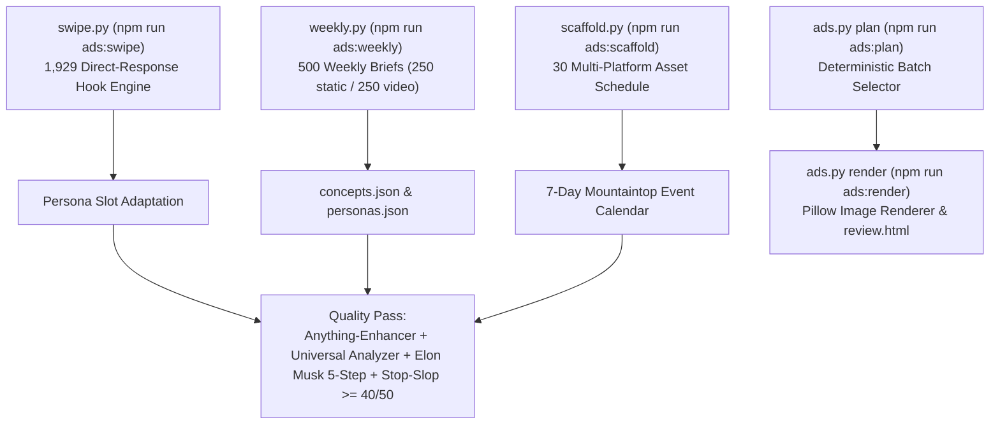

# Codex Handoff: Offline Ad Studio Tooling (`tools/ads/`)

> **Target Audience**: AI Coding Assistants (Codex / Antigravity / Claude Code) maintaining or extending the Ad Studio.  
> **Repository Location**: `tools/ads/` (Excluded from web production deploys)  
> **Test Suite**: `rtk npm run test:ads` (30 unit tests)  
> **Timestamp**: 2026-09-15  

---

## 1. Executive Summary & Purpose

The **Offline Ad Studio** in `tools/ads/` is a local creative generation, direct-response swipe adaptation, batch planning, static image rendering, and multi-platform schedule scaffolding suite for `https://senseisandy.com`.

### Production Protection Rules
1. **Never Commit Outputs**: Generated export batches (`tools/ads/output/`) and image caches (`tools/ads/cache/`) are strictly `.gitignore`d and must never be committed or included in public web distributions.
2. **Offline-First & Local Assets**: Renderer asset sources are declared in `tools/ads/assets.json` and grounded in verified local repository assets (`src/assets/images/...`).
3. **Mandatory Content Pipeline**: All ad headlines, video scripts, social captions, and campaign distribution schedules MUST pass through the project's quality pipeline:
   - **`Anything-Enhancer` (Enhance Pass)**: Creative depth, tone, sensory appeal, safety walkthrough emphasis (*Start calm. Train smart.*).
   - **`Universal Analyzer-Improver` (Improve Pass)**: 0–3s hook retention, Mountaintop local SEO geo-intent keywords, friction-free CTAs (`/free-bjj-intro-tannersville-ny#booking-flow` and SMS `+1 (917) 736-8649`), `rtk npm run qa:volatile-facts` compliance.
   - **`GLOB🌐=E.MUSK` 5-Step Questioning Algorithm**: Question requirements, delete dead stubs, simplify, accelerate via `rtk`, automate.
   - **`stop-slop` Prose Filter (Hardik Pandya)**: **Score floor >= 40/50** (active voice, zero adverbs, no passive voice, no formulaic binary contrasts, no em-dashes, zero AI tells).

---

## 2. Command Architecture & CLI Reference

All commands must be run with the `rtk` proxy wrapper from the repository root:

```bash
# 1. Generate 500 weekly concepts (250 static + 250 video) in Markdown
rtk npm run ads:weekly
# or: rtk proxy python3 tools/ads/weekly.py --week 2026-W39

# 2. Plan a static ad export run
rtk npm run ads:plan -- --count 6 --personas ben --series beginner_questions

# 3. Render static draft ad PNGs & build review.html
rtk npm run ads:render -- --count 6 --personas ben --series beginner_questions --week run-01

# 4. Generate optional workflow task brief
rtk npm run ads:brief

# 5. Direct-response hook swipe file engine (1,929 hooks across 21 categories)
rtk npm run ads:swipe -- categories
rtk npm run ads:swipe -- adapt --persona ben --category Contrarian --count 5

# 6. Scaffold 10x weekly production schedule (30 multi-platform assets)
rtk npm run ads:scaffold -- --week 2026-W38

# 7. Run Ad Studio test suite (30 unit tests)
rtk npm run test:ads
```

---

## 3. Module & File Architecture



### Key Core Modules
- [`tools/ads/weekly.py`](file:///home/twizss/Documents/ssbjjweb/tmb/tools/ads/weekly.py): Generates 500 concepts across 6 buyer personas (Parents, Adult beginners, Teens, Community-service, Families, Visitors).
- [`tools/ads/ads.py`](file:///home/twizss/Documents/ssbjjweb/tmb/tools/ads/ads.py): Deterministic planner and Pillow-based static image draft renderer.
- [`tools/ads/swipe.py`](file:///home/twizss/Documents/ssbjjweb/tmb/tools/ads/swipe.py): Engine querying `k10k-swipe-file.json` (1,929 direct-response hooks across 21 categories) with persona slot-filling.
- [`tools/ads/scaffold.py`](file:///home/twizss/Documents/ssbjjweb/tmb/tools/ads/scaffold.py): 7-day production schedule generator mapping 30 assets (10 short-form reels, 10 static ads, 7 stories, 3 carousels) anchored in Mountaintop seasonal events (Autumn foliage, Hunter Mountain Oktoberfest, Windham Mountain Club ski prep, etc.).
- [`tools/ads/workflow.py`](file:///home/twizss/Documents/ssbjjweb/tmb/tools/ads/workflow.py): Generates Markdown task briefs from `workflow-input.json`.

---

## 4. Single Source of Truth Authority Map

| Fact Domain | Single Source of Truth File | Invariant Rule |
| :--- | :--- | :--- |
| Ad Copy & Evidence | [`tools/ads/concepts.json`](file:///home/twizss/Documents/ssbjjweb/tmb/tools/ads/concepts.json) | Do not duplicate copy into new trackers. |
| Persona Routes, CTAs & Offers | [`tools/ads/personas.json`](file:///home/twizss/Documents/ssbjjweb/tmb/tools/ads/personas.json) | Schedule/pricing facts must match canonical site `/schedule` & `/options-pricing`. |
| Image Assets & Approvals | [`tools/ads/assets.json`](file:///home/twizss/Documents/ssbjjweb/tmb/tools/ads/assets.json) | Grounded in `src/assets/...`. Require verified permission. |
| Swipe File Engine | [`tools/ads/k10k-swipe-file.json`](file:///home/twizss/Documents/ssbjjweb/tmb/tools/ads/k10k-swipe-file.json) | 1,929 hooks. See `SWIPE-FILE-REFERENCE.md`. |

---

## 5. Verification & Test Suite

Run the unit test suite before finalizing any edits to `tools/ads/`:

```bash
rtk npm run test:ads
```

### Covered Test Specs (30 Tests)
- `test_planning.py`: Batch sizing, persona filtering, concept selection determinism.
- `test_weekly.py`: 500-concept Markdown generator structure, medium splits (250/250).
- `test_workflow.py`: Task brief generation from `workflow-input.json`.
- `test_swipe.py`: Category listing, keyword search, persona adaptation slot filling across 21 categories.
- `test_scaffold.py`: 30-asset schedule allocation, 7-day spread, persona balance, UTM parameter formatting.

---

## 6. Backlog & Expansion Guidance for Codex

When Codex picks up work on the Ad Studio:
1. **Adding New Swipe File Categories**: Edit `k10k-swipe-file.json` and ensure `test_swipe.py` passes.
2. **Adding New Layout Renderers**: Extend `ads.py` rendering logic; ensure fonts reference `font.ttf` and draft images write to `output/`.
3. **Updating Seasonal Events**: Update event calendar maps in `scaffold.py` for upcoming Catskills seasons (Ski Season Prep, Spring Re-Open, Summer Express).
4. **Enforcing Volatile Facts**: Run `rtk npm run qa:volatile-facts` whenever modifying offer copy or pricing tiers in `personas.json`.
