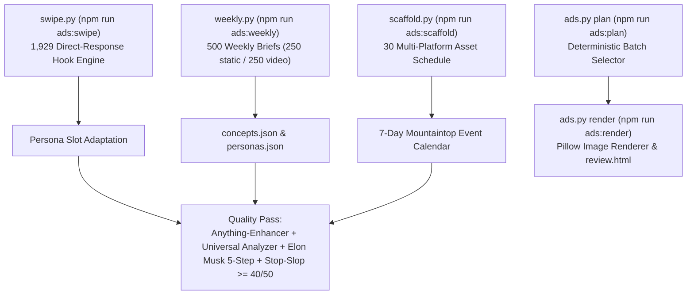

# Codex Handoff: Offline Ad Studio Tooling (`tools/ads/`)

> **Target Audience**: AI Coding Assistants (Codex / Antigravity / Claude Code) maintaining or extending the Ad Studio.  
> **Repository Location**: `tools/ads/` (Excluded from web production deploys)  
> **Test Suite**: `rtk npm run test:ads` (36 unit tests)  
> **Timestamp**: 2026-09-15  

---

## 1. Executive Summary & Purpose

The **Offline Ad Studio** in `tools/ads/` is a local creative generation, direct-response swipe adaptation, batch planning, static image rendering, and multi-platform schedule scaffolding suite for `https://senseisandy.com`.

### Production Protection Rules
1. **Never Commit Outputs**: Generated export batches (`tools/ads/output/`) and image caches (`tools/ads/cache/`) are strictly `.gitignore`d and must never be committed or included in public web distributions.
2. **Offline-First & Local Assets**: Renderer asset sources are declared in `tools/ads/assets.json` and grounded in verified local repository assets (`src/assets/images/...`).
3. **Mandatory 4-Rubric Content Pipeline**: All ad headlines, video scripts, social captions, and campaign distribution schedules MUST pass through the 4-rubric quality pipeline:
   - **`Rubric 1: Stop-Slop` Prose Filter (Hardik Pandya)**: **Score floor >= 40/50** (active voice, zero adverbs, no passive voice, no formulaic binary contrasts, no em-dashes, two items beat three, zero AI tells).
   - **`Rubric 2: Universal Analyzer-Improver` (Improve Pass)**: 0–3s hook retention, Mountaintop local SEO geo-intent keywords, friction-free tri-channel CTAs (`Comment TRIGGER`, bio link, SMS `+1 (917) 736-8649`), `rtk npm run qa:volatile-facts` compliance.
   - **`Rubric 3: Anything-Enhancer` (Enhance Pass)**: Creative depth, narrative warmth, kinesthetic/biomechanical realism, safety walkthrough emphasis (*Start calm. Train smart.*).
   - **`Rubric 4: Empirical Reach Matrix` (Macro Historical Meta Dataset)**: Prioritize 16–30s Reel format for non-follower discovery (2.8x higher median reach), contrarian problem-solver hooks (0–2s thumb-stop), the 4-Tag Rule (`#catskills #bjj #tannersvilleny #hudsonvalley`), lineage/collaborator tagging (`@clockworkbjj` capped at once per week on peak technical/curriculum posts), location tagging (`Tannersville, New York`), and algorithmic comment triggers (`Comment START`).
4. **Universal START Trigger Rule**: The canonical comment trigger across all social media posts, Reels, carousels, and ads is **`START`** (`Comment START`). Standardizing on `START` unifies DM automation, prevents automation routing failures, and keeps CTAs predictable and frictionless.
5. **Positive Beginner Reassurance & 3rd-Grade Reading Level Rule**: Beginner reassurance copy MUST be written at a **3rd-grade reading level or below** (short words, 1–2 syllables average, simple 6–8 word sentence structures, ultra-accessible vocabulary) and framed purely in the positive (what students receive and experience). Strictly BAN the word "zero" (no "zero live sparring", "zero roughhousing", "zero muscling", "zero meathead ego") and negative language (no "without", "no injuries", "stop", "don't", "won't", "never"). Always substitute positive affirming alternatives: *"Cooperative, coached movement from day one"*, *"Calm, structured partner drills"*, *"Respectful room and cooperative pacing"*, *"Pure mechanical leverage"*, *"Supportive team environment"*, *"Quiet confidence and balance"*, *"Train under one roof with your family"*.
6. **Lineage Tagging Frequency Rule**: Lineage/collaborator tagging (`@clockworkbjj`) must be used at most **once per week**, strictly reserved for the single most relevant technical curriculum or tournament proof post of that week (e.g. weekly tactical micro-clinic or tournament reel). Do not tag `@clockworkbjj` on routine daily announcements, youth classes, beginner convert posts, or visitor drops.


---

## 2. Command Architecture & CLI Reference

All commands must be run with the `rtk` proxy wrapper from the repository root:

```bash
# 1. Generate 500 weekly concepts (250 static + 250 video) in Markdown
rtk npm run ads:weekly
# or: rtk proxy python3 tools/ads/weekly.py --week 2026-W39

# 2. Plan a static ad export run
rtk npm run ads:plan -- --count 6 --personas ben --series beginner_questions

# 3. Render static draft ad PNGs & build review.html
rtk npm run ads:render -- --count 6 --personas ben --series beginner_questions --week run-01

# 4. Generate optional workflow task brief
rtk npm run ads:brief

# 5. Direct-response hook swipe file engine (1,929 hooks across 21 categories)
rtk npm run ads:swipe -- categories
rtk npm run ads:swipe -- adapt --persona ben --category Contrarian --count 5

# 6. Scaffold 10x weekly production schedule (30 multi-platform assets)
rtk npm run ads:scaffold -- --week 2026-W38

# 7. Run Ad Studio test suite (36 unit tests)
rtk npm run test:ads
```

---

## 3. Module & File Architecture


### Key Core Modules
- [`tools/ads/weekly.py`](file:///home/twizss/Documents/ssbjjweb/tmb/tools/ads/weekly.py): Generates 500 concepts across 6 buyer personas (Parents, Adult beginners, Teens, Community-service, Families, Visitors).
- [`tools/ads/ads.py`](file:///home/twizss/Documents/ssbjjweb/tmb/tools/ads/ads.py): Deterministic planner and Pillow-based static image draft renderer.
- [`tools/ads/render_day.py`](file:///home/twizss/Documents/ssbjjweb/tmb/tools/ads/render_day.py): Multi-day production rendering engine for 10x weekly scaffold (carousels, reel covers, story polls, static feed ads, and Google Business Profile graphics).
- [`tools/ads/swipe.py`](file:///home/twizss/Documents/ssbjjweb/tmb/tools/ads/swipe.py): Engine querying `k10k-swipe-file.json` (1,929 direct-response hooks across 21 categories) with persona slot-filling.
- [`tools/ads/scaffold.py`](file:///home/twizss/Documents/ssbjjweb/tmb/tools/ads/scaffold.py): 7-day production schedule generator mapping 30 assets (10 short-form reels, 10 static ads, 7 stories, 3 carousels) anchored in Mountaintop seasonal events (Autumn foliage, Hunter Mountain Oktoberfest, Windham Mountain Club ski prep, etc.).
- [`tools/ads/workflow.py`](file:///home/twizss/Documents/ssbjjweb/tmb/tools/ads/workflow.py): Generates Markdown task briefs from `workflow-input.json`.

---

## 4. Single Source of Truth Authority Map

| Fact Domain | Single Source of Truth File | Invariant Rule |
| :--- | :--- | :--- |
| Ad Copy & Evidence | [`tools/ads/concepts.json`](file:///home/twizss/Documents/ssbjjweb/tmb/tools/ads/concepts.json) | Do not duplicate copy into new trackers. |
| Persona Routes, CTAs & Offers | [`tools/ads/personas.json`](file:///home/twizss/Documents/ssbjjweb/tmb/tools/ads/personas.json) | Schedule/pricing facts must match canonical site `/schedule` & `/options-pricing`. |
| Image Assets & Approvals | [`tools/ads/assets.json`](file:///home/twizss/Documents/ssbjjweb/tmb/tools/ads/assets.json) | Grounded in `src/assets/...`. Require verified permission. |
| Swipe File Engine | [`tools/ads/k10k-swipe-file.json`](file:///home/twizss/Documents/ssbjjweb/tmb/tools/ads/k10k-swipe-file.json) | 1,929 hooks. See `SWIPE-FILE-REFERENCE.md`. |

---

## 5. Verification & Test Suite

Run the unit test suite before finalizing any edits to `tools/ads/`:

```bash
rtk npm run test:ads
```

### Covered Test Specs (36 Tests)
- `test_planning.py`: Batch sizing, persona filtering, concept selection determinism.
- `test_weekly.py`: 500-concept Markdown generator structure, medium splits (250/250).
- `test_workflow.py`: Task brief generation from `workflow-input.json`.
- `test_swipe.py`: Category listing, keyword search, persona adaptation slot filling across 21 categories.
- `test_scaffold.py`: 30-asset schedule allocation, 7-day spread, persona balance, UTM parameter formatting.
- `test_render_day.py`: Multi-day graphic rendering, text wrapping bounds, header/footer branding, square/story/carousel geometry.

---

## 6. Backlog & Expansion Guidance for Codex

When Codex picks up work on the Ad Studio:
1. **Adding New Swipe File Categories**: Edit `k10k-swipe-file.json` and ensure `test_swipe.py` passes.
2. **Adding New Layout Renderers**: Extend `ads.py` rendering logic; ensure fonts reference `font.ttf` and draft images write to `output/`.
3. **Updating Seasonal Events**: Update event calendar maps in `scaffold.py` for upcoming Catskills seasons (Ski Season Prep, Spring Re-Open, Summer Express).
4. **Enforcing Volatile Facts**: Run `rtk npm run qa:volatile-facts` whenever modifying offer copy or pricing tiers in `personas.json`.

---

## 7. Mandatory Slot Production & Enhancement Protocol (The 5-Stage Standard)

Every daily slot in the active schedule (Carousels, Video Reels, Stories, Static Ads, GBP posts) MUST pass through this standardized 5-stage iteration before final release and publication:

1. **Stage 1: Empirical Meta Performance & Reach Calibration (`Rubric 4: Empirical Reach Matrix`)**
   - Ingest verified CSV data from `assets/data/` (or `tools/ads/PLACEMENT-REGISTER-YYYY-Wxx.csv`).
   - Prioritize Reach-maximizing formats: Short-form Reels (16–30s) deliver 2.8x higher median reach than static images and account for 84% of non-follower discovery.
   - Enforce the 4-Tag Rule (`#catskills #bjj #tannersvilleny #hudsonvalley`) over tag stuffing.
   - Apply lineage/collaborator tagging (`@clockworkbjj` max 1x/week on peak technical post), location tagging (`Tannersville, New York`), and algorithmic comment triggers (`Comment START`).
   - Target peak launch windows (8:00 AM or 1:00 PM EDT on Fri/Mon/Sun/Thu).

2. **Stage 2: Dual-Engine Enhancement (`Rubric 2 & Rubric 3`)**
   - **`Rubric 3: Anything-Enhancer` (Enhance Pass)**: Elevate creative depth, narrative warmth, kinesthetic/sensory realism (biomechanical leverage, clean mat sound, physical tension release), and psychological safety.
   - **`Rubric 2: Universal Analyzer-Improver` (Improve Pass)**: Optimize 0–3s hook retention, thumb-stop triggers, multi-channel booking architecture (`Comment TRIGGER`, Bio link, private SMS to `(917) 736-8649`), and mountaintop geo-intent.

3. **Stage 3: Stop-Slop Prose Filtration (`Rubric 1: Stop-Slop` - Score >= 40/50)**
   - Eliminate all adverbs (`-ly` words like *really, genuinely, directly, quickly*).
   - Eradicate false agency (inanimate abstractions doing human actions).
   - Dismantle binary contrasts (*Not X, but Y*) and negative listing.
   - Enforce rhythm rule: two items beat three in bulleted lists.
   - Strictly ban em-dashes and ensure active voice with human subjects.

4. **Stage 4: Visual Asset Iteration & Re-rendering**
   - Verify layout boundaries and text wrapping in `tools/ads/render_day.py`.
   - Re-render production assets into `tools/ads/output/` (4:5 portrait for carousels/feed ads; 9:16 vertical for stories/reels).
   - Re-generate `review.html` gallery for immediate local inspection.

5. **Stage 5: Master Scaffold & Registry Synchronization**
   - Populate `converter_copy` with complete headline, body, bullets, and comment triggers in `tools/ads/week-10x-scaffold-YYYY-Wxx.json`.
   - Update ready-to-post copy blocks in `tools/ads/week-10x-scaffold-YYYY-Wxx.md`.
   - Synchronize `tools/ads/CROSS-PLATFORM-DEPLOYMENT-WEEK1.md`.
   - Execute verification: `rtk npm run test:ads` and `rtk npm run qa:volatile-facts`.


